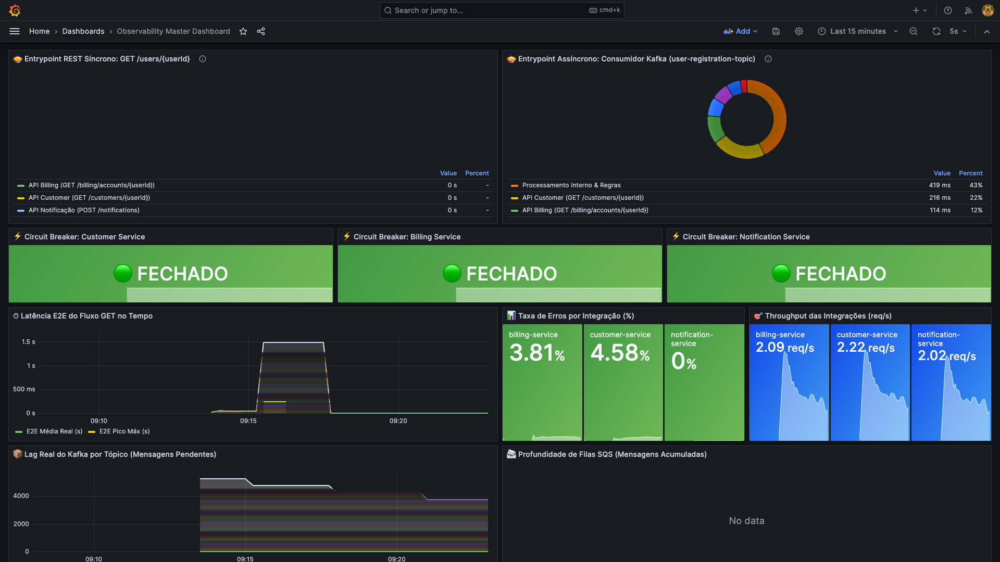
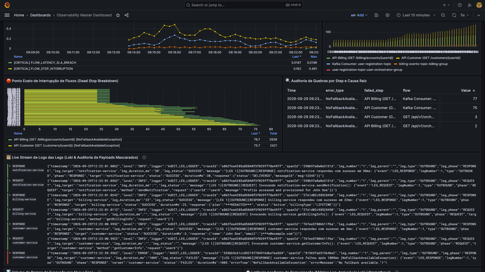
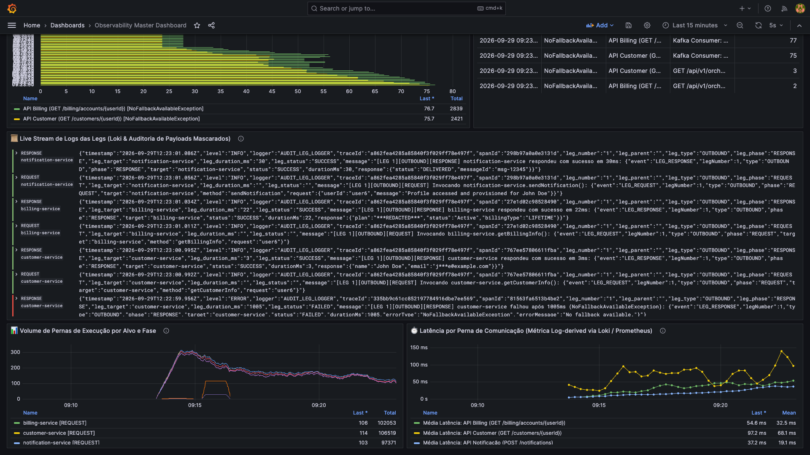
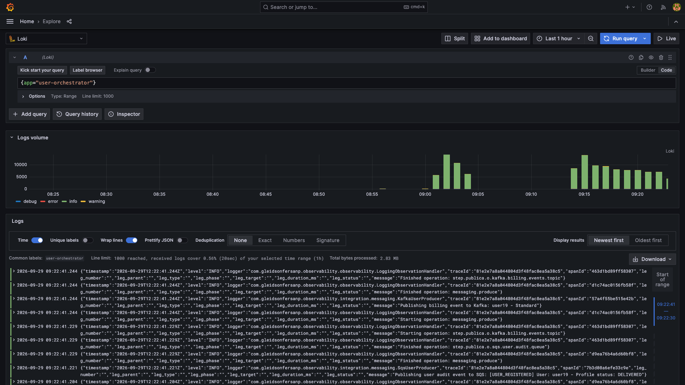

# Observability & Resilience Example
Um projeto completo demonstrando microsserviços integrados com Spring Boot 3, Kafka, SQS (LocalStack), WireMock, Micrometer, Resilience4j, Prometheus, Grafana e Jaeger!

## 🏛️ Arquitetura Multi-Módulo do Starter Corporativo

O repositório é organizado no formato Maven Multi-Module, separando estritamente os contratos de API, o core do domínio de telemetria, as auto-configurações do Spring Boot, o starter agregador, os testes de conformidade de topologia e a aplicação de demonstração:

```text
corporate-observability-parent (root pom)
├── observability-api             # Contratos puros, anotações (@TrackFlow, @TrackStep, @FlowDimension, @LogLeg) sem dependências externas
├── observability-core            # Domínio de observabilidade (FlowSemanticContext, FlowVariant, LatencyAttribution, CardinalityPolicy, OpenTelemetry API pura)
├── observability-autoconfigure   # Auto-configurações Spring Boot 3, EnvironmentPostProcessor, TracingRuntimeDetector, Endpoints Actuator
├── observability-spring-boot-starter # Starter corporativo plug-and-play para consumo pelas aplicações
├── observability-test            # Test Harness e Matriz de Conformidade (Single Producer, detecção de conflitos, Datadog/Prometheus)
├── observability-legacy-compat   # Módulo ponte de compatibilidade para transição de legados
└── observability-demo            # Aplicação laboratório (user-orchestrator) com REST, Feign, Kafka, SQS, Circuit Breaker, WireMock e BD
```

### 🎯 Políticas Arquiteturais Fundamentais
1. **Single Producer Per Signal**: O starter previne conflitos de agentes (`dd-java-agent` vs `opentelemetry-javaagent`) e duplicação de métricas. O `TracingRuntimeDetector` e o `ObservabilityTopologyValidator` realizam validação fail-fast no startup.
2. **OpenTelemetry API Pura no Core**: O starter depende exclusivamente de `opentelemetry-api` (sem SDK e sem exporters OTLP), permitindo coexistência limpa com o `dd-java-agent` através de `DD_TRACE_OTEL_ENABLED=true`.
3. **Seleção de Perfis Nativos**:
   - `observability.profile: datadog` (Padrão Corporativo): Exportação para Datadog ativa, `management.tracing.enabled=false` para evitar duplicidade com o Java Agent.
   - `observability.profile: prometheus`: Desabilita Datadog e ativa `PrometheusMeterRegistry` e Micrometer Tracing.
   - `observability.metrics.allow-dual-export: true`: Autorização explícita obrigatória para períodos transitórios de migração dual.
4. **Proteção de Cardinalidade**: O `CardinalityPolicy` filtra automaticamente identificadores de alta cardinalidade (`userId`, `orderId`, `traceId`, `cpf`, `token`) evitando explosão de métricas nos backends analíticos.

### Coordenadas Maven para Aplicações Clientes
```xml
<dependency>
    <groupId>com.empresa.platform</groupId>
    <artifactId>observability-spring-boot-starter</artifactId>
    <version>1.0.0-SNAPSHOT</version>
</dependency>
```

## 📚 Documentação Completa
A documentação detalhada da arquitetura, observabilidade e engenharia de caos está disponível na pasta [`documentacao/`](file:///Users/gleidsonfersanp/workspace/spring-observability-example/documentacao/README.md):
- [**Visão Geral e Arquitetura**](file:///Users/gleidsonfersanp/workspace/spring-observability-example/documentacao/README.md)
- [**Especificação Técnica: Engine SPI e Datadog Oficial**](file:///Users/gleidsonfersanp/workspace/spring-observability-example/documentacao/ESPECIFICACAO_TECNICA_ENGINE_DATADOG_E_VENDOR_NEUTRAL.md)
- [**Guia de Flow Dimensions, Migração Operacional e Feature Flags**](file:///Users/gleidsonfersanp/workspace/spring-observability-example/documentacao/GUIA_FLOW_DIMENSIONS_E_MIGRACAO_FEATURE_FLAGS.md)
- [**Especificação Técnica para Starter Spring Boot**](file:///Users/gleidsonfersanp/workspace/spring-observability-example/documentacao/ESPECIFICACAO_TECNICA_STARTER_OBSERVABILIDADE.md)
- [**Guia de Pernas de Execução (Legs) e Mascaramento SpEL**](file:///Users/gleidsonfersanp/workspace/spring-observability-example/documentacao/GUIA_DE_LEGS_E_AUDITORIA_DE_LOGS.md)
- [**Como Metrificar por Stack Tecnológica**](file:///Users/gleidsonfersanp/workspace/spring-observability-example/documentacao/GUIA_METRIFICACAO_DAS_STACKS.md)
- [**Catálogo de Métricas e Consultas PromQL do Dashboard**](file:///Users/gleidsonfersanp/workspace/spring-observability-example/documentacao/CATALOGO_DE_METRICAS_E_QUERIES_DASHBOARD.md)
- [**Registro de Decisões Arquiteturais (ADRs)**](file:///Users/gleidsonfersanp/workspace/spring-observability-example/documentacao/DECISOES_ARQUITETURAIS_ADR.md)
- [**Guia de Alarmística, SLAs e Incidentes**](file:///Users/gleidsonfersanp/workspace/spring-observability-example/documentacao/GUIA_DE_ALARMISTICA_E_SLAS.md)
- [**Guia de Observabilidade, SpEL e Métricas**](file:///Users/gleidsonfersanp/workspace/spring-observability-example/documentacao/OBSERVABILIDADE_E_METRICAS.md)
- [**Guia de Abstração de Vendors e Provedores**](file:///Users/gleidsonfersanp/workspace/spring-observability-example/documentacao/GUIA_DE_ABSTRACAO_DE_VENDORS_E_PROVEDORES.md)
- [**Guia de Testes de Integração, E2E e Validação da Telemetria**](file:///Users/gleidsonfersanp/workspace/spring-observability-example/documentacao/GUIA_DE_TESTES_E2E_E_INTEGRACAO.md)
- [**Cenários de Teste, Caos e Validação**](file:///Users/gleidsonfersanp/workspace/spring-observability-example/documentacao/CENARIOS_DE_TESTE_E_CAOS.md)

## 📸 Evidências Visuais e Dashboards

| Topo: Decomposição de Entrada, SLAs e Circuit Breakers | Meio: Central de Alarmística e Diagnóstico de Dead Stop |
| :---: | :---: |
|  |  |

| Fundo: Pernas de Execução (Legs), Auditoria e Latência | Loki Explore: Streams Estruturados e Rastreabilidade |
| :---: | :---: |
|  |  |

## 🧪 Testes Automatizados (Stubs sobre Mocks & Validação da Telemetria)
A aplicação conta com uma suíte abrangente de **38 testes de integração e ponta a ponta (E2E)** que comprovam toda a telemetria (Logs, Métricas, Traces, SpEL, Feature Flags, Flow Dimensions, Topologia, Enriquecimento Declarativo de MDC e Inspeção Canônica de Telemetria) sem necessidade de mocks:
```bash
# Executar todos os 38 testes em todos os módulos
mvn test

# Executar suíte canônica de inspeção de Métricas (@TrackFlow), Legs (@LogLeg) e MDCs (@MDC)
mvn test -Dtest=FlowTelemetryInspectionExampleIntegrationTest

# Executar suíte E2E Síncrono
mvn test -Dtest=UserOrchestratorE2EObservabilityIntegrationTest

# Executar suíte de Correlation ID e Logback Padronizado
mvn test -Dtest=CorrelationAndStandardLogbackIntegrationTest

# Executar suíte de Enriquecimento de Logs via @MDC
mvn test -Dtest=MdcEnrichmentIntegrationTest

# Executar suíte de Migração de Fluxos com Feature Flags e Flow Dimensions
mvn test -Dtest=FeatureFlagMigrationFlowIntegrationTest
```
Consulte o [**Guia de Testes de Integração e E2E**](file:///Users/gleidsonfersanp/workspace/spring-observability-example/documentacao/GUIA_DE_TESTES_E2E_E_INTEGRACAO.md) para detalhes da arquitetura de testes e templates.

## 🏷️ Enriquecimento Declarativo de Logs (`@MDC`)
O projeto utiliza a anotação [`@MDC`](file:///Users/gleidsonfersanp/workspace/spring-observability-example/observability-api/src/main/java/com/empresa/platform/observability/core/annotation/MDC.java) do starter para eliminar 100% dos `MDC.put` / `MDC.remove` manuais do código da aplicação:
- **No Controller REST ([`UserOrchestratorController`](file:///Users/gleidsonfersanp/workspace/spring-observability-example/observability-demo/src/main/java/com/gleidsonfersanp/observability/api/UserOrchestratorController.java))**:
  - `GET /users/{userId}`: captura `@PathVariable @MDC("userId") String userId`.
  - `POST /users`: captura `@MDC(key = "userId", expression = "#request.userId")` e `@MDC(key = "channel", value = "web")`.
- **No Serviço de Negócio ([`UserOrchestratorService`](file:///Users/gleidsonfersanp/workspace/spring-observability-example/observability-demo/src/main/java/com/gleidsonfersanp/observability/application/UserOrchestratorService.java))**:
  - `fetchAndProvisionUserProfile`: injeta `@MDC(key = "flowType", value = "orchestrated-provisioning")`.
- **Stack Semantics**: Todos os valores são empilhados no início do método e restaurados/removidos no bloco `finally`, prevenindo contaminação entre requisições em thread pools.

## 📜 Padronização de Logs (Logback Multi-Perfil Centralizado & Correlation ID)
O logging da aplicação herda a configuração centralizada [`logback.yml`](file:///Users/gleidsonfersanp/workspace/spring-observability-example/observability-autoconfigure/src/main/resources/logback.yml) do starter e a estende no `logback-spring.xml` com separação de perfis:
- **Dev/Local (`!container & !prod`)**: Console colorido com identificação de threads, `[cid=...]`, `[%X{traceId},%X{spanId}]` e `[flow=...,step=...]`.
- **Produção/Cloud (`container | prod`)**: Console em formato JSON estruturado (`JSON_CONSOLE`) mono-linha com atributos de correlação, pernas (`leg_*`), tags de negócio do `@MDC` (`userId`, `flowType`, `channel`) e sanitização de quebras de linha (`CRLF`).
- **Appenders Assíncronos (`AsyncAppender`)**: Escrita de logs em fila sem bloquear threads de negócio.
- **Grafana Loki (`Loki4jAppender`)**: Push direto assíncrono para o Loki (`:3100`) com indexação de labels (`app`, `level`, `leg_type`, `leg_target`, `leg_phase`).
- **Propagação de Correlation ID (`X-Correlation-Id` / `cid`)**: Interceptação na entrada HTTP (`CorrelationIdFilter`), propagação downstream no Feign e envelopes Kafka e SQS.


## Como Rodar o Ambiente
Suba todos os serviços base:
```bash
docker-compose up -d
```
Aguarde alguns segundos e acesse as ferramentas de observabilidade:
- **Grafana**: http://localhost:3000 (admin/admin)
- **Prometheus**: http://localhost:9090
- **Jaeger (Traces)**: http://localhost:16686
- **Grafana Loki (Logs)**: http://localhost:3100

## Chaos Engineering / Simulações de Falhas
- **Timeout**: `curl http://localhost:8080/api/v1/orchestrator/users/slow`
- **Erro 500**: `curl http://localhost:8080/api/v1/orchestrator/users/error`
- **Flaky**: `curl http://localhost:8080/api/v1/orchestrator/users/flake`

## Load Test e Distribuição de BillingTypes
Acabei de atualizar o WireMock criando **20 cenários diferentes de clientes** (user1 até user20), cada um com um `billingType` aleatório (MONTHLY, YEARLY, FREE, TRIAL, etc).

Para ver o dashboard de proporção ser populado no Grafana, dispare essa carga:
```bash
# Reinicie o WireMock para carregar os novos usuários
curl -X POST http://localhost:8081/__admin/mappings/reset

# Dispare 100 requisições simuladas
for i in {1..100}; do 
  USER_ID=$(( (RANDOM % 20) + 1 ))
  curl -s -o /dev/null -w "User $USER_ID: %{http_code}\n" http://localhost:8080/api/v1/orchestrator/users/user$USER_ID
done
```

## Como montar o gráfico Pie Chart no Grafana:
Crie um novo Dashboard, adicione um Painel do tipo "Pie Chart" e cole a query PromQL:
`sum(rate(user_profile_provision_seconds_count[1m])) by (billing_type)`

## Teste de Carga Massiva (Stress Test)
Para gerar uma enxurrada de requisições, encher as filas do Kafka/SQS e ver os disjuntores abrindo em tempo real no Grafana, criei um script Python multithread. Ele enviará 1000 requisições concorrentes:
```bash
python3 massive_load.py
```
