# Catálogo de Métricas Customizadas e Consultas PromQL do Dashboard

Este documento é a referência canônica e exaustiva sobre **todas as formas customizadas de instrumentação e medição** implementadas no projeto, bem como o **catálogo completo das 15 consultas PromQL** configuradas no dashboard corporativo do Grafana ([`grafana-dashboard.json`](file:///Users/gleidsonfersanp/workspace/spring-observability-example/grafana-dashboard.json)).

---

## 🎯 1. Visão Geral da Filosofia de Instrumentação

A engenharia de observabilidade deste projeto foi construída sobre três pilares inegociáveis:
1. **Não-Intrusividade Absoluta**: Nenhuma classe de negócio (como [`UserOrchestratorService`](file:///Users/gleidsonfersanp/workspace/spring-observability-example/src/main/java/com/gleidsonfersanp/observability/application/UserOrchestratorService.java)) possui chamadas a `MeterRegistry`, `Observation` ou APIs de métricas. Toda a instrumentação opera por interceptação AOP, interfaces de borda, listeners e binders desacoplados.
2. **Fechamento Matemático (100% da Latência)**: A decomposição de tempo de cada requisição deve cobrir todo o ciclo de vida. O tempo não gasto em clientes externos é medido e classificado explicitamente como processamento interno.
3. **Isolamento Estrito por Entrypoint**: Cada ponto de entrada no sistema (seja uma chamada REST ou consumo de fila) possui seu próprio contexto de observabilidade e fatias de latência independentes.

---

## 🧩 2. As Formas Customizadas de Metrificar

```mermaid
flowchart TD
    subgraph CustomInstrumentation ["Mecanismos Customizados de Medição"]
        AOP_Flow["1. Flow & Step Tracking\n(@TrackFlow / @TrackStep / FlowContext)"]
        AOP_SpEL["2. Dynamic SpEL Tagging\n(@ObservationTag / SpelObservationAspect)"]
        CB_Resilience["3. Granular Circuit Breakers\n(Resilience4j + RegistryEventConsumer)"]
        Kafka_Lag["4. Broker Kafka Lag Binder\n(KafkaLagMetricsBinder + AdminClient)"]
        SQS_Depth["5. Dynamic SQS Depth Binder\n(SqsMetricsBinder + AWS SDK)"]
        Msg_ProduceConsume["6. Messaging Throughput\n(@Observed em Producers & Consumers)"]
        Hikari_Pool["7. Connection Pool Watchdog\n(HikariCP Metrics + AlertWatcher)"]
        InApp_Alerts["8. In-App SLA & Alert Dispatcher\n(AlertDispatcher + Micrometer Counter)"]
    end

    subgraph ExportedMetrics ["Métricas Micrometer Exportadas"]
        M1["flow_slice_duration_seconds\nflow_total_duration_seconds"]
        M2["Tags de negócio: billing_type, client, etc."]
        M3["resilience4j_circuitbreaker_state\nresilience4j_circuitbreaker_calls_seconds_*"]
        M4["kafka_consumer_lag_records"]
        M5["sqs_queue_depth\nsqs_queue_in_flight"]
        M6["messaging_produce_seconds_*\nmessaging_consume_seconds_*"]
        M7["hikaricp_connections_*\nhikaricp_connections_timeout_total"]
        M8["alerts_triggered_total"]
    end

    AOP_Flow --> M1
    AOP_SpEL --> M2
    CB_Resilience --> M3
    Kafka_Lag --> M4
    SQS_Depth --> M5
    Msg_ProduceConsume --> M6
    Hikari_Pool --> M7
    InApp_Alerts --> M8
```



---

### 2.1. Rastreamento E2E e Decomposição de Latência em Fatias

- **Classes / Anotações**:
  - [`@TrackFlow`](file:///Users/gleidsonfersanp/workspace/spring-observability-example/src/main/java/com/gleidsonfersanp/observability/observability/flow/TrackFlow.java): Anotado nos pontos de entrada (REST Controllers e Consumers de mensageria).
  - [`@TrackStep`](file:///Users/gleidsonfersanp/workspace/spring-observability-example/src/main/java/com/gleidsonfersanp/observability/observability/flow/TrackStep.java): Anotado nas interfaces externas (Feign Clients, Producers Kafka/SQS, chamadas de banco).
  - [`FlowContext`](file:///Users/gleidsonfersanp/workspace/spring-observability-example/src/main/java/com/gleidsonfersanp/observability/observability/flow/FlowContext.java) & [`FlowContextHolder`](file:///Users/gleidsonfersanp/workspace/spring-observability-example/src/main/java/com/gleidsonfersanp/observability/observability/flow/FlowContext.java): Mantém o contexto de execução isolado por thread via `ThreadLocal`.
  - [`FlowTrackingAspect`](file:///Users/gleidsonfersanp/workspace/spring-observability-example/src/main/java/com/gleidsonfersanp/observability/observability/flow/FlowTrackingAspect.java): Interceptor AOP com `@Order(1)`.

- **Como Funciona**:
  1. Quando uma requisição atinge um método `@TrackFlow("NOME_FLUXO")`, o aspecto captura `startNanos = System.nanoTime()` e inicializa um novo `FlowContext`.
  2. Cada subprocesso anotado com `@TrackStep("NOME_PASSO")` executado na mesma thread é cronometrado pelo join point `proceed()`.
  3. A duração do passo é acumulada no `FlowContext` e registrada imediatamente no Micrometer:
     ```java
     Timer.builder("flow_slice_duration_seconds")
         .tag("flow", flowName)
         .tag("step", stepName)
         .tag("status", success ? "SUCCESS" : "ERROR")
         .publishPercentileHistogram(true)
         .register(meterRegistry)
         .record(stepDurationNanos, TimeUnit.NANOSECONDS);
     ```
  4. Ao término do fluxo principal, o interceptor calcula a **Fatia Residual** (o tempo gasto estritamente dentro da JVM em regras, parsing e transformações):
     $$\text{internalNanos} = \max\left(0, \text{totalNanos} - \sum_{i=1}^{n} \text{stepNanos}_i\right)$$
  5. Essa fatia residual é publicada sob o mesmo timer com o rótulo `step="Processamento Interno & Regras"`.
  6. A duração total é publicada em `flow_total_duration_seconds{flow="...", status="..."}`.

- **Vantagem Arquitetural**: Permite plotar um gráfico de pizza 100% fechado, onde a soma de todas as fatias é matematicamente idêntica à latência total da requisição.

---

### 2.2. Enriquecimento Dinâmico de Tags com SpEL em Bordas

- **Classes / Anotações**:
  - [`@ObservationTag`](file:///Users/gleidsonfersanp/workspace/spring-observability-example/src/main/java/com/gleidsonfersanp/observability/observability/ObservationTag.java) e [`@ObservationTags`](file:///Users/gleidsonfersanp/workspace/spring-observability-example/src/main/java/com/gleidsonfersanp/observability/observability/ObservationTags.java)
  - [`SpelObservationAspect`](file:///Users/gleidsonfersanp/workspace/spring-observability-example/src/main/java/com/gleidsonfersanp/observability/observability/SpelObservationAspect.java)

- **Como Funciona**:
  - Anotada diretamente nas interfaces declarativas do Feign Client (ex: [`BillingClient`](file:///Users/gleidsonfersanp/workspace/spring-observability-example/src/main/java/com/gleidsonfersanp/observability/integration/BillingClient.java)):
    ```java
    @ObservationTag(key = "client", expression = "'billing'")
    @ObservationTag(key = "billing_type", expression = "#result?.billingType()?.name()")
    @GetMapping("/billing/accounts/{userId}")
    BillingDto getBillingInfo(@PathVariable("userId") String userId);
    ```
  - O aspecto avalia a expressão SpEL em duas fases:
    - *Pré-execução*: Registra parâmetros do método (`#userId`).
    - *Pós-execução*: Disponibiliza a variável `#result` ou `#error`.
  - Injeta a tag diretamente no `Observation` corrente da thread através de `observation.lowCardinalityKeyValue(key, value)`.

---

### 2.3. Resiliência Granular e Interceptação de Disjuntores

- **Classes**:
  - Resilience4j Circuit Breakers por integração: `customer-service`, `billing-service`, `notification-service`.
  - [`CircuitBreakerAlertListener`](file:///Users/gleidsonfersanp/workspace/spring-observability-example/src/main/java/com/gleidsonfersanp/observability/observability/alerting/CircuitBreakerAlertListener.java): Implementa `RegistryEventConsumer<CircuitBreaker>`.

- **Como Funciona**:
  - O Resilience4j exporta métricas nativas para o Micrometer:
    - `resilience4j_circuitbreaker_state{name="...", state="closed|open|half_open"}`
    - `resilience4j_circuitbreaker_calls_seconds_count{name="...", kind="successful|failed|ignored"}`
    - `resilience4j_circuitbreaker_calls_seconds_sum{name="..."}`
  - O listener desacoplado escuta eventos de ciclo de vida (`onStateTransition`) e emite alertas instantâneos de forma reativa sem que o Feign Client ou o Service precisem saber de alarmística.

---

### 2.4. Medição Autoritativa de Lag do Kafka via Broker

- **Classe**:
  - [`KafkaLagMetricsBinder`](file:///Users/gleidsonfersanp/workspace/spring-observability-example/src/main/java/com/gleidsonfersanp/observability/observability/KafkaLagMetricsBinder.java)

- **Como Funciona**:
  - Em vez de depender de métricas em memória dos consumidores da JVM (que congelam quando o consumidor trava ou quando não há mensagens sendo processadas), o binder utiliza o `AdminClient` do Apache Kafka.
  - A cada 5 segundos:
    1. Consulta os offsets comitados do grupo de consumo via `adminClient.listConsumerGroupOffsets(groupId)`.
    2. Consulta o último offset das partições diretamente no broker via `adminClient.listOffsets(OffsetSpec.latest())`.
    3. Calcula a diferença:
       $$\text{Lag} = \text{Offset}_{\text{broker}} - \text{Offset}_{\text{consumer}}$$
    4. Atualiza o Gauge do Micrometer:
       `kafka_consumer_lag_records{topic="...", group="..."}`.

---

### 2.5. Descoberta Dinâmica e Monitoramento de Filas AWS SQS

- **Classe**:
  - [`SqsMetricsBinder`](file:///Users/gleidsonfersanp/workspace/spring-observability-example/src/main/java/com/gleidsonfersanp/observability/observability/SqsMetricsBinder.java)

- **Como Funciona**:
  - Implementa a interface `MeterBinder` do Spring Boot / Micrometer.
  - A cada 10 segundos, executa `sqsAsyncClient.listQueues()`.
  - Para cada fila encontrada no LocalStack ou AWS, solicita os atributos:
    - `ApproximateNumberOfMessages` $\rightarrow$ Gauge `sqs_queue_depth{queue="..."}`
    - `ApproximateNumberOfMessagesNotVisible` $\rightarrow$ Gauge `sqs_queue_in_flight{queue="..."}`
  - Filas criadas dinamicamente são registradas no `MeterRegistry` automaticamente sem reinicialização da aplicação.

---

### 2.6. Throughput e Latência de Mensageria (Producers & Consumers)

- **Classes**:
  - [`KafkaUserProducer`](file:///Users/gleidsonfersanp/workspace/spring-observability-example/src/main/java/com/gleidsonfersanp/observability/integration/messaging/KafkaUserProducer.java), [`KafkaUserConsumer`](file:///Users/gleidsonfersanp/workspace/spring-observability-example/src/main/java/com/gleidsonfersanp/observability/integration/messaging/KafkaUserConsumer.java)
  - [`SqsUserProducer`](file:///Users/gleidsonfersanp/workspace/spring-observability-example/src/main/java/com/gleidsonfersanp/observability/integration/messaging/SqsUserProducer.java), [`SqsUserConsumer`](file:///Users/gleidsonfersanp/workspace/spring-observability-example/src/main/java/com/gleidsonfersanp/observability/integration/messaging/SqsUserConsumer.java)

- **Como Funciona**:
  - Métodos anotados com `@Observed(name = "messaging.produce")` e `@Observed(name = "messaging.consume")`.
  - O Micrometer exporta os timers:
    - `messaging_produce_seconds_count{method="..."}` e `messaging_produce_seconds_sum{method="..."}`
    - `messaging_consume_seconds_count{method="..."}` e `messaging_consume_seconds_sum{method="..."}`

---

### 2.7. Observabilidade e Watchdog do Pool de Banco de Dados (HikariCP)

- **Classes / Configuração**:
  - Configuração do pool: `spring.datasource.hikari.pool-name=observability-hikari-pool`.
  - [`HikariPoolAlertWatcher`](file:///Users/gleidsonfersanp/workspace/spring-observability-example/src/main/java/com/gleidsonfersanp/observability/observability/alerting/HikariPoolAlertWatcher.java): Agendador executado a cada 10 segundos.

- **Métricas Exportadas pelo Micrometer**:
  - `hikaricp_connections_active{pool="observability-hikari-pool"}`: Conexões ocupadas executando queries.
  - `hikaricp_connections_idle{pool="observability-hikari-pool"}`: Conexões abertas disponíveis.
  - `hikaricp_connections_pending{pool="observability-hikari-pool"}`: Threads aguardando conexão livre.
  - `hikaricp_connections_timeout_total{pool="observability-hikari-pool"}`: Total acumulado de timeouts.

---

### 2.8. Central de Alarmística In-App e SLAs

- **Classes**:
  - [`AlertDispatcher`](file:///Users/gleidsonfersanp/workspace/spring-observability-example/src/main/java/com/gleidsonfersanp/observability/observability/alerting/AlertDispatcher.java)
  - [`AlertEvent`](file:///Users/gleidsonfersanp/workspace/spring-observability-example/src/main/java/com/gleidsonfersanp/observability/observability/alerting/AlertEvent.java)
  - [`AlertingProperties`](file:///Users/gleidsonfersanp/workspace/spring-observability-example/src/main/java/com/gleidsonfersanp/observability/observability/alerting/AlertingProperties.java)

- **Como Funciona**:
  - O `FlowTrackingAspect` compara o tempo de cada step ou flow com os SLAs definidos no `application.yml`.
  - Se violado, invoca `alertDispatcher.dispatch(...)`.
  - O despachante incrementa a métrica:
    ```java
    Counter.builder("alerts_triggered_total")
        .tag("type", event.type().name())
        .tag("severity", event.severity().name())
        .tag("source", event.source())
        .tag("target", event.target())
        .register(meterRegistry)
        .increment();
    ```

---

## 📊 3. Catálogo Completo dos 15 Painéis do Dashboard Grafana

Abaixo está a especificação completa de cada painel configurado no arquivo [`grafana-dashboard.json`](file:///Users/gleidsonfersanp/workspace/spring-observability-example/grafana-dashboard.json).

---

### Tabela Resumo dos Painéis

| ID | Título do Painel | Tipo Grafana | Posição (x, y, w, h) | Métrica Base |
| :---: | :--- | :---: | :---: | :--- |
| **1** | `🥧 Entrypoint REST Síncrono: GET /users/{userId}` | `piechart` | `0, 0, 12, 9` | `flow_slice_duration_seconds_sum` |
| **2** | `🥧 Entrypoint Assíncrono: Consumidor Kafka (user-registration-topic)` | `piechart` | `12, 0, 12, 9` | `flow_slice_duration_seconds_sum` |
| **3** | `⚡ Circuit Breaker: Customer Service` | `stat` | `0, 9, 8, 4` | `resilience4j_circuitbreaker_state` |
| **4** | `⚡ Circuit Breaker: Billing Service` | `stat` | `8, 9, 8, 4` | `resilience4j_circuitbreaker_state` |
| **5** | `⚡ Circuit Breaker: Notification Service` | `stat` | `16, 9, 8, 4` | `resilience4j_circuitbreaker_state` |
| **6** | `⏱ Latência E2E do Fluxo GET no Tempo` | `timeseries` | `0, 13, 12, 7` | `flow_total_duration_seconds_*` |
| **7** | `📊 Taxa de Erros por Integração (%)` | `stat` | `12, 13, 6, 7` | `resilience4j_circuitbreaker_calls_seconds_count` |
| **8** | `🎯 Throughput das Integrações (req/s)` | `stat` | `18, 13, 6, 7` | `resilience4j_circuitbreaker_calls_seconds_count` |
| **9** | `📦 Lag Real do Kafka por Tópico (Mensagens Pendentes)` | `timeseries` | `0, 20, 12, 7` | `kafka_consumer_lag_records` |
| **10** | `📨 Profundidade de Filas SQS (Mensagens Acumuladas)` | `timeseries` | `12, 20, 12, 7` | `sqs_queue_depth` |
| **11** | `📤 Taxa de Produção (msg/s)` | `timeseries` | `0, 27, 8, 7` | `messaging_produce_seconds_count` |
| **12** | `📥 Taxa de Consumo (msg/s)` | `timeseries` | `8, 27, 8, 7` | `messaging_consume_seconds_count` |
| **13** | `💳 Proporção de Planos de Cobrança` | `piechart` | `16, 27, 8, 7` | `user_profile_provision_seconds_count` |
| **14** | `🚨 Central de Alarmística e Violações de SLA (Alerts/sec)` | `timeseries` | `0, 34, 16, 7` | `alerts_triggered_total` |
| **15** | `⚠️ Incidentes e Violações por Alvo` | `barchart` | `16, 34, 8, 7` | `alerts_triggered_total` |

---

### Detalhamento Painel por Painel

#### Painel ID 1: `🥧 Entrypoint REST Síncrono: GET /users/{userId}`
- **Tipo**: `piechart` (Donut com legenda à direita exibindo porcentagem e valores)
- **GridPos**: `x: 0, y: 0, w: 12, h: 9`
- **Unidade**: Segundos (`s`)
- **Consulta PromQL**:
  ```promql
  sum(rate(flow_slice_duration_seconds_sum{flow="GET /api/v1/orchestrator/users/{userId}"}[1m])) by (step)
  ```
- **Legenda**: `{{step}}`
- **Racional Matemático e Operacional**:
  - `flow_slice_duration_seconds_sum` acumula os segundos gastos por cada fatia.
  - A função `rate(...[1m])` calcula a taxa por segundo de tempo despendido em cada subprocesso na janela de 1 minuto.
  - O operador `sum(...) by (step)` agrega os valores entre réplicas da aplicação agrupando exclusivamente pelo nome do subprocesso.
  - O Grafana normaliza as fatias proporcionalmente, formando 100% da pizza:
    - `API Customer (GET /customers/{userId})`
    - `API Billing (GET /billing/accounts/{userId})`
    - `API Notificação (POST /notifications)`
    - `Processamento Interno & Regras` (fatia residual da JVM).

---

#### Painel ID 2: `🥧 Entrypoint Assíncrono: Consumidor Kafka (user-registration-topic)`
- **Tipo**: `piechart` (Donut com legenda à direita)
- **GridPos**: `x: 12, y: 0, w: 12, h: 9`
- **Unidade**: Segundos (`s`)
- **Consulta PromQL**:
  ```promql
  sum(rate(flow_slice_duration_seconds_sum{flow="Kafka Consumer: user-registration-topic"}[1m])) by (step)
  ```
- **Legenda**: `{{step}}`
- **Racional Matemático e Operacional**:
  - Demonstra a latência do fluxo assíncrono desencadeado pela leitura de eventos do Kafka.
  - Não sofre contaminação com as chamadas feitas pelo endpoint REST, permitindo comparar o overhead de publicação em filas SQS e novos tópicos Kafka que só ocorrem no fluxo do consumidor.

---

#### Painel ID 3: `⚡ Circuit Breaker: Customer Service`
- **Tipo**: `stat`
- **GridPos**: `x: 0, y: 9, w: 8, h: 4`
- **Thresholds**: Absolute (`None -> red`, `1 -> green`)
- **Value Mappings**:
  - `0` $\rightarrow$ `🔴 ABERTO` (Cor: Vermelho)
  - `1` $\rightarrow$ `🟢 FECHADO` (Cor: Verde)
- **Consulta PromQL**:
  ```promql
  resilience4j_circuitbreaker_state{group="none", name="customer-service", state="closed"}
  ```
- **Racional Matemático e Operacional**:
  - A métrica `resilience4j_circuitbreaker_state` assume o valor `1` quando o disjuntor está no estado correspondente ao rótulo `state`.
  - Ao filtrar `state="closed"`, o valor `1` indica operação saudável (closed), enquanto `0` alerta que o disjuntor abriu (open ou half_open).

---

#### Painel ID 4: `⚡ Circuit Breaker: Billing Service`
- **Tipo**: `stat`
- **GridPos**: `x: 8, y: 9, w: 8, h: 4`
- **Thresholds**: Absolute (`None -> red`, `1 -> green`)
- **Value Mappings**:
  - `0` $\rightarrow$ `🔴 ABERTO` (Vermelho)
  - `1` $\rightarrow$ `🟢 FECHADO` (Verde)
- **Consulta PromQL**:
  ```promql
  resilience4j_circuitbreaker_state{group="none", name="billing-service", state="closed"}
  ```
- **Racional Matemático e Operacional**:
  - Isola o estado do disjuntor do serviço de faturamento. Quando o endpoint `/billing/accounts/{userId}` falha consecutivamente (por exemplo, sob injeção de caos com 500s), o card vira instantaneamente para `🔴 ABERTO`.

---

#### Painel ID 5: `⚡ Circuit Breaker: Notification Service`
- **Tipo**: `stat`
- **GridPos**: `x: 16, y: 9, w: 8, h: 4`
- **Thresholds**: Absolute (`None -> red`, `1 -> green`)
- **Value Mappings**:
  - `0` $\rightarrow$ `🔴 ABERTO` (Vermelho)
  - `1` $\rightarrow$ `🟢 FECHADO` (Verde)
- **Consulta PromQL**:
  ```promql
  resilience4j_circuitbreaker_state{group="none", name="notification-service", state="closed"}
  ```
- **Racional Matemático e Operacional**:
  - Monitora o disjuntor do serviço de notificações.

---

#### Painel ID 6: `⏱ Latência E2E do Fluxo GET no Tempo`
- **Tipo**: `timeseries`
- **GridPos**: `x: 0, y: 13, w: 12, h: 7`
- **Unidade**: Segundos (`s`)
- **Consultas PromQL**:
  - **Série A (Média Real ponderada)**:
    ```promql
    sum(rate(flow_total_duration_seconds_sum{flow="GET /api/v1/orchestrator/users/{userId}"}[1m])) 
    / 
    sum(rate(flow_total_duration_seconds_count{flow="GET /api/v1/orchestrator/users/{userId}"}[1m]))
    ```
    - *Legenda*: `E2E Média Real (s)`
  - **Série B (Pico Máximo)**:
    ```promql
    flow_total_duration_seconds_max{flow="GET /api/v1/orchestrator/users/{userId}"}
    ```
    - *Legenda*: `E2E Pico Máx (s)`
- **Racional Matemático e Operacional**:
  - A divisão da taxa de soma (`_sum`) pela taxa de contagem (`_count`) em janela deslizante de 1 minuto resulta na média aritmética ponderada real de latência, imune a distorções de volumes variáveis de requisição.
  - A série B plota a latência máxima registrada pelo Micrometer na janela móvel, expondo picos e caudas de latência sem diluição pela média.

---

#### Painel ID 7: `📊 Taxa de Erros por Integração (%)`
- **Tipo**: `stat`
- **GridPos**: `x: 12, y: 13, w: 6, h: 7`
- **Unidade**: Porcentagem (`percent` 0-100)
- **Thresholds**: Verde $\le 5\%$, Amarelo $> 5\%$, Vermelho $\ge 20\%$
- **Consulta PromQL**:
  ```promql
  sum(rate(resilience4j_circuitbreaker_calls_seconds_count{group="none", name=~"customer-service|billing-service|notification-service", kind="failed"}[5m])) by (name) 
  / 
  (
    sum(rate(resilience4j_circuitbreaker_calls_seconds_count{group="none", name=~"customer-service|billing-service|notification-service", kind="successful"}[5m])) by (name) 
    + 
    sum(rate(resilience4j_circuitbreaker_calls_seconds_count{group="none", name=~"customer-service|billing-service|notification-service", kind="failed"}[5m])) by (name)
  ) * 100
  ```
- **Legenda**: `{{name}}`
- **Racional Matemático e Operacional**:
  - Expressa a proporção percentual de chamadas que falharam em relação ao volume total de chamadas nos últimos 5 minutos:
    $$\text{Taxa de Erro} = \frac{\text{Falhas}}{\text{Sucessos} + \text{Falhas}} \times 100$$
  - A janela de 5 minutos suaviza oscilações espúrias enquanto reage confiavelmente a degradações sustentadas.

---

#### Painel ID 8: `🎯 Throughput das Integrações (req/s)`
- **Tipo**: `stat`
- **GridPos**: `x: 18, y: 13, w: 6, h: 7`
- **Unidade**: Requisições por segundo (`reqps`)
- **Consulta PromQL**:
  ```promql
  sum(rate(resilience4j_circuitbreaker_calls_seconds_count{group="none", name=~"customer-service|billing-service|notification-service"}[1m])) by (name)
  ```
- **Legenda**: `{{name}}`
- **Racional Matemático e Operacional**:
  - Mede a cadência instantânea de chamadas disparadas para cada cliente HTTP.

---

#### Painel ID 9: `📦 Lag Real do Kafka por Tópico (Mensagens Pendentes)`
- **Tipo**: `timeseries`
- **GridPos**: `x: 0, y: 20, w: 12, h: 7`
- **Consulta PromQL**:
  ```promql
  sum(kafka_consumer_lag_records) by (topic)
  ```
- **Legenda**: `{{topic}}`
- **Racional Matemático e Operacional**:
  - Plota o acúmulo real de mensagens não consumidas na partição calculadas no broker pelo `KafkaLagMetricsBinder`.
  - Diferente do lag em memória, este valor reflete o atraso exato mesmo se os consumidores estiverem temporariamente bloqueados.

---

#### Painel ID 10: `📨 Profundidade de Filas SQS (Mensagens Acumuladas)`
- **Tipo**: `timeseries`
- **GridPos**: `x: 12, y: 20, w: 12, h: 7`
- **Consulta PromQL**:
  ```promql
  sqs_queue_depth
  ```
- **Legenda**: `{{queue}}`
- **Racional Matemático e Operacional**:
  - Exibe o número de mensagens acumuladas nas filas SQS (`user-audit-queue`, `welcome-email-queue`, etc.).
  - Como a consulta não especifica o nome da fila fixo, qualquer nova fila criada no AWS/LocalStack surge automaticamente no gráfico graças à descoberta dinâmica do `SqsMetricsBinder`.

---

#### Painel ID 11: `📤 Taxa de Produção (msg/s)`
- **Tipo**: `timeseries`
- **GridPos**: `x: 0, y: 27, w: 8, h: 7`
- **Unidade**: Mensagens por segundo (`reqps`)
- **Consulta PromQL**:
  ```promql
  sum(rate(messaging_produce_seconds_count[1m])) by (method)
  ```
- **Legenda**: `{{method}}`
- **Racional Matemático e Operacional**:
  - Mede a velocidade de postagem de mensagens em tópicos Kafka ou filas SQS pelos producers da aplicação.

---

#### Painel ID 12: `📥 Taxa de Consumo (msg/s)`
- **Tipo**: `timeseries`
- **GridPos**: `x: 8, y: 27, w: 8, h: 7`
- **Unidade**: Mensagens por segundo (`reqps`)
- **Consulta PromQL**:
  ```promql
  sum(rate(messaging_consume_seconds_count[1m])) by (method)
  ```
- **Legenda**: `{{method}}`
- **Racional Matemático e Operacional**:
  - Mede a vazão de processamento das mensagens retiradas das filas pelos `@KafkaListener` e `@SqsListener`.

---

#### Painel ID 13: `💳 Proporção de Planos de Cobrança`
- **Tipo**: `piechart`
- **GridPos**: `x: 16, y: 27, w: 8, h: 7`
- **Consulta PromQL**:
  ```promql
  sum(increase(user_profile_provision_seconds_count[1h])) by (billing_type)
  ```
- **Legenda**: `{{billing_type}}`
- **Racional Matemático e Operacional**:
  - Utiliza `increase(...[1h])` para calcular o volume absoluto de provisionamentos na última hora, agrupado pela tag de negócio `billing_type` extraída dinamicamente via SpEL (`PREPAID`, `POSTPAID`, etc.).

---

#### Painel ID 14: `🚨 Central de Alarmística e Violações de SLA (Alerts/sec)`
- **Tipo**: `timeseries`
- **GridPos**: `x: 0, y: 34, w: 16, h: 7`
- **Consulta PromQL**:
  ```promql
  sum(rate(alerts_triggered_total[1m])) by (type, severity)
  ```
- **Legenda**: `[{{severity}}] {{type}}`
- **Racional Matemático e Operacional**:
  - Linha temporal que plota a frequência de disparo dos alertas in-app por segundo.
  - O agrupamento `by (type, severity)` permite identificar picos repentinos de `CIRCUIT_BREAKER_OPEN`, `INTEGRATION_LATENCY_SLA_BREACH`, `KAFKA_LAG_HIGH` ou `DATABASE_POOL_STARVATION`.

---

#### Painel ID 15: `⚠️ Incidentes e Violações por Alvo`
- **Tipo**: `barchart`
- **GridPos**: `x: 16, y: 34, w: 8, h: 7`
- **Consulta PromQL**:
  ```promql
  sum(increase(alerts_triggered_total[15m])) by (target)
  ```
- **Legenda**: `{{target}}`
- **Racional Matemático e Operacional**:
  - Gráfico de barras que quantifica o total acumulado de incidentes nos últimos 15 minutos agrupado pelo componente alvo (ex: `billing-service`, `API Customer (GET /customers/{userId})`, `user-registration-topic`).
  - Permite identificar instantaneamente o "vilão da arquitetura" durante um incidente.

---

## 🔗 4. Matriz de Rastreabilidade (Métrica $\rightarrow$ PromQL $\rightarrow$ Painel $\rightarrow$ Alerta)

| Métrica Java / Micrometer | Consulta PromQL | Painel Grafana | Regra de Alerta Prometheus |
| :--- | :--- | :---: | :--- |
| `flow_slice_duration_seconds` | `sum(rate(flow_slice_duration_seconds_sum[1m])) by (step)` | 1 e 2 | `IntegrationStepLatencyHigh` |
| `flow_total_duration_seconds` | `sum(rate(flow_total_duration_seconds_sum[1m])) / sum(...)` | 6 | `FlowE2ELatencyHigh` |
| `resilience4j_circuitbreaker_state` | `resilience4j_circuitbreaker_state{state="closed"}` | 3, 4 e 5 | `CircuitBreakerOpen`, `CircuitBreakerDegraded` |
| `resilience4j_circuitbreaker_calls_seconds_*` | `sum(rate(resilience4j...[5m])) by (name)` | 7 e 8 | - |
| `kafka_consumer_lag_records` | `sum(kafka_consumer_lag_records) by (topic)` | 9 | `KafkaConsumerLagCritical` |
| `sqs_queue_depth` | `sqs_queue_depth` | 10 | `SqsQueueBacklogHigh` |
| `messaging_produce_seconds_*` | `sum(rate(messaging_produce_seconds_count[1m]))` | 11 | - |
| `messaging_consume_seconds_*` | `sum(rate(messaging_consume_seconds_count[1m]))` | 12 | - |
| `user_profile_provision_seconds_*` | `sum(increase(user_profile...[1h])) by (billing_type)` | 13 | - |
| `alerts_triggered_total` | `sum(rate(alerts_triggered_total[1m])) by (...)` | 14 e 15 | `InAppReactiveAlertsSpike` |
| `hikaricp_connections_pending` | `hikaricp_connections_pending` | - | `DatabasePoolStarvation` |

---

## 💡 5. Boas Práticas e Decisões de Design Adotadas

1. **Evitar `irate()` em Agregações de Dashboard**:
   - Foi utilizado `rate(...[1m])` ou `rate(...[5m])` em vez de `irate()`. `irate` reage instantaneamente aos dois últimos scrapes, tornando o gráfico ruidoso e inadequado para funções de agregação como `sum()`.
2. **Divisão de Taxas para Médias Ponderadas**:
   - Médias de latência são sempre calculadas dividindo `sum(rate(_sum[1m]))` por `sum(rate(_count[1m]))`. Nunca fazemos média aritmética simples entre percentis ou médias pré-calculadas, pois isso viola a lei das médias ponderadas.
3. **Cardinalidade Controlada**:
   - Métricas de alta frequência nunca usam tags como `userId`, `traceId` ou payload da mensagem. Apenas categorias finitas (`flow`, `step`, `status`, `name`, `severity`) são promovidas a tags do Micrometer. Tags dinâmicas pertencem exclusivamente ao Tracing distribuído (Jaeger).
4. **Isolamento de Janela de Scrape**:
   - A janela de amostragem mínima nas queries foi fixada em `[1m]`, suportando perfeitamente o intervalo de scrape de 15 segundos do Prometheus (garantindo pelo menos 4 pontos de coleta por janela).
