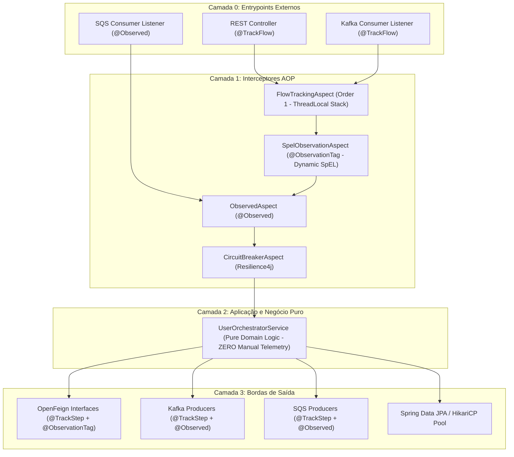

# Especificação Técnica de Extração: Spring Boot Starter Observability
## Arquitetura de Observabilidade Não-Intrusiva, Decomposição Matemática de Fluxos e Telemetria de Bordas

---

## 📋 Sumário Executivo

Esta especificação técnica detalha a arquitetura, o racional de engenharia, a análise do histórico evolutivo de commits e o plano completo para extração da camada de observabilidade do repositório `spring-observability-example` em um **Spring Boot Starter corporativo reutilizável** (`observability-spring-boot-starter`).

O objetivo principal desta arquitetura é fornecer **observabilidade de ponta a ponta (Métricas, Logs e Tracing Distribuído)** com **ZERO intrusão no código de negócio**. Toda a instrumentação é executada por interceptação transparente em bordas de comunicação (REST Controllers, Feign Clients, Kafka Consumers/Producers, SQS Listeners/Producers, Connection Pool HikariCP), garantindo que as classes de domínio e aplicação permaneçam puras, coesas e desacopladas de APIs de infraestrutura.

---

## 🔎 1. Análise Histórica dos Commits do Repositório

O repositório foi construído em uma sequência evolutiva clara, documentada em 3 commits principais:

### 1.1. Commit `b20c4ac`: Fundação da Arquitetura e scaffold de Observabilidade
- **Mensagem**: `feat: initial commit for spring-observability-example`
- **Escopo**:
  - Configuração do ecossistema base em Spring Boot 3.2.3, Java 21 e Spring Cloud 2023.0.0.
  - Setup de infraestrutura em Docker (`docker-compose.yml`): Prometheus, Jaeger OTLP, Grafana, LocalStack (SQS), Kafka/Zookeeper e WireMock.
  - Criação do `UserOrchestratorApplication`, controllers, services e DTOs.
  - Implementação inicial de integrações com OpenFeign (`CustomerClient`, `BillingClient`, `NotificationClient`), Kafka e AWS SQS.
  - Introdução pioneira das anotações de aspecto:
    - `@ObservationTag` e `@ObservationTags` com SpEL (`SpelObservationAspect`).
    - `LoggingObservationHandler` para ciclo de vida de observações.
    - Primeira versão de `TrackFlow`, `TrackStep` e `FlowContext`.
    - Primeira versão de `SqsMetricsBinder` e `KafkaLagMetricsBinder`.
  - Configuração de cenários de teste com WireMock (usuários `slow`, `error`, `flake`).
- **Diagnóstico das limitações do commit inicial**:
  - As métricas de latência para fatiamento de tela no Grafana ainda dependiam excessivamente de métricas genéricas de disjuntor (`resilience4j_circuitbreaker_calls_seconds`), as quais sofriam de contaminação cruzada quando um mesmo Feign client era consumido tanto por uma rota REST síncrona quanto por um consumidor assíncrono Kafka.
  - A medição de lag do Kafka não estava autoritativa em relação ao broker.
  - Os cards de Circuit Breakers no Grafana sofriam de truncamento visual de texto.

---

### 1.2. Commit `8956deb`: Decomposição Matemática de Latência por Entrypoint, Lag Autoritativo e Refinamento do Grafana
- **Mensagem**: `feat(observability): add flow-aware latency slicing per entrypoint, kafka lag binder, and comprehensive architecture docs`
- **Escopo**:
  - **Refatoração do `FlowContext`**: Implementação de uma pilha (`Deque<FlowContext>`) em `ThreadLocal`. Cada método anotado com `@TrackFlow` inicia um escopo isolado. Cada chamada anotada com `@TrackStep` soma seus nanos ao contexto. No fechamento (`complete`), calcula-se a fatia residual:
    $$\text{internalNanos} = \max(0, \text{totalNanos} - \sum \text{stepNanos})$$
    Isso gerou o fechamento matemático perfeito (100%) da latência do fluxo, isolando completamente o fluxo REST síncrono do fluxo do consumidor Kafka.
  - **`KafkaLagMetricsBinder`**: Refatorado para utilizar a API `AdminClient` do Apache Kafka, consultando offsets diretamente do cluster (`listConsumerGroupOffsets` + `listOffsets(latest)`). Isso tornou a medição de lag autoritativa, independente de commits locais do listener.
  - **`SqsMetricsBinder`**: Evoluído para consulta assíncrona agendada (`@Scheduled`) via `SqsAsyncClient` com registro de Gauges dinâmicos (`sqs.queue.depth`).
  - **Ergonomia do Dashboard**: Cards de Circuit Breaker redimensionados (`w: 8`), eliminando truncamento com reticências. Criação de dois gráficos de pizza isolados por entrypoint.
  - **Persistência Relacional & Engenharia de Caos**: Adição do PostgreSQL, Spring Data JPA, `DatabaseChaosController` e `DatabaseChaosService` com pool de conexões HikariCP restrito (`maximum-pool-size: 5`) para testes de `slow-query` e `exhaust-pool`.
  - **Documentação Arquitetural**: Criação formal dos ADRs (ADR 01 a 07 em `documentacao/DECISOES_ARQUITETURAIS_ADR.md`).

---

### 1.3. Commit `3f2e90d`: Enriquecimento da Documentação de Caos e Métricas HikariCP
- **Mensagem**: `docs: enrich database chaos scenarios and HikariCP metrics documentation`
- **Escopo**:
  - Documentação detalhada sobre o ciclo de vida e esgotamento do pool de conexões HikariCP.
  - Mapeamento das métricas `hikaricp_connections_active`, `hikaricp_connections_idle`, `hikaricp_connections_pending` e `hikaricp_connections_timeout_total` e sua correlação com falhas `SQLTransientConnectionException`.
  - Instruções de teste de estresse de banco com `curl`.

---

## 🏛️ 2. Filosofia Central: Observabilidade Não-Intrusiva em Camadas

O princípio que rege toda a implementação é: **A lógica de negócio deve ignorar a existência da infraestrutura de observabilidade**.

### 2.1. O Anti-Padrão que Evitamos
Em código corporativo tradicional, observa-se frequentemente serviços com o seguinte perfil:

```java
// ANTI-PADRÃO: Poluição com infraestrutura, acoplamento e ruído cognitivo
@Service
public class OrderService {
    @Autowired private MeterRegistry registry;
    @Autowired private Tracer tracer;
    @Autowired private Logger log;

    public OrderResponse processOrder(OrderRequest request) {
        log.info("Processing order for user: {}", request.getUserId());
        Span span = tracer.nextSpan().name("process-order").start();
        Timer.Sample sample = Timer.start(registry);
        
        try (Tracer.SpanInScope ws = tracer.withSpan(span)) {
            span.tag("user.id", request.getUserId());
            MDC.put("userId", request.getUserId());
            
            // Regra de negócio sufocada por código de telemetria...
            Order order = repository.save(...);
            
            sample.stop(registry.timer("order.process.time", "status", "SUCCESS"));
            return new OrderResponse(order);
        } catch (Exception e) {
            span.error(e);
            registry.counter("order.errors", "type", e.getClass().getSimpleName()).increment();
            throw e;
        } finally {
            span.end();
            MDC.clear();
        }
    }
}
```

### 2.2. O Padrão Adotado no Projeto
No projeto, o `UserOrchestratorService` é implementado da seguinte maneira:

```java
@Service
public class UserOrchestratorService {

    private final CustomerClient customerClient;
    private final BillingClient billingClient;
    private final NotificationClient notificationClient;
    private final KafkaUserProducer kafkaProducer;

    // Injeção de dependências estritamente de domínio/integração
    public UserOrchestratorService(...) { ... }

    @CircuitBreaker(name = "orchestrator", fallbackMethod = "orchestratorFallback")
    @Observed(name = "user.profile.provision", contextualName = "provision-user-profile")
    @ObservationTag(key = "userId", expression = "#userId", highCardinality = true)
    @ObservationTag(key = "flow", expression = "'provisioning'")
    @ObservationTag(key = "customer_plan", expression = "#result?.billing()?.plan()")
    public UserProfile fetchAndProvisionUserProfile(String userId) {
        
        CustomerDto customer = customerClient.getCustomerInfo(userId);
        BillingDto billing = billingClient.getBillingInfo(userId);

        NotificationResponse notificationResponse = notificationClient.sendNotification(
                Map.of("userId", userId, "message", "Profile accessed and provisioned for " + customer.name())
        );

        return new UserProfile(userId, customer, billing, notificationResponse.status());
    }
}
```

**Benefícios imediatos:**
1. **Legibilidade Máxima**: 100% das linhas do corpo do método são regras de negócio puras.
2. **Testabilidade Imbatível**: Não há necessidade de mockar `MeterRegistry`, `Tracer`, `Span`, `Timer.Sample` ou `ObservationRegistry` em testes unitários.
3. **Imunidade a Mudanças de Biblioteca**: Se a empresa migrar do Micrometer para OpenTelemetry Java SDK direto ou Micrometer 2, as regras de negócio permanecem inalteradas.

---

## 🔬 3. Deep-Dive nos Componentes de `observability/*`

### 3.1. Anotações `@ObservationTag` e `@ObservationTags`
- **Arquivo**: `com.gleidsonfersanp.observability.observability.ObservationTag`
- **Finalidade**: Anotar métodos para extrair dados contextuais em tempo de execução via expressões SpEL.
- **Assinatura**:
  - `String key()`: Nome da tag a ser registrada na observação.
  - `String expression()`: Expressão SpEL a ser avaliada. Suporta variáveis de argumentos de entrada (`#paramName`) e o resultado do método (`#result`).
  - `boolean highCardinality() default false`:
    - `false` (Low Cardinality): A tag é enviada para as métricas do Prometheus (ex: `billing_type=MONTHLY`). Deve ter valores limitados para evitar explosão de memória no banco de métricas.
    - `true` (High Cardinality): A tag é enviada exclusivamente para os spans de tracing distribuído no Jaeger/OTLP (ex: `userId=user-12345`).

### 3.2. Aspecto `SpelObservationAspect`
- **Arquivo**: `com.gleidsonfersanp.observability.observability.SpelObservationAspect`
- **Mecanismo de Execução**:
  1. Intercepta via `@Around` qualquer método anotado com `@ObservationTag` ou `@ObservationTags`.
  2. Obtém a observação corrente através de `observationRegistry.getCurrentObservation()`. Caso nenhuma observação esteja ativa (método não envolvido por `@Observed`), ignora e apenas prossegue a execução (`joinPoint.proceed()`).
  3. Constrói um `StandardEvaluationContext` e preenche as variáveis de parâmetros usando os nomes dos argumentos da assinatura do método (`signature.getParameterNames()`).
  4. **Fase 1 (Pré-execução)**: Avalia expressões que **não** contenham `#result` e aplica as tags na observação ativa antes da execução do método de negócio.
  5. Executa o método alvo (`joinPoint.proceed()`). Em caso de exceção, injeta a variável `#error` no contexto e propaga a exceção.
  6. **Fase 2 (Pós-execução)**: Injeta o objeto retornado sob o identificador `#result` e avalia as expressões restantes (ex: `#result?.billing()?.plan()`).
  7. **Resiliência e Tolerância a Falhas**: O parser do SpEL é isolado em bloco `try/catch`. Caso a expressão seja inválida ou um campo seja nulo e não tratado, um log de nível `WARN` é emitido, **sem jamais quebrar ou interromper a execução do método de negócio**.

### 3.3. Aspecto e Contexto de Decomposição: `TrackFlow`, `TrackStep`, `FlowContext` e `FlowTrackingAspect`
- **Arquivos**:
  - `com.gleidsonfersanp.observability.observability.flow.TrackFlow`
  - `com.gleidsonfersanp.observability.observability.flow.TrackStep`
  - `com.gleidsonfersanp.observability.observability.flow.FlowContext`
  - `com.gleidsonfersanp.observability.observability.flow.FlowTrackingAspect`

#### O Problema Matemático e Arquitetural
Em arquiteturas orientadas a microsserviços, dashboards do Grafana frequentemente exibem latências de clientes HTTP isolados (ex: `resilience4j_circuitbreaker_calls_seconds`). Porém:
1. **Contaminação de Contexto**: Se tanto o endpoint síncrono `GET /users/{userId}` quanto o consumidor assíncrono Kafka chamam o `customer-service`, as métricas de tempo do Feign se misturam. É impossível saber quanto tempo a API REST gastou versus o worker do Kafka.
2. **Inexistência de Fechamento Matemático (100%)**: Clientes HTTP medem apenas o tráfego de rede para fora da aplicação. O tempo gasto com desserialização JSON, execução de regras de negócio em CPU, validações e preparação de DTOs fica invisível. Um gráfico de pizza com métricas tradicionais nunca fecha em 100%.

#### A Solução do `FlowContext`
1. **Estrutura de Pilha em `ThreadLocal`**:
   ```java
   private static final ThreadLocal<Deque<FlowContext>> CURRENT_FLOW = ThreadLocal.withInitial(ArrayDeque::new);
   ```
   Permite suporte a fluxos aninhados ou chamadas recursivas reentrantes.
2. **`@TrackFlow("<Nome do Fluxo>")`**:
   - Aplicado exclusivamente nos pontos de entrada:
     - REST Controller: `@TrackFlow("GET /api/v1/orchestrator/users/{userId}")`
     - Kafka Consumer: `@TrackFlow("Kafka Consumer: user-registration-topic")`
   - O `FlowTrackingAspect` com `@Order(1)` intercepta o início do fluxo e registra `startNanos = System.nanoTime()`.
3. **`@TrackStep("<Nome da Fatia>")`**:
   - Aplicado nas interfaces e produtores de saída:
     - `CustomerClient`: `@TrackStep("API Customer (GET /customers/{userId})")`
     - `BillingClient`: `@TrackStep("API Billing (GET /billing/accounts/{userId})")`
     - `NotificationClient`: `@TrackStep("API Notificação (POST /notifications)")`
     - `KafkaUserProducer`: `@TrackStep("Publicação Kafka (...)")`
     - `SqsUserProducer`: `@TrackStep("Publicação SQS (...)")`
   - Mede o tempo de execução do passo e acumula na thread corrente via `FlowContext.recordStep(stepName, durationNanos)`.
4. **Fechamento e Emissão de Métricas**:
   No bloco `finally` do `@TrackFlow`, o método `FlowContext.complete(meterRegistry)` é disparado:
   - Mede $\text{totalNanos} = \text{System.nanoTime()} - \text{startNanos}$.
   - Itera por cada step registrado e publica o timer `flow_slice_duration_seconds{flow="...", step="..."}`.
   - Calcula a fatia residual de processamento interno:
     $$\text{internalNanos} = \max(0, \text{totalNanos} - \sum \text{stepNanos})$$
   - Publica o timer `flow_slice_duration_seconds{flow="...", step="Processamento Interno & Regras"}`.
   - Publica o timer total `flow_total_duration_seconds{flow="..."}`.
   - **Garantia contra Memory Leak**: Remove a referência da thread corrente com `CURRENT_FLOW.remove()` assim que a pilha atinge o estado vazio.

### 3.4. Monitoramento Autoritativo de Lag Kafka (`KafkaLagMetricsBinder`)
- **Arquivo**: `com.gleidsonfersanp.observability.observability.KafkaLagMetricsBinder`
- **Problema Abordado**: Os listeners Kafka nativos do Spring expõem métricas locais que dependem de mensagens ativas sendo processadas. Se o consumidor parar de consumir ou a thread travar, as métricas podem não refletir o acúmulo real de mensagens represadas no broker.
- **Implementação**:
  - Implementa `MeterBinder` do Micrometer.
  - Constrói uma instância dedicada de `AdminClient` a partir das configurações do `KafkaAdmin`.
  - Em uma thread daemon de pool agendado (`scheduleAtFixedRate`), executa a cada 5 segundos:
    1. `adminClient.listConsumerGroupOffsets(group)` para obter o offset commitado pelo grupo de consumidores.
    2. `adminClient.listOffsets(requestOffsets)` com `OffsetSpec.latest()` para obter o último offset gravado nas partições do broker.
    3. Calcula o lag real por partição:
       $$\text{Lag} = \text{Offset}_{\text{broker}} - \text{Offset}_{\text{consumer}}$$
    4. Atualiza um `AtomicLong` registrado como `Gauge` no Micrometer sob a métrica `kafka_consumer_lag_records{topic="...", group="..."}`.

### 3.5. Descoberta Dinâmica de Filas SQS (`SqsMetricsBinder`)
- **Arquivo**: `com.gleidsonfersanp.observability.observability.SqsMetricsBinder`
- **Problema Abordado**: Evitar hardcode de nomes de filas SQS no código de monitoramento e garantir suporte dinâmico a novas filas sem necessidade de restart da aplicação.
- **Implementação**:
  - Implementa `MeterBinder` do Micrometer.
  - Injeta o `SqsAsyncClient` e faz cache das URLs das filas consultadas.
  - Executa periodicamente a consulta de atributos das filas via `GetQueueAttributesRequest` para a métrica `APPROXIMATE_NUMBER_OF_MESSAGES`.
  - Registra Gauges dinâmicos sob `sqs.queue.depth{queue="..."}`.

### 3.6. Ciclo de Vida e Log Estruturado (`LoggingObservationHandler`)
- **Arquivo**: `com.gleidsonfersanp.observability.observability.LoggingObservationHandler`
- **Implementação**:
  - Implementa `ObservationHandler<Observation.Context>`.
  - Registra automaticamente entradas e saídas de observações com `log.info("Starting operation: {}", context.getName())` e `log.info("Finished operation: {}", context.getName())`.
  - Em caso de falha, captura o erro com `log.error("Error in operation: {}", context.getName(), context.getError())`.
  - Mantém o MDC e os identificadores de tracing sincronizados com o logger.

### 3.7. Subsistema de Alarmística e Notificações Não-Intrusivas (`observability/alerting`)
- **Arquivos**:
  - `AlertDispatcher.java`
  - `AlertEvent.java`
  - `AlertNotifier.java`
  - `AlertSeverity.java` (`INFO`, `WARNING`, `CRITICAL`)
  - `AlertType.java` (`CIRCUIT_BREAKER_OPEN`, `CIRCUIT_BREAKER_DEGRADED`, `FLOW_LATENCY_SLA_BREACH`, etc.)
  - `AlertingProperties.java` (`app.observability.alerting.*`)
  - `CircuitBreakerAlertListener.java`
  - `LogAlertNotifier.java`
  - `WebhookAlertNotifier.java`
- **Mecanismos de Ação**:
  1. **Detecção Reativa via Resilience4j**: `CircuitBreakerAlertListener` implementa `RegistryEventConsumer<CircuitBreaker>`. Quando qualquer disjuntor do sistema abre ou entra em modo meio-aberto, um `AlertEvent` é gerado sem qualquer código no controller ou Feign.
  2. **Detecção Proativa de Violação de SLA de Latência**: O `FlowTrackingAspect` compara o tempo de cada `@TrackStep` e de cada `@TrackFlow` com os limites definidos em `AlertingProperties.getThresholdForStep()` e `AlertingProperties.getThresholdForFlow()`. Ao violar o SLA, despacha imediatamente um alerta `FLOW_LATENCY_SLA_BREACH` ou `INTEGRATION_LATENCY_SLA_BREACH`.
  3. **Métrica e Rastreabilidade**: O `AlertDispatcher` emite a métrica Prometheus `alerts_triggered_total{type="...", severity="...", target="..."}` e mantém um buffer circular dos últimos 100 incidentes.
  4. **Multi-Canal Extensível**: Suporta múltiplos `AlertNotifier` (log estruturado, webhooks para Slack/Teams/PagerDuty) de forma plugável via injeção de dependência.

---

## 🎯 4. Interceptação nas Bordas Arquiteturais

A observabilidade foi desenhada em anéis de interceptação:



---

## 📦 5. Especificação Técnica para o Spring Boot Starter

Esta seção constitui a especificação formal que um Agente de IA ou Engenheiro de Plataforma deve seguir para extrair a implementação em um starter corporativo independente.

### 5.1. Nomenclatura e Coordenadas Maven
- **GroupId**: `com.empresa.framework.observability`
- **ArtifactId**: `observability-spring-boot-starter`
- **Versão Inicial**: `1.0.0`
- **Compatibilidade**: Spring Boot `3.2.x+`, Spring Cloud `2023.0.x+`, Java `21+`

### 5.2. Estrutura Modular Recomendada

Para seguir as melhores práticas do Spring Boot, o projeto deve ser dividido em 2 submódulos Maven:
1. `observability-spring-boot-autoconfigure`: Contém toda a lógica, classes de aspecto, binders e classes `@AutoConfiguration`.
2. `observability-spring-boot-starter`: Módulo agregador que importa o autoconfigure e as dependências essenciais de runtime.

```
observability-spring-boot-starter/
├── pom.xml (Parent Multi-módulo)
├── observability-spring-boot-autoconfigure/
│   ├── pom.xml
│   └── src/main/java/com/empresa/framework/observability/autoconfigure/
│       ├── flow/
│       │   ├── TrackFlow.java
│       │   ├── TrackStep.java
│       │   ├── FlowContext.java
│       │   ├── FlowTrackingAspect.java
│       │   └── ObservabilityFlowProperties.java
│       ├── spel/
│       │   ├── ObservationTag.java
│       │   ├── ObservationTags.java
│       │   ├── SpelObservationAspect.java
│       │   └── ObservabilitySpelProperties.java
│       ├── logging/
│       │   ├── LoggingObservationHandler.java
│       │   └── ObservabilityLoggingProperties.java
│       ├── kafka/
│       │   ├── KafkaLagMetricsBinder.java
│       │   └── ObservabilityKafkaLagProperties.java
│       ├── sqs/
│       │   ├── SqsMetricsBinder.java
│       │   └── ObservabilitySqsProperties.java
│       └── ObservabilityAutoConfiguration.java
│   └── src/main/resources/
│       └── META-INF/
│           └── spring/
│               └── org.springframework.boot.autoconfigure.AutoConfiguration.imports
└── observability-spring-boot-starter/
    ├── pom.xml (POM agregador de dependências)
```

---

### 5.3. Estratégia de Dependências: `provided` vs `optional`

O starter **não deve forçar** que a aplicação consumidora tenha Kafka, AWS SQS ou OpenFeign se ela for apenas uma API REST simples com banco de dados.

| Dependência | Escopo no Autoconfigure | Condição de Ativação no Spring |
| :--- | :--- | :--- |
| `spring-boot-starter-actuator` | `compile` | Obrigatório |
| `spring-boot-starter-aop` | `compile` | Obrigatório |
| `io.micrometer:micrometer-observation` | `compile` | Obrigatório |
| `io.micrometer:micrometer-core` | `compile` | Obrigatório |
| `org.springframework.kafka:spring-kafka` | `provided` / `optional` | Ativa somente se `KafkaAdmin` e `AdminClient` estiverem presentes |
| `io.awspring.cloud:spring-cloud-aws-starter-sqs` | `provided` / `optional` | Ativa somente se `SqsAsyncClient` estiver presente |
| `org.springframework.cloud:spring-cloud-starter-openfeign` | `provided` / `optional` | Suporte a `@FeignClient` |
| `io.github.resilience4j:resilience4j-spring-boot3` | `provided` / `optional` | Suporte a disjuntores |

---

### 5.4. Classes de Propriedades de Configuração (`@ConfigurationProperties`)

As propriedades devem permitir controle granular de cada recurso com prefixo padronizado `management.observability`:

```java
@ConfigurationProperties(prefix = "management.observability")
public class ObservabilityProperties {

    private boolean enabled = true;
    private final Flow flow = new Flow();
    private final Spel spel = new Spel();
    private final KafkaLag kafkaLag = new KafkaLag();
    private final Sqs sqs = new Sqs();
    private final Logging logging = new Logging();

    public static class Flow {
        private boolean enabled = true;
        private String internalProcessStepName = "Processamento Interno & Regras";
        // getters e setters
    }

    public static class Spel {
        private boolean enabled = true;
        // getters e setters
    }

    public static class KafkaLag {
        private boolean enabled = true;
        private int pollIntervalSeconds = 5;
        private List<String> consumerGroups = new ArrayList<>();
        // getters e setters
    }

    public static class Sqs {
        private boolean enabled = true;
        private int pollDelayMillis = 10000;
        private List<String> queues = new ArrayList<>();
        // getters e setters
    }

    public static class Logging {
        private boolean enabled = true;
        // getters e setters
    }
}
```

---

### 5.5. Auto-Configurações Condicionais do Spring Boot 3

No Spring Boot 3, a auto-configuração é registrada em `META-INF/spring/org.springframework.boot.autoconfigure.AutoConfiguration.imports`:

```properties
com.empresa.framework.observability.autoconfigure.ObservabilityAutoConfiguration
com.empresa.framework.observability.autoconfigure.kafka.KafkaLagMetricsAutoConfiguration
com.empresa.framework.observability.autoconfigure.sqs.SqsMetricsAutoConfiguration
```

#### Exemplo: `ObservabilityAutoConfiguration.java`
```java
@AutoConfiguration
@ConditionalOnProperty(prefix = "management.observability", name = "enabled", havingValue = "true", matchIfMissing = true)
@EnableConfigurationProperties(ObservabilityProperties.class)
public class ObservabilityAutoConfiguration {

    @Bean
    @ConditionalOnMissingBean
    public ObservedAspect observedAspect(ObservationRegistry observationRegistry) {
        return new ObservedAspect(observationRegistry);
    }

    @Bean
    @ConditionalOnMissingBean
    @ConditionalOnProperty(prefix = "management.observability.spel", name = "enabled", havingValue = "true", matchIfMissing = true)
    public SpelObservationAspect spelObservationAspect(ObservationRegistry observationRegistry) {
        return new SpelObservationAspect(observationRegistry);
    }

    @Bean
    @ConditionalOnMissingBean
    @ConditionalOnProperty(prefix = "management.observability.flow", name = "enabled", havingValue = "true", matchIfMissing = true)
    public FlowTrackingAspect flowTrackingAspect(MeterRegistry meterRegistry, ObservabilityProperties properties) {
        return new FlowTrackingAspect(meterRegistry, properties.getFlow());
    }

    @Bean
    @ConditionalOnMissingBean
    @ConditionalOnProperty(prefix = "management.observability.logging", name = "enabled", havingValue = "true", matchIfMissing = true)
    public LoggingObservationHandler loggingObservationHandler() {
        return new LoggingObservationHandler();
    }
}
```

#### Exemplo: `KafkaLagMetricsAutoConfiguration.java`
```java
@AutoConfiguration
@ConditionalOnClass({AdminClient.class, KafkaAdmin.class})
@ConditionalOnBean(KafkaAdmin.class)
@ConditionalOnProperty(prefix = "management.observability.kafka-lag", name = "enabled", havingValue = "true", matchIfMissing = true)
public class KafkaLagMetricsAutoConfiguration {

    @Bean
    @ConditionalOnMissingBean
    public KafkaLagMetricsBinder kafkaLagMetricsBinder(KafkaAdmin kafkaAdmin, ObservabilityProperties properties) {
        return new KafkaLagMetricsBinder(kafkaAdmin, properties.getKafkaLag());
    }
}
```

#### Exemplo: `SqsMetricsAutoConfiguration.java`
```java
@AutoConfiguration
@ConditionalOnClass(SqsAsyncClient.class)
@ConditionalOnBean(SqsAsyncClient.class)
@ConditionalOnProperty(prefix = "management.observability.sqs", name = "enabled", havingValue = "true", matchIfMissing = true)
public class SqsMetricsAutoConfiguration {

    @Bean
    @ConditionalOnMissingBean
    public SqsMetricsBinder sqsMetricsBinder(SqsAsyncClient sqsAsyncClient, ObservabilityProperties properties) {
        return new SqsMetricsBinder(sqsAsyncClient, properties.getSqs());
    }
}
```

---

### 5.6. Guia Passo a Passo para o Agente de IA Executar a Extração

Quando um Agente de IA for encarregado de realizar a extração deste starter, ele deve executar os seguintes passos rigorosos:

1. **Passo 1: Criar Repositório/Módulo Dedicado**:
   - Inicializar a estrutura Maven padrão para starters com módulo `autoconfigure` e `starter`.
2. **Passo 2: Migrar Anotações e Aspectos de Core**:
   - Copiar `ObservationTag`, `ObservationTags`, `SpelObservationAspect`.
   - Copiar `TrackFlow`, `TrackStep`, `FlowContext`, `FlowTrackingAspect`.
   - Garantir que as anotações pertençam ao pacote canônico da biblioteca (ex: `com.empresa.framework.observability.annotation`).
3. **Passo 3: Tornar os Componentes Configuráveis**:
   - Substituir literais hardcoded (ex: `"Processamento Interno & Regras"`, grupos de consumidores Kafka, tempos de poll) por atributos injetados via `@ConfigurationProperties`.
4. **Passo 4: Configurar Proteções Condicionais**:
   - Anotar todas as classes com `@ConditionalOnProperty`, `@ConditionalOnClass`, `@ConditionalOnMissingBean` para evitar que a ausência de uma biblioteca opcional (como Kafka ou SQS) impeça a inicialização de uma aplicação simples.
5. **Passo 5: Registrar no `AutoConfiguration.imports`**:
   - Criar o arquivo `META-INF/spring/org.springframework.boot.autoconfigure.AutoConfiguration.imports` contendo as classes `@AutoConfiguration`.
6. **Passo 6: Implementar Testes com `ApplicationContextRunner`**:
   - Escrever testes automatizados no starter utilizando `ApplicationContextRunner` para garantir que:
     - Os beans são criados quando habilitados.
     - Os beans são ignorados quando a propriedade `.enabled=false`.
     - Beans customizados da aplicação substituem os padrões via `@ConditionalOnMissingBean`.
7. **Passo 7: Validação no Projeto Exemplo (`spring-observability-example`)**:
   - Remover as classes de `com.gleidsonfersanp.observability.observability.*`.
   - Adicionar a dependência do novo `observability-spring-boot-starter`.
   - Executar `mvn clean test` e disparar o `massive_load.py` para verificar se os gráficos no Grafana continuam funcionando identicamente.

---

## 📊 6. Especificação das Métricas Exportadas e Consultas PromQL

O starter exporta o seguinte catálogo canônico de métricas para o Prometheus:

| Métrica | Tipo | Tags Principais | Descrição |
| :--- | :--- | :--- | :--- |
| `flow_slice_duration_seconds` | Timer | `flow`, `step` | Duração de cada etapa/integração e do processamento interno dentro de um entrypoint. |
| `flow_total_duration_seconds` | Timer | `flow` | Duração total de ponta a ponta do fluxo. |
| `kafka_consumer_lag_records` | Gauge | `topic`, `group` | Lag real do consumidor medido diretamente no broker Kafka. |
| `sqs.queue.depth` | Gauge | `queue` | Quantidade aproximada de mensagens visíveis na fila SQS. |
| `hikaricp_connections_active` | Gauge | `pool` | Conexões ativas em uso por transações no banco de dados. |
| `hikaricp_connections_pending` | Gauge | `pool` | Threads aguardando liberação de conexão no pool. |
| `hikaricp_connections_timeout_total` | Counter | `pool` | Total de falhas por estouro de `connection-timeout`. |

### Consultas PromQL Canônicas para Dashboards
- **Gráfico de Pizza 100% por Entrypoint**:
  ```promql
  sum(rate(flow_slice_duration_seconds_sum{flow="$FLOW_NAME"}[1m])) by (step)
  ```
- **Latência Média End-to-End**:
  ```promql
  sum(rate(flow_total_duration_seconds_sum{flow="$FLOW_NAME"}[1m]))
  /
  sum(rate(flow_total_duration_seconds_count{flow="$FLOW_NAME"}[1m]))
  ```
- **Taxa de Erro por Integração Externa**:
  ```promql
  sum(rate(resilience4j_circuitbreaker_calls_seconds_count{kind="failed"}[1m])) by (name)
  /
  (sum(rate(resilience4j_circuitbreaker_calls_seconds_count{kind="successful"}[1m])) by (name)
   + sum(rate(resilience4j_circuitbreaker_calls_seconds_count{kind="failed"}[1m])) by (name)) * 100
  ```

---

## 🏆 7. Conclusão

Esta arquitetura demonstra que é plenamente viável construir uma observabilidade corporativa sofisticada, precisa e matematicamente correta sem comprometer o design de software orientado a domínio. A extração dessa implementação para um Spring Boot Starter permitirá que dezenas de microsserviços herdem essa capacidade de forma plug-and-play, elevando o padrão de confiabilidade e monitoramento de toda a organização.
