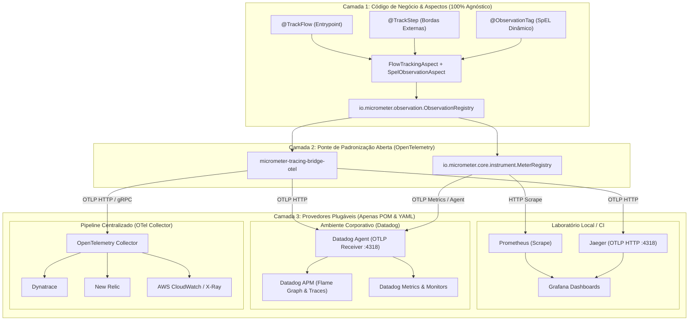

# Guia de Abstração de Provedores de Observabilidade (Vendor-Neutral Architecture)
## Como Alternar Transparentemente entre Prometheus/Jaeger, Datadog, Dynatrace, New Relic e OTel Collector

---

## 🎯 1. Visão Geral e Filosofia Arquitetural

Em ambientes corporativos modernos, a camada de observabilidade enfrenta um desafio recorrente: **como permitir que desenvolvedores testem a telemetria completa em ambientes locais (usando ferramentas gratuitas e de código aberto como Prometheus, Jaeger e Grafana) e, ao mesmo tempo, garantir que a mesma aplicação opere nativamente com plataformas corporativas de mercado (como Datadog, Dynatrace, New Relic ou AWS X-Ray), sem alterar uma única linha de código Java?**

A arquitetura desenvolvida neste projeto adota o **Padrão Facade de Três Camadas** do Spring Boot 3, baseado na **Micrometer Observation API** e no padrão aberto **OpenTelemetry (OTel)**.



---

## 🧩 2. Os Quatro Princípios do Desacoplamento

### Princípio 1: Zero Imports de Fornecedor no Código
Nenhuma classe dentro do pacote `src/main/java` importa classes de pacotes como `io.prometheus.*`, `io.jaegertracing.*` ou `com.datadoghq.*`. Toda a instrumentação depende estritamente das interfaces do Spring e Micrometer:
- `io.micrometer.observation.Observation`
- `io.micrometer.observation.ObservationRegistry`
- `io.micrometer.core.instrument.MeterRegistry`
- `io.micrometer.core.instrument.Timer`
- `io.micrometer.core.instrument.Counter`

### Princípio 2: Separação Rigorosa de Cardinalidade
O Micrometer Observation divide atributos em duas categorias fundamentais:
1. **Baixa Cardinalidade (`lowCardinalityKeyValue`)**:
   - Dados com conjunto finito e previsível de valores (ex: `flow="GET /users/{userId}"`, `step="API Billing"`, `client="billing"`, `status="FAILED"`).
   - Esses pares chave-valor são enviados **tanto para as métricas (Prometheus / Datadog Metrics) quanto para os spans de tracing**.
   - Evita a temida explosão de séries temporais (*cardinality explosion*) nos bancos de séries temporais.
2. **Alta Cardinalidade (`highCardinalityKeyValue`)**:
   - Dados de granularidade fina com valores infinitos ou únicos (ex: `userId="usr-98124"`, `orderId="ord-5512"`, `error.message="Connection timed out calling http://billing:8081"`).
   - Esses pares chave-valor são enviados **exclusivamente para os spans de tracing distribuído (Jaeger, Datadog APM)**, onde o volume de dados não degrada índices de métricas.

### Princípio 3: Ciclo de Vida Único para Traces e Métricas
Em vez de um desenvolvedor precisar criar um `Timer.start()` para medir o tempo e simultaneamente criar um `tracer.nextSpan()` para o tracing, uma única `Observation`:
- Inicia o timer de métrica;
- Inicia o span distribuído;
- Propaga o contexto de tracing via cabeçalhos W3C Trace Context (`traceparent`);
- Em caso de exceção (`observation.error(t)`), carimba o span com o erro e incrementa contadores de falha de métrica simultaneamente.

### Princípio 4: Configuração Dirigida por Ambiente (12-Factor App)
A escolha do backend de destino é feita exclusivamente via propriedades no `application.yml` ou variáveis de ambiente injetadas no container (`OTEL_EXPORTER_OTLP_ENDPOINT`, `MANAGEMENT_OTLP_TRACING_ENDPOINT`).

---

## 🛠️ 3. Guia Detalhado de Configuração por Provedor

Abaixo apresentamos as receitas completas de configuração para cada provedor.

---

### Provedor 1: Ambiente Local & Open-Source (Prometheus + Jaeger + Grafana)

Este é o ambiente já configurado e em execução neste repositório.

#### 1. Dependências no `pom.xml`:
```xml
<!-- Actuator para expor endpoints de métricas e health -->
<dependency>
    <groupId>org.springframework.boot</groupId>
    <artifactId>spring-boot-starter-actuator</artifactId>
</dependency>

<!-- Micrometer Observation Core -->
<dependency>
    <groupId>io.micrometer</groupId>
    <artifactId>micrometer-observation</artifactId>
</dependency>

<!-- Ponte OpenTelemetry para Tracing -->
<dependency>
    <groupId>io.micrometer</groupId>
    <artifactId>micrometer-tracing-bridge-otel</artifactId>
</dependency>

<!-- Exportador OTLP padrão -->
<dependency>
    <groupId>io.opentelemetry</groupId>
    <artifactId>opentelemetry-exporter-otlp</artifactId>
</dependency>

<!-- Registro do Prometheus para raspagem (Scraping) -->
<dependency>
    <groupId>io.micrometer</groupId>
    <artifactId>micrometer-registry-prometheus</artifactId>
</dependency>
```

#### 2. Configuração no `application.yml`:
```yaml
management:
  endpoints:
    web:
      exposure:
        include: "health,info,prometheus,metrics"
  tracing:
    sampling:
      probability: 1.0 # 100% das requisições tracejadas para testes locais
  otlp:
    tracing:
      # Envia spans via HTTP/JSON ou protobuf para o container do Jaeger
      endpoint: http://localhost:4318/v1/traces
```

#### 3. Integração de Exemplars no Grafana (`datasource.yml`):
Permite que o desenvolvedor clique em um ponto de pico de latência ou erro no gráfico do Prometheus e o Grafana abra diretamente a árvore do trace do Jaeger correspondente:
```yaml
apiVersion: 1

datasources:
  - name: Prometheus
    type: prometheus
    access: proxy
    url: http://prometheus:9090
    isDefault: true
    jsonData:
      exemplarTraceIdDestinations:
        - name: trace_id
          datasourceUid: jaeger-traces

  - name: Jaeger
    uid: jaeger-traces
    type: jaeger
    access: proxy
    url: http://jaeger:16686
    jsonData:
      nodeGraph:
        enabled: true
```

---

### Provedor 2: Datadog (Padrão Corporativo Recomendado via Datadog Agent OTLP)

O Datadog suporta nativamente o padrão OpenTelemetry. A partir do **Datadog Agent v7.35+**, o agente possui receptores OTLP embutidos nas portas `4318` (HTTP) e `4317` (gRPC).

Esta é a abordagem mais elegante e moderna, pois **não adiciona nenhuma biblioteca proprietária da Datadog à sua aplicação Spring Boot**.

#### 1. Dependências no `pom.xml`:
Exatamente as mesmas do OpenTelemetry padrão:
```xml
<dependency>
    <groupId>io.micrometer</groupId>
    <artifactId>micrometer-tracing-bridge-otel</artifactId>
</dependency>
<dependency>
    <groupId>io.opentelemetry</groupId>
    <artifactId>opentelemetry-exporter-otlp</artifactId>
</dependency>
<dependency>
    <groupId>io.micrometer</groupId>
    <artifactId>micrometer-registry-prometheus</artifactId>
</dependency>
```

#### 2. Configuração no `application.yml`:
```yaml
management:
  tracing:
    sampling:
      probability: 1.0 # Em produção pode ser reduzido (ex: 0.1 ou 0.2)
  otlp:
    tracing:
      # Aponta para o Datadog Agent rodando como Sidecar no Pod ou DaemonSet no Host
      endpoint: http://${DD_AGENT_HOST:localhost}:4318/v1/traces
```

#### 3. Configuração no Datadog Agent (`datadog.yaml` ou Variáveis de Ambiente no Kubernetes):
Para que o Datadog Agent receba os traces OTLP da sua aplicação, basta habilitar o receptor:
```yaml
# No datadog.yaml do agente:
otlp_config:
  receiver:
    protocols:
      http:
        endpoint: 0.0.0.0:4318
      grpc:
        endpoint: 0.0.0.0:4317
```
No Kubernetes, via Helm ou env vars:
```yaml
env:
  - name: DD_OTLP_CONFIG_RECEIVER_PROTOCOLS_HTTP_ENDPOINT
    value: "0.0.0.0:4318"
```

#### 4. Coleta de Métricas pelo Datadog Agent:
O Datadog Agent pode raspar automaticamente o endpoint `/actuator/prometheus` da aplicação via Autodiscovery annotations no Kubernetes:
```yaml
apiVersion: apps/v1
kind: Deployment
metadata:
  name: user-orchestrator
spec:
  template:
    metadata:
      annotations:
        ad.datadoghq.com/user-orchestrator.check_names: '["openmetrics"]'
        ad.datadoghq.com/user-orchestrator.init_configs: '[{}]'
        ad.datadoghq.com/user-orchestrator.instances: |
          [
            {
              "openmetrics_endpoint": "http://%%host%%:8080/actuator/prometheus",
              "namespace": "orchestrator",
              "metrics": [
                "flow_slice_duration_seconds*",
                "flow_total_duration_seconds*",
                "flow_interruption_total*",
                "alerts_triggered_total*",
                "resilience4j_circuitbreaker*"
              ]
            }
          ]
```

#### 5. Como a Interrupção Aparece no Datadog APM:
- O `@TrackFlow` cria o Root Span (ex: `flow.orchestrator.get-user`).
- Cada `@TrackStep` cria um Child Span (ex: `step.api-billing`).
- Em caso de falha no `BillingClient`:
  - O span `step.api-billing` no **Datadog Flame Graph** aparece em **vermelho escuro** com o badge `Error`.
  - A aba *Error Details* exibe:
    - `error.type`: `com.gleidsonfersanp.observability.shared.IntegrationServerException`
    - `error.message`: `Server error from external service: BillingClient#getBillingInfo`
    - `failed_step`: `API Billing (GET /billing/accounts/{userId})`
  - No dashboard do Datadog, o widget Top List da métrica `flow_interruption_total` exibe imediatamente qual step foi o responsável pela queda.

---

### Provedor 3: Datadog via Registry Direto (`micrometer-registry-datadog`)

Se a sua empresa não utiliza o Datadog Agent para raspar Prometheus e prefere que a aplicação faça *push* direto de métricas para a API pública da Datadog:

#### 1. Dependência no `pom.xml`:
```xml
<dependency>
    <groupId>io.micrometer</groupId>
    <artifactId>micrometer-registry-datadog</artifactId>
</dependency>
```

#### 2. Configuração no `application.yml`:
```yaml
management:
  datadog:
    metrics:
      export:
        enabled: true
        api-key: ${DD_API_KEY}
        application-key: ${DD_APP_KEY}
        uri: https://api.datadoghq.com # ou https://api.datadoghq.eu para Europa
        step: 10s
        descriptions: true
```
*Observação*: As métricas são enviadas periodicamente em lote para a Datadog. As tags de baixa cardinalidade (`flow`, `step`, `failed_step`, `severity`) tornam-se tags nativas na Datadog (`flow:GET /users/{userId}`, `step:API Billing`).

---

### Provedor 4: Dynatrace / New Relic via OTLP (Padrão Enterprise)

Se a sua empresa migrar para Dynatrace ou New Relic amanhã, o procedimento é rigorosamente idêntico ao do Datadog:

#### No Dynatrace:
Basta apontar o endpoint OTLP para o OneAgent ou ActiveGate:
```yaml
management:
  otlp:
    tracing:
      endpoint: https://${DYNATRACE_TENANT}.live.dynatrace.com/api/v2/otlp/v1/traces
      headers:
        Authorization: "Api-Token ${DT_INGEST_TOKEN}"
```

#### No New Relic:
```yaml
management:
  otlp:
    tracing:
      endpoint: https://otlp.nr-data.net:4318/v1/traces
      headers:
        api-key: ${NEW_RELIC_LICENSE_KEY}
```

---

### Provedor 5: OpenTelemetry Collector (A Estratégia Centralizadora)

Em grandes corporações, a aplicação frequentemente não se conecta diretamente a nenhum fornecedor. Ela envia todos os dados via OTLP para um **OpenTelemetry Collector** central, e o Collector roteia simultaneamente para os destinos configurados pela equipe de plataforma.

#### No Spring Boot:
```yaml
management:
  otlp:
    tracing:
      endpoint: http://otel-collector:4318/v1/traces
```

#### No `otel-collector-config.yaml`:
```yaml
receivers:
  otlp:
    protocols:
      http:
        endpoint: 0.0.0.0:4318

exporters:
  datadog:
    api:
      key: ${env:DD_API_KEY}
      site: datadoghq.com
  prometheus:
    endpoint: 0.0.0.0:8889
  otlp/jaeger:
    endpoint: jaeger:4317
    tls:
      insecure: true

service:
  pipelines:
    traces:
      receivers: [otlp]
      exporters: [datadog, otlp/jaeger]
    metrics:
      receivers: [otlp]
      exporters: [datadog, prometheus]
```

---

## 📊 4. Matriz Comparativa de Capacidades por Fornecedor

| Recurso de Observabilidade | Implementação no Código | Prometheus + Jaeger | Datadog APM & Metrics | Dynatrace / New Relic |
| :--- | :--- | :--- | :--- | :--- |
| **Ponto Exato de Interrupção** | `FlowContext.recordInterruption` | Métrica `flow_interruption_total` no Grafana | Facet `failed_step` no Datadog Dashboards | Service Flow Breakdown no Dynatrace |
| **Fatias de Latência do Fluxo** | `@TrackStep` e `FlowContext` | Timers `flow_slice_duration_seconds` (Pizza) | Metric Math / Heatmap no Datadog | Response Time Breakdown |
| **Detecção de Queda de Disjuntor** | `CircuitBreakerAlertListener` | Gauge `resilience4j_circuitbreaker_state` | Monitor / Alert Event no Datadog Events | Problem Incident Detection |
| **Árvore de Spans (Waterfall)** | `ObservationRegistry` via OTel | UI do Jaeger / Grafana Tracing | Flame Graph / Trace Timeline | PurePath / Distributed Tracing |
| **Link Métrica -> Trace** | Exemplars com `trace_id` | Pontos azuis no gráfico do Grafana | Trace-to-Metric correlação nativa | Drilldown automático |
| **Metadados de Negócio Dinâmicos** | `@ObservationTag` com SpEL | Tags no Trace Jaeger / Prometheus | Tags no Span / Facets filtráveis | Span Attributes / Metadata |

---

## 🏆 5. Diretrizes para a Extração do Spring Boot Starter

Para que o **Agent de IA** garanta a abstração total de fornecedor ao criar o `observability-spring-boot-starter`:

1. **Dependências do Módulo Core**:
   - `io.micrometer:micrometer-observation` (Obrigatória)
   - `io.micrometer:micrometer-core` (Obrigatória)
   - `spring-boot-starter-aop` (Obrigatória)
   - `io.micrometer:micrometer-tracing-bridge-otel` (Obrigatória para tracing)
   - `io.opentelemetry:opentelemetry-exporter-otlp` (Obrigatória para exportação padrão)
2. **Dependências Proibidas no Starter Core**:
   - ❌ `micrometer-registry-prometheus`
   - ❌ `micrometer-registry-datadog`
   - ❌ `dd-trace-java`
   - ❌ `jaeger-client`
3. **Módulos Opcionais / Starters Específicos**:
   Se a organização desejar, ela pode criar agregadores do tipo:
   - `observability-spring-boot-starter-local`: Importa o starter core + `micrometer-registry-prometheus`.
   - `observability-spring-boot-starter-datadog`: Importa o starter core + `micrometer-registry-datadog` (ou apenas a configuração OTLP).
