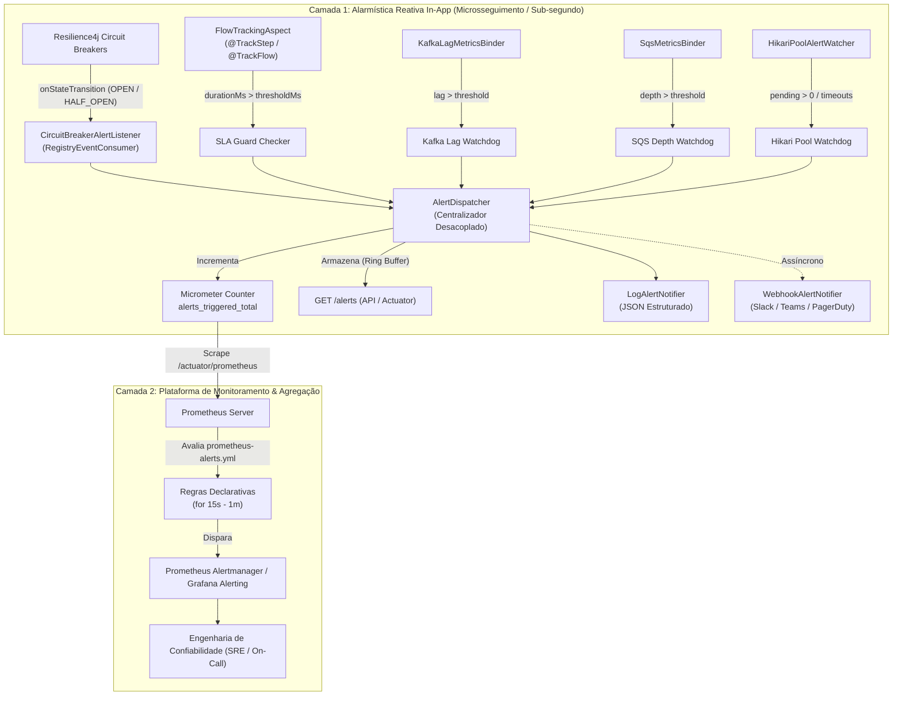

# Guia de Alarmística, SLAs e Detecção de Incidentes

Este documento detalha o desenho da solução de **Alarmística Não-Intrusiva** desenvolvida no projeto, explicando sua fundamentação teórica, a estrutura em duas camadas (In-App Reativa e Plataforma Prometheus) e como extrair essa abstração para um **Spring Boot Starter corporativo** reutilizável em múltiplos microsserviços.

---

## 🎯 1. O Desafio em Arquiteturas Corporativas

Em sistemas distribuídos com dezenas ou centenas de microsserviços, a alarmística frequentemente falha por dois extremos:
1. **Acoplamento Extremo (Poluição de Domínio)**: Desenvolvedores inserem chamadas condicionais manuais de envio de alertas (e-mail, webhook, Slack) dentro das classes de serviço de negócio, criando acoplamento com canais externos e tornando o código ilegível e frágil.
2. **Dependência Exclusiva de Agregação Lenta (Only-Prometheus)**: Confiar unicamente na raspagem do Prometheus (scrape interval de 15s a 60s) e na janela de avaliação do Alertmanager (for 1m a 5m) significa que incidentes críticos (como um disjuntor abrindo ou esgotamento de pool de banco) demoram até vários minutos para serem notificados, além de perderem metadados contextuais da JVM (ID da transação, tenant, exceção exata).

---

## 🏛️ 2. A Solução: Arquitetura em Duas Camadas

Para resolver esses desafios com o mais alto nível de engenharia, a alarmística foi desenhada em **duas camadas complementares que operam de forma não-intrusiva**:



---

## 🧩 3. Detalhamento dos Componentes da Abstração

Toda a lógica está isolada no pacote [`com.gleidsonfersanp.observability.observability.alerting`](file:///Users/gleidsonfersanp/workspace/spring-observability-example/src/main/java/com/gleidsonfersanp/observability/observability/alerting):

### 3.1. Modelo Canônico de Evento (`AlertEvent`)
Estrutura imutável que padroniza todos os tipos de alerta emitidos por qualquer componente:
- `alertId`: Identificador único (UUID).
- `timestamp`: Momento exato da ocorrência (`Instant`).
- `type`: Categoria semântica (`CIRCUIT_BREAKER_OPEN`, `INTEGRATION_LATENCY_SLA_BREACH`, etc.).
- `severity`: Severidade operacional (`INFO`, `WARNING`, `CRITICAL`).
- `source`: Módulo emissor (`Resilience4j`, `FlowStep`, `KafkaLagBinder`, `HikariPool`).
- `target`: Recurso afetado (`customer-service`, `API Customer`, `user-audit-queue`, `observability-hikari-pool`).
- `currentValue` e `thresholdValue`: Dados numéricos da medição vs tolerância.
- `metadata`: Mapa livre de atributos de diagnóstico (taxa de erro, states, delta, etc.).

---

### 3.2. Interceptador Global de Disjuntores (`CircuitBreakerAlertListener`)
- **Implementação**: Implementa a SPI `RegistryEventConsumer<CircuitBreaker>` do Resilience4j.
- **Como Funciona**: O Spring Boot registra automaticamente o consumidor no `CircuitBreakerRegistry`. Sempre que **qualquer** disjuntor da aplicação (atual ou adicionado no futuro) muda de estado, o callback `onStateTransition` é acionado:
  - `CLOSED -> OPEN`: Dispara imediatamente alerta **CRITICAL** informando a taxa de falha e bloqueio de tráfego.
  - `OPEN -> HALF_OPEN`: Dispara alerta **WARNING** informando início do período de teste de recuperação.
  - `HALF_OPEN -> CLOSED`: Dispara alerta **INFO** confirmando a autocura do serviço.
- **Invasão de Código**: **ZERO**. Nenhuma linha em Feign clients ou controllers.

---

### 3.3. SLA Guard nas Bordas (`FlowTrackingAspect`)
- **Integração com `@TrackStep` e `@TrackFlow`**:
  Ao interceptar o fim da chamada externa (no `finally`), o aspecto compara o tempo decorrido com as propriedades de SLA configuradas no `application.yml`:
  ```java
  long stepDurationMs = TimeUnit.NANOSECONDS.toMillis(duration);
  long stepThresholdMs = alertingProperties.getThresholdForStep(trackStep.value());
  if (stepDurationMs > stepThresholdMs) {
      alertDispatcher.dispatch(AlertEvent.of(
          AlertType.INTEGRATION_LATENCY_SLA_BREACH,
          AlertSeverity.WARNING,
          "FlowStep",
          trackStep.value(),
          ...
      ));
  }
  ```
- **Invasão de Código**: **ZERO**. As interfaces continuam declarativas e o `UserOrchestratorService` nem sabe que SLAs existem.

---

### 3.4. Watchdogs de Infraestrutura (Kafka, SQS e Banco)
1. **Kafka Lag Watchdog** ([`KafkaLagMetricsBinder`](file:///Users/gleidsonfersanp/workspace/spring-observability-example/src/main/java/com/gleidsonfersanp/observability/observability/KafkaLagMetricsBinder.java)):
   Ao consultar o `AdminClient` periodicamente, se o lag do consumidor ultrapassar `kafkaLagThreshold` (ex: 80 msgs), um alerta é emitido com estrangulamento de 30 segundos (evitando tempestade de notificações).
2. **SQS Depth Watchdog** ([`SqsMetricsBinder`](file:///Users/gleidsonfersanp/workspace/spring-observability-example/src/main/java/com/gleidsonfersanp/observability/observability/SqsMetricsBinder.java)):
   Ao obter os atributos da fila, se `APPROXIMATE_NUMBER_OF_MESSAGES` ultrapassar `sqsDepthThreshold` (ex: 40 msgs), um alerta é disparado.
3. **HikariCP Pool Starvation** ([`HikariPoolAlertWatcher`](file:///Users/gleidsonfersanp/workspace/spring-observability-example/src/main/java/com/gleidsonfersanp/observability/observability/alerting/HikariPoolAlertWatcher.java)):
   Monitora a fila de espera do pool (`hikaricp.connections.pending`) e a ocorrência de novos timeouts (`hikaricp.connections.timeout.total`). Dispara alerta **CRITICAL** se threads estiverem bloqueadas aguardando conexão.

---

### 3.5. Despachante Central e Notificadores Pluggáveis
O [`AlertDispatcher`](file:///Users/gleidsonfersanp/workspace/spring-observability-example/src/main/java/com/gleidsonfersanp/observability/observability/alerting/AlertDispatcher.java):
1. Registra no Micrometer a métrica dimensional:
   $$\text{alerts\_triggered\_total}\{\text{type}, \text{severity}, \text{target}\}$$
2. Armazena os últimos 100 alertas em memória, acessíveis via endpoint `GET /api/v1/orchestrator/alerts`.
3. Repassa para todas as instâncias da interface [`AlertNotifier`](file:///Users/gleidsonfersanp/workspace/spring-observability-example/src/main/java/com/gleidsonfersanp/observability/observability/alerting/AlertNotifier.java):
   - [`LogAlertNotifier`](file:///Users/gleidsonfersanp/workspace/spring-observability-example/src/main/java/com/gleidsonfersanp/observability/observability/alerting/LogAlertNotifier.java): Gera logs formatados com tags `[ALERT-CRITICAL]` para agregadores de log.
   - [`WebhookAlertNotifier`](file:///Users/gleidsonfersanp/workspace/spring-observability-example/src/main/java/com/gleidsonfersanp/observability/observability/alerting/WebhookAlertNotifier.java): Dispara requisições HTTP assíncronas para webhooks corporativos (Slack, Teams, PagerDuty).

---

## ⚙️ 4. Configuração Declarativa (`application.yml`)

As regras de alarme e thresholds são configuradas centralizadamente sem necessidade de compilar código:

```yaml
app:
  observability:
    alerting:
      enabled: true
      webhookUrl: "https://hooks.slack.com/services/..." # Opcional
      defaultStepSlaMs: 1000
      defaultFlowSlaMs: 2000
      kafkaLagThreshold: 80
      sqsDepthThreshold: 40
      hikariPendingThreshold: 1
      stepSlaMs:
        "API Customer (GET /customers/{userId})": 500
        "API Billing (GET /billing/accounts/{userId})": 500
        "API Notificação (POST /notifications)": 500
        "Publicação Kafka (user-registration-topic)": 300
        "Publicação SQS (user-audit-queue)": 300
      flowSlaMs:
        "GET /api/v1/orchestrator/users/{userId}": 1000
        "Kafka Consumer: user-registration-topic": 2000
```

---

## 📢 5. Regras Declarativas de Plataforma no Prometheus (`prometheus-alerts.yml`)

O arquivo [`prometheus-alerts.yml`](file:///Users/gleidsonfersanp/workspace/spring-observability-example/prometheus-alerts.yml) está montado no contêiner do Prometheus e avalia a saúde agregada da frota:

| Nome do Alerta | Expressão PromQL | For | Severidade | Ação Esperada |
| :--- | :--- | :--- | :--- | :--- |
| `CircuitBreakerOpen` | `resilience4j_circuitbreaker_state{state="open"} == 1` | 15s | Critical | Investigar serviço dependente imediatamente |
| `CircuitBreakerDegraded` | `resilience4j_circuitbreaker_state{state="half_open"} == 1` | 30s | Warning | Acompanhar recuperação |
| `IntegrationStepLatencyHigh` | `sum(rate(flow_slice_duration_seconds_sum[1m])) by (flow, step) / sum(rate(flow_slice_duration_seconds_count[1m])) by (flow, step) > 1.2` | 30s | Warning | Analisar gargalo na fatia |
| `FlowE2ELatencyHigh` | `sum(rate(flow_total_duration_seconds_sum[1m])) by (flow) / sum(rate(flow_total_duration_seconds_count[1m])) by (flow) > 2.5` | 30s | Critical | Violação de SLA de cliente |
| `KafkaConsumerLagCritical` | `kafka_consumer_lag_records > 80` | 45s | Critical | Escalar instâncias do consumidor |
| `SqsQueueBacklogHigh` | `sqs_queue_depth > 40` | 1m | Warning | Avaliar taxa de consumo de filas |
| `DatabasePoolStarvation` | `hikaricp_connections_pending > 0 or rate(hikaricp_connections_timeout_total[1m]) > 0` | 15s | Critical | Investigar locks ou slow queries no banco |
| `InAppReactiveAlertsSpike` | `sum(rate(alerts_triggered_total[1m])) by (type, severity) > 0.05` | 15s | Warning | Incidentes frequentes detectados in-app |

---

## 📦 6. Como Transformar em um Starter Corporativo Reutilizável

Para disponibilizar essa mesma abstração para **todas as outras aplicações** da empresa, a estrutura deve ser empacotada em um módulo Maven/Gradle independente:

### Passo a Passo de Extração:
1. **Criar o módulo `enterprise-observability-spring-boot-starter`**:
   - Conter o pacote `observability.flow` (`@TrackFlow`, `@TrackStep`, `FlowContext`, `FlowTrackingAspect`).
   - Conter o pacote `observability.alerting` (`AlertDispatcher`, `CircuitBreakerAlertListener`, `HikariPoolAlertWatcher`, etc.).
   - Conter o aspecto SpEL `@ObservationTag`.
2. **Auto-Configuration (`spring.factories` ou `org.springframework.boot.autoconfigure.AutoConfiguration.imports`)**:
   ```
   com.enterprise.observability.autoconfig.ObservabilityAutoConfiguration
   ```
3. **Nas aplicações cliente**:
   Basta adicionar uma única dependência no `pom.xml`:
   ```xml
   <dependency>
       <groupId>com.enterprise</groupId>
       <artifactId>enterprise-observability-spring-boot-starter</artifactId>
       <version>1.0.0</version>
   </dependency>
   ```
   E configurar os SLAs desejados no `application.yml` de cada aplicação.
   **Nenhum código de infraestrutura precisará ser rescrito!**
