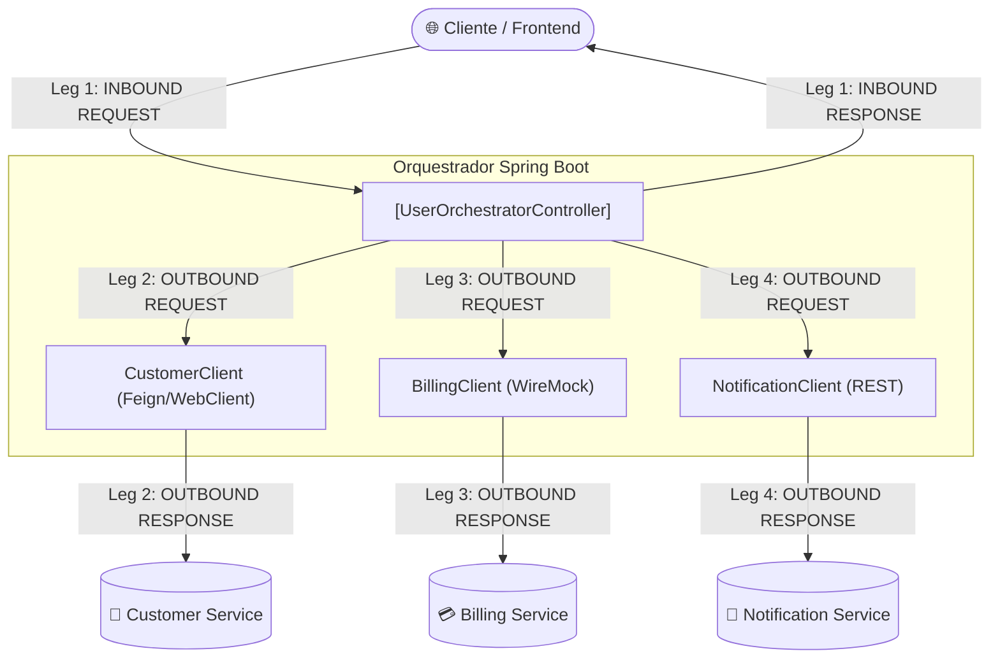

# 📜 Guia de Pernas de Execução (Legs), Auditoria e Mascaramento SpEL com Grafana Loki

Este documento detalha a arquitetura, motivação, implementação técnica e guia operacional do mecanismo de **Legs (Pernas de Comunicação)**, auditoria de payloads (Request/Response) e **mascaramento dinâmico de dados sensíveis via SpEL** (*Spring Expression Language*), integrados nativamente com **Grafana Loki**.

---

## 1. O Conceito de Pernas de Execução (Legs)

### 1.1 O que é uma "Leg"?
Em sistemas distribuídos modernos (microsserviços, orquestradores e sistemas transacionais), uma única transação de negócio (uma requisição HTTP ou o consumo de um evento Kafka) raramente é executada isoladamente. Ela geralmente orquestra múltiplos saltos de rede:
- Consultas a microsserviços terceiros via REST/gRPC.
- Leituras e escritas em bancos de dados relacionais ou NoSQL.
- Produção e consumo de mensagens em filas e tópicos (Kafka, SQS, RabbitMQ).
- Chamadas para gateways de pagamento ou bureaus de crédito.

Uma **Leg** (ou *Perna de Comunicação/Execução*) representa **um segmento bem delimitado de entrada, saída ou processamento interno** dentro do ciclo de vida de uma transação.



### 1.2 Por que o rastreamento por Legs é crucial?
1. **Auditoria Precisa de Acordos de Interface**: Saber exatamente o que foi enviado e o que foi recebido em cada fronteira do sistema.
2. **Diagnóstico Imediato de Causa Raiz**: Quando uma transação falha ou degrada, identificar imediatamente em qual perna o problema ocorreu (e.g., se o parceiro retornou 500 ou se o payload continha dados incorretos).
3. **Imputabilidade e Não-Repúdio**: Prova auditável de transações com parceiros externos ou clientes finais.
4. **Alinhamento com Tracing Distribuído**: Cada log de Leg carrega o mesmo `traceId` e `spanId`, unindo Métricas, Tracing e Logs estruturados em uma única visão correlacionada.

---

## 2. Tipos e Fases de Legs

### 2.1 Tipos de Leg (`LegType`)
- `INBOUND`: Requisições que entram no sistema (Controllers REST, ouvintes de mensageria SQS/Kafka, gRPC endpoints).
- `OUTBOUND`: Chamadas emitidas pelo sistema para dependências externas (HTTP Clients, banco de dados, produtores de mensageria).
- `INTERNAL`: Execução de blocos críticos ou subprocessos de negócio dentro do próprio domínio.

### 2.2 Fases de Leg (`LegPhase`)
- `REQUEST`: Momento imediatamente anterior ao processamento/disparo. Contém os parâmetros submetidos, headers ou corpo da requisição.
- `RESPONSE`: Momento imediatamente posterior ao processamento/retorno. Contém o status (`SUCCESS` ou `ERROR`), latência de execução (`durationMs`) e corpo retornado.

---

## 3. Arquitetura Não-Intrusiva e Zero Efeitos Colaterais

Seguindo a diretriz de **100% de isolamento entre regras de negócio e observabilidade**, o desenvolvedor de negócio **não escreve uma única linha de log ou mascaramento dentro dos seus Services**.

### 3.1 Pilha de Contexto de Pernas (`LegContext`)
O `LegContext` mantém uma pilha em `ThreadLocal` para rastrear a hierarquia e o índice sequencial das Legs na thread corrente:
- Transações iniciadas recebem `legNumber = 1`.
- Chamadas subsequentes dentro da mesma transação incrementam o contador sequencialmente (`legNumber = 2`, `3`, etc.).
- Permite identificar relações pai-filho (`parentLegNumber`).

### 3.2 Imutabilidade Absoluta do Domínio via Árvores Jackson (`JsonNode`)
Um dos riscos mais críticos ao mascarar dados em tempo de execução é **modificar acidentalmente o objeto DTO em memória** (e.g., fazer `user.setEmail("***")`), corrompendo a execução de negócios subsequente.

Nossa solução resolve isso com **Segurança Criptográfica de Estado**:
1. O objeto de negócio é serializado para uma árvore desvinculada `JsonNode` (Jackson `ObjectMapper`).
2. As expressões SpEL e máscaras são aplicadas **exclusivamente sobre os nós da árvore JSON em memória do logger**.
3. O objeto DTO em memória no Spring Application Context permanece **100% inalterado e íntegro**.

---

## 4. Mascaramento Dinâmico de Dados Sensíveis com SpEL

Em conformidade com a **LGPD** (*Lei Geral de Proteção de Dados*) e o padrão **PCI-DSS**, dados sensíveis (senhas, CPFs, tokens, cartões, dados biométricos, emails) jamais podem vazar em logs de auditoria.

### 4.1 A Anotação `@LogLeg` e `@MaskField`
A anotação `@LogLeg` é declarada nas fronteiras arquiteturais (Controllers, Clientes HTTP, Consumers):

```java
@Target({ElementType.METHOD, ElementType.TYPE})
@Retention(RetentionPolicy.RUNTIME)
public @interface LogLeg {
    String target();
    LegType type() default LegType.OUTBOUND;
    boolean includePayload() default true;
    MaskField[] mask() default {};
}
```

A anotação `@MaskField` define regras granulares via SpEL:
```java
@Retention(RetentionPolicy.RUNTIME)
public @interface MaskField {
    String spel(); // Expressão SpEL
    MaskPattern pattern() default MaskPattern.FULL_MASK;
    String customMask() default "";
}
```

### 4.2 Padrões de Mascaramento Pré-definidos (`MaskPattern`)
- `FULL_MASK`: Substitui todo o valor por `***REDACTED***`.
- `EMAIL_PARTIAL`: Preserva primeira letra, domínio e mascara o miolo (ex.: `john.doe@example.com` ➔ `j***e@example.com`).
- `CPF_PARTIAL`: Preserva 3 primeiros dígitos e dígitos verificadores (ex.: `123.456.789-00` ➔ `123.***.***-00`).
- `CARD_PARTIAL`: Preserva primeiros 6 e últimos 4 dígitos (ex.: `4111111111111234` ➔ `4111-11**-****-1234`).
- `PASSWORD`: Substitui por `********`.
- `CUSTOM`: Aplica a string customizada definida em `customMask`.

### 4.3 Exemplos Práticos de Aplicação

#### No Controller REST (INBOUND):
```java
@GetMapping("/{userId}")
@LogLeg(
    target = "UserOrchestratorApi",
    type = LegType.INBOUND,
    mask = {
        @MaskField(spel = "#result?.email", pattern = MaskPattern.EMAIL_PARTIAL),
        @MaskField(spel = "#result?.password", pattern = MaskPattern.PASSWORD)
    }
)
public ResponseEntity<UserProfileDto> getUserProfile(@PathVariable String userId) { ... }
```

#### No Cliente de Integração HTTP (OUTBOUND):
```java
@Component
public class CustomerClient {

    @LogLeg(
        target = "customer-service",
        type = LegType.OUTBOUND,
        mask = {
            @MaskField(spel = "#result?.email", pattern = MaskPattern.EMAIL_PARTIAL),
            @MaskField(spel = "#result?.cpf", pattern = MaskPattern.CPF_PARTIAL)
        }
    )
    public CustomerDto getCustomer(String userId) { ... }
}
```

```java
@Component
public class BillingClient {

    @LogLeg(
        target = "billing-service",
        type = LegType.OUTBOUND,
        mask = {
            @MaskField(spel = "#result?.plan", pattern = MaskPattern.FULL_MASK)
        }
    )
    public BillingDto getBillingInfo(String userId) { ... }
}
```

---

## 5. Plataforma de Logs: Grafana Loki & Logback

### 5.1 Por que Grafana Loki?
Optamos pelo **Grafana Loki** como a plataforma oficial de logs pelos seguintes diferenciais arquiteturais:
1. **Indexação Baseada em Labels (Similar ao Prometheus)**: Em vez de indexar o texto completo (como o Elasticsearch/OpenSearch), o Loki indexa apenas os metadados de stream (`app`, `leg_target`, `leg_type`, `leg_phase`, `level`). Isso reduz os custos de CPU e armazenamento em mais de **80%**.
2. **Integração Nativa com Grafana**: Permite criar dashboards unificados contendo Métricas (Prometheus), Tracing (Jaeger) e Logs (Loki) no mesmo painel.
3. **Poderosa Linguagem LogQL**: Permite filtrar logs, parsear JSON dinamicamente, extrair métricas de logs e calcular percentis de latência em tempo real.
4. **Derived Fields (Logs ➔ Traces)**: O Loki mapeia automaticamente campos de texto como `traceId` para o datasource do Jaeger, permitindo saltar de um log de falha diretamente para o gráfico em cascata de tracing com um único clique.

### 5.2 Arquitetura de Ingestão: Loki4j Direct Push
Em ambientes de laboratório e nuvem conteinerizada, evitamos a complexidade de agentes adicionais no host (*Promtail* ou *Fluentbit*) utilizando o **`loki-logback-appender`** (`com.github.loki4j:loki-logback-appender:1.5.1`):
- O appender envia lotes de logs assincronamente via HTTP POST (`http://loki:3100/loki/api/v1/push`).
- Não bloqueia a thread de execução do Spring.
- Injeta labels do MDC (*Mapped Diagnostic Context*) diretamente nas streams do Loki.

### 5.3 Configuração Padronizada do `logback-spring.xml` (Multi-Perfil e Não-Bloqueante)
O arquivo `logback-spring.xml` implementa o padrão corporativo com separação de perfis para ambiente de desenvolvimento local (`!container & !prod`) e ambientes em nuvem/contêiner (`container | prod`), além de appenders assíncronos (`AsyncAppender`) para eliminar sobrecarga de I/O nas threads da aplicação:

```xml
<?xml version="1.0" encoding="UTF-8"?>
<configuration scan="true" scanPeriod="30 seconds">
    <include resource="org/springframework/boot/logging/logback/defaults.xml"/>

    <!-- Propriedades do Contexto Spring -->
    <springProperty scope="context" name="APP_NAME" source="spring.application.name" defaultValue="user-orchestrator"/>
    <springProperty scope="context" name="LOKI_URL" source="app.observability.loki.url" defaultValue="http://localhost:3100/loki/api/v1/push"/>

    <!-- 1. Appender Loki (Push direto HTTP assíncrono para Loki) -->
    <appender name="LOKI" class="com.github.loki4j.logback.Loki4jAppender">
        <http>
            <url>${LOKI_URL}</url>
        </http>
        <format>
            <label>
                <pattern>app=${APP_NAME},level=%level,leg_type=%X{leg_type:-none},leg_target=%X{leg_target:-none},leg_phase=%X{leg_phase:-none}</pattern>
            </label>
            <message>
                <pattern>{"timestamp":"%d{yyyy-MM-dd'T'HH:mm:ss.SSS'Z',UTC}","level":"%level","logger":"%logger","correlation_id":"%X{correlation_id:-none}","traceId":"%X{traceId:-}","spanId":"%X{spanId:-}","leg_number":"%X{leg_number:-}","leg_parent":"%X{leg_parent:-}","leg_type":"%X{leg_type:-}","leg_phase":"%X{leg_phase:-}","leg_target":"%X{leg_target:-}","leg_duration_ms":"%X{leg_duration_ms:-}","leg_status":"%X{leg_status:-}","message":"%msg"}</pattern>
            </message>
        </format>
    </appender>

    <!-- 2. Perfil Local/Dev (!container & !prod): Console Colorido com [cid] e [traceId,spanId] -->
    <springProfile name="!container &amp; !prod">
        <appender name="CONSOLE_SYNC" class="ch.qos.logback.core.ConsoleAppender">
            <encoder>
                <pattern>%clr(%d{yyyy-MM-dd HH:mm:ss.SSS}){faint} %clr(%5p) %clr(---){faint} %clr([%15.15t]){faint} %clr(%-40.40logger{39}){cyan} %clr(:){faint} [cid=%X{correlation_id:-none}] [%X{traceId:-},%X{spanId:-}] %m%n%wEx</pattern>
                <charset>UTF-8</charset>
            </encoder>
        </appender>

        <appender name="ASYNC_CONSOLE" class="ch.qos.logback.classic.AsyncAppender">
            <appender-ref ref="CONSOLE_SYNC"/>
            <queueSize>512</queueSize>
            <discardingThreshold>0</discardingThreshold>
            <neverBlock>false</neverBlock>
            <includeCallerData>false</includeCallerData>
        </appender>

        <root level="INFO">
            <appender-ref ref="ASYNC_CONSOLE"/>
            <appender-ref ref="LOKI"/>
        </root>
    </springProfile>

    <!-- 3. Perfil Nuvem/Container/Prod (container | prod): JSON Estruturado Mono-linha -->
    <springProfile name="container | prod">
        <appender name="JSON_CONSOLE_SYNC" class="ch.qos.logback.core.ConsoleAppender">
            <encoder class="ch.qos.logback.classic.encoder.PatternLayoutEncoder">
                <pattern>{"timestamp":"%d{yyyy-MM-dd'T'HH:mm:ss.SSSXXX,UTC}","app":"${APP_NAME}","level":"%p","thread":"%t","logger":"%logger","correlation_id":"%X{correlation_id:-none}","traceId":"%X{traceId:-}","spanId":"%X{spanId:-}","leg_number":"%X{leg_number:-}","leg_parent":"%X{leg_parent:-}","leg_type":"%X{leg_type:-}","leg_phase":"%X{leg_phase:-}","leg_target":"%X{leg_target:-}","leg_duration_ms":"%X{leg_duration_ms:-}","leg_status":"%X{leg_status:-}","message":"%replace(%m){'[\r\n\t]', ' '}","exception":"%replace(%wEx){'[\r\n\t]', ' '}"}%n</pattern>
                <charset>UTF-8</charset>
            </encoder>
        </appender>

        <appender name="ASYNC_JSON_CONSOLE" class="ch.qos.logback.classic.AsyncAppender">
            <appender-ref ref="JSON_CONSOLE_SYNC"/>
            <queueSize>1024</queueSize>
            <discardingThreshold>0</discardingThreshold>
            <neverBlock>false</neverBlock>
            <includeCallerData>false</includeCallerData>
        </appender>

        <root level="INFO">
            <appender-ref ref="ASYNC_JSON_CONSOLE"/>
            <appender-ref ref="LOKI"/>
        </root>
    </springProfile>

    <!-- 4. Níveis de Log Padronizados -->
    <logger name="org.springframework.web" level="INFO"/>
    <logger name="org.apache.kafka" level="WARN"/>
    <logger name="org.hibernate" level="WARN"/>
    <logger name="com.zaxxer.hikari" level="INFO"/>
    <logger name="io.awspring.cloud.sqs" level="INFO"/>
    <logger name="com.gleidsonfersanp.observability" level="DEBUG"/>
    <logger name="AUDIT_LEG_LOGGER" level="INFO"/>
</configuration>
```


---

## 6. Catálogo de Queries LogQL para Investigação Operacional

### 6.1 Stream de Auditoria Completo de Pernas (Live Tail)
Exibe todos os logs estruturados emitidos pelos interceptores de pernas de comunicação:
```logql
{app="user-orchestrator", leg_type=~"INBOUND|OUTBOUND"}
```

### 6.2 Filtrando Legs com Falhas ou Status de Erro
Isola instantaneamente chamadas a parceiros ou endpoints que retornaram erro:
```logql
{app="user-orchestrator", leg_type="OUTBOUND", leg_phase="RESPONSE"} | json | leg_status = "ERROR"
```

### 6.3 Localizando Transação por TraceID Específico
Quando uma métrica ou alerta aponta para um `traceId`:
```logql
{app="user-orchestrator"} |= "df40eb21a32dcb4d76fa4987022d30dd"
```

### 6.4 Calculando Volume de Requisições por Perna e Alvo (Log-derived Metric)
Calcula a taxa por segundo de chamadas processadas para cada parceiro externo:
```logql
sum(rate({app="user-orchestrator", leg_target!="none"}[1m])) by (leg_target, leg_phase)
```

### 6.5 Percentil 95 (P95) de Latência Extraído dos Logs
Calcula a latência das pernas de saída utilizando o campo `durationMs` impresso no JSON:
```logql
quantile_over_time(0.95, {app="user-orchestrator", leg_type="OUTBOUND", leg_phase="RESPONSE"} | json | unwrap leg_duration_ms [1m]) by (leg_target)
```

---

## 7. Painéis no Grafana Master Dashboard

O dashboard `Observability Master Dashboard` (`obs-master`) foi expandido com três novos painéis dedicados:

1. **Painel 18 — 📜 Live Stream de Logs das Legs (Loki & Auditoria de Payloads Mascarados)**:
   - Visualização: `logs`.
   - Consulta LogQL: `{app="user-orchestrator", leg_type=~"INBOUND|OUTBOUND"}`.
   - Recursos: Wrap de mensagens, detalhes JSON expansíveis e link direto do `traceId` para o Jaeger.

2. **Painel 19 — 📊 Volume de Pernas de Execução por Alvo e Fase**:
   - Visualização: `timeseries` / gráfico de linhas e áreas.
   - Consulta LogQL: `sum(count_over_time({app="user-orchestrator", leg_target!="none"}[1m])) by (leg_target, leg_phase)`.
   - Permite comparar o balanço entre requisições enviadas e respostas recebidas por serviço integrado.

3. **Painel 20 — ⏱️ Latência por Perna de Comunicação (Métrica Log-derived via Loki / Prometheus)**:
   - Visualização: `timeseries`.
   - Exibe a média e percentil das latências das fatias de execução de cada perna.

### 📸 Evidência Visual no Grafana: Painéis 18, 19 e 20 (Loki Legs Stream, Volume e Latência)


### 📸 Evidência Visual no Grafana Loki Explore: Streams Estruturados e Rastreabilidade


---

## 8. Evidência Real de Execução (Logs Reais Capturados)

### 8.1 Invocação Inbound (Endpoint REST `/users/user1`)
```json
{
  "timestamp": "2026-09-29T12:02:32.180Z",
  "level": "INFO",
  "logger": "AUDIT_LEG_LOGGER",
  "traceId": "9b1c7a82e9d249f38f712534f3ad43e2",
  "spanId": "f784d14c2784cb12",
  "leg_number": "1",
  "leg_parent": "",
  "leg_type": "INBOUND",
  "leg_phase": "RESPONSE",
  "leg_target": "UserOrchestratorApi",
  "leg_duration_ms": "68",
  "leg_status": "SUCCESS",
  "message": "[LEG 1][INBOUND][RESPONSE] UserOrchestratorApi respondeu com sucesso em 68ms: {\"event\":\"LEG_RESPONSE\",\"legNumber\":1,\"type\":\"INBOUND\",\"phase\":\"RESPONSE\",\"target\":\"UserOrchestratorApi\",\"status\":\"SUCCESS\",\"durationMs\":68,\"response\":{\"userId\":\"user1\",\"name\":\"John Doe\",\"email\":\"j***e@example.com\",\"status\":\"ACTIVE\",\"plan\":\"***REDACTED***\"}}"
}
```
*Observe que `email` foi mascarado para `j***e@example.com` e `plan` para `***REDACTED***` sem que o controller precisasse alterar os objetos retornados.*

### 8.2 Invocação Outbound (Chamada ao `billing-service`)
```json
{
  "timestamp": "2026-09-29T12:02:32.215Z",
  "level": "INFO",
  "logger": "AUDIT_LEG_LOGGER",
  "traceId": "9b1c7a82e9d249f38f712534f3ad43e2",
  "spanId": "e938f9037a1f5921",
  "leg_number": "2",
  "leg_parent": "1",
  "leg_type": "OUTBOUND",
  "leg_phase": "RESPONSE",
  "leg_target": "billing-service",
  "leg_duration_ms": "14",
  "leg_status": "SUCCESS",
  "message": "[LEG 2][OUTBOUND][RESPONSE] billing-service respondeu com sucesso em 14ms: {\"event\":\"LEG_RESPONSE\",\"legNumber\":2,\"type\":\"OUTBOUND\",\"phase\":\"RESPONSE\",\"target\":\"billing-service\",\"status\":\"SUCCESS\",\"durationMs\":14,\"response\":{\"userId\":\"user1\",\"plan\":\"***REDACTED***\",\"status\":\"ACTIVE\"}}"
}
```

---

## 9. Guia de Portabilidade para o Starter Corporativo

Para exportar esse mecanismo para a biblioteca corporativa `spring-boot-starter-observability`:
1. Copie o pacote `com.gleidsonfersanp.observability.observability.leg` para o starter.
2. Registre `SpelMaskingService` e `LegLoggingAspect` na `@AutoConfiguration` sob a condicional `@ConditionalOnProperty(name = "observability.legs.enabled", matchIfMissing = true)`.
3. Ofereça propriedades de configuração em `ObservabilityLegsProperties`:
   - `observability.legs.include-payload=true`
   - `observability.legs.loki.enabled=true`
   - `observability.legs.default-mask-patterns.email=EMAIL_PARTIAL`
   - `observability.legs.default-mask-patterns.cpf=CPF_PARTIAL`
