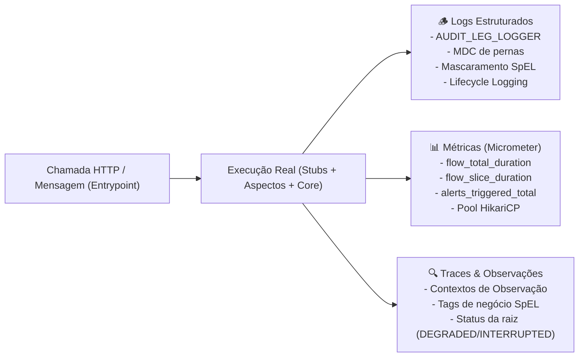

# Guia de Testes de Integração, E2E e Validação da Telemetria

Este guia documenta detalhadamente a estratégia, arquitetura e execução da suíte de **testes de integração robustos e testes de ponta a ponta (E2E)** do projeto `user-orchestrator`.

---

## 🎯 1. Filosofia: Stubs sobre Mocks

Em sistemas distribuídos e orientados a observabilidade, **mocks unitários convencionais (ex: Mockito) mascaram o comportamento real da telemetria**. Quando um método é "mockado":
- Não há serialização ou deserialização real de payloads JSON;
- O interceptor HTTP e os cabeçalhos de propagação de contexto (`traceparent`, `b3`) não são transmitidos;
- As métricas de rede do cliente Feign (`http.client.requests`) não são registradas com precisão;
- As pernas de comunicação estruturadas (`@LogLeg`) e o mascaramento LGPD não são acionados nas bordas de I/O reais;
- Os tempos de resposta e timeouts de rede não exercitam os disjuntores da Resilience4j.

Por essa razão, adotamos o princípio de **Stubs Reais sobre Mocks**:

| Componente | Abordagem Tradicional (Evitada) | Nossa Abordagem com Stubs / Componentes Reais |
| :--- | :--- | :--- |
| **Bordas HTTP Feign** | `@MockBean CustomerClient` | **WireMock Server na rede local** servindo contratos JSON idênticos aos de produção com atrasos e códigos HTTP reais. |
| **Banco de Dados Relacional** | `@MockBean TransactionRepository` | **H2 Database relacional real em memória**, com pool físico **HikariCP**, Hibernate JPA e dialeto SQL real. |
| **Pool de Conexões (HikariCP)**| Mocks do DataSource | **Pool real de 5 conexões**, submetido a estresse com threads concorrentes bloqueadas em `dataSource.getConnection()`. |
| **Mensageria Assíncrona** | Mocks de produtores/consumidores | **Templates e binders reais**, validando registro de métricas de decomposição, tags de tópico e alarmística. |
| **Métricas & Registros** | Classes mock de métricas | **`SimpleMeterRegistry` / `PrometheusMeterRegistry` real**, inspecionando timers, tags, gauges e contadores. |
| **Traces & Observações** | Mocks de Observation | **`ObservationRegistry` real** com handlers de ciclo de vida e inspeção de chaves de alta e baixa cardinalidade. |
| **Coleta de Logs** | `System.out` ou ausência de teste | **`ListAppender<ILoggingEvent>` do Logback em memória**, capturando e auditando cada linha gerada na chamada. |

---

## 🔬 2. A Tríade de Telemetria Validada nos Testes

Cada teste de ponta a ponta exercita um entrypoint da API e valida rigorosamente os três pilares da observabilidade:



### 2.1. Logs Estruturados e Auditoria de Pernas (`@LogLeg`)
Nos testes, adicionamos um `ListAppender<ILoggingEvent>` ao logger raiz do Logback:
1. **Logs de Ciclo de Vida da Observação**: Verificamos que o [`LoggingObservationHandler`](file:///Users/gleidsonfersanp/workspace/spring-observability-example/src/main/java/com/gleidsonfersanp/observability/observability/LoggingObservationHandler.java) emite `Starting operation: ...` e `Finished operation: ...`.
2. **Auditoria de Pernas (Legs)**: Comprovamos a sequência exata de saltos no `AUDIT_LEG_LOGGER`:
   - `[LEG 1][INBOUND][REQUEST]`
   - `[LEG 2][OUTBOUND][REQUEST]` e `[LEG 2][OUTBOUND][RESPONSE]`
   - `[LEG 3][OUTBOUND][REQUEST]` e `[LEG 3][OUTBOUND][RESPONSE]`
   - `[LEG 4][OUTBOUND][REQUEST]` e `[LEG 4][OUTBOUND][RESPONSE]`
   - `[LEG 1][INBOUND][RESPONSE]`
3. **MDC (Mapped Diagnostic Context)**: Validamos a presença das chaves:
   - `leg_number`, `leg_type` (`INBOUND` / `OUTBOUND`), `leg_target`, `leg_phase` (`REQUEST` / `RESPONSE`), `leg_status`, `leg_duration_ms`.
4. **Mascaramento de Dados LGPD**: Validamos que campos anotados com [`@MaskField`](file:///Users/gleidsonfersanp/workspace/spring-observability-example/src/main/java/com/gleidsonfersanp/observability/observability/leg/MaskField.java) aparecem mascarados no JSON da perna (ex: `j***e@example.com` ou `***REDACTED***`) e que o texto em claro **nunca** vaza para o log.

### 2.2. Decomposição Matemática de Latência (Métricas)
Comprovamos que a métrica do Micrometer decompõe a latência sem sobras ou arredondamentos ocultos:
$$\text{flow\_total\_duration\_seconds} \approx \sum \text{flow\_slice\_duration\_seconds(steps)} + \text{flow\_slice\_duration\_seconds(Processamento Interno \& Regras)}$$
O teste calcula a soma dos slices e afirma que a diferença para a duração total do fluxo é inferior a uma margem de tolerância (ex: $< 15\text{ms}$).

### 2.3. Contextos de Observação e Tags SpEL
Verificamos que as tags de negócio injetadas via [`@ObservationTag`](file:///Users/gleidsonfersanp/workspace/spring-observability-example/src/main/java/com/gleidsonfersanp/observability/observability/ObservationTag.java) sem poluição de código:
- Capturam argumentos de métodos (`#userId`, `#request.email()`);
- Capturam atributos do objeto de retorno (`#result?.billing()?.plan()`);
- Classificam adequadamente baixa cardinalidade (`observation.lowCardinalityKeyValue`) e alta cardinalidade (`observation.highCardinalityKeyValue`);
- Em caso de falha ou fallback, a observação raiz recebe tags de status (`flow.status=DEGRADED_FALLBACK` ou `flow.status=INTERRUPTED`).

---

## 📂 3. Catálogo das Suítes de Testes Implementadas

| Classe de Teste | Tipo | Escopo e Experimentos Provados |
| :--- | :--- | :--- |
| [`UserOrchestratorE2EObservabilityIntegrationTest`](file:///Users/gleidsonfersanp/workspace/spring-observability-example/src/test/java/com/gleidsonfersanp/observability/UserOrchestratorE2EObservabilityIntegrationTest.java) | **E2E / Integração** | Jornada síncrona completa (`GET /users/{userId}`), stubs de rede WireMock, sequência de 5 pernas de log, mascaramento de email/plano, decomposição de slices em 4 etapas e tags SpEL. |
| [`CircuitBreakerAndAlertingIntegrationTest`](file:///Users/gleidsonfersanp/workspace/spring-observability-example/src/test/java/com/gleidsonfersanp/observability/CircuitBreakerAndAlertingIntegrationTest.java) | **Integração** | Injeção de erros 500 no `billing-service`, transição de circuito `CLOSED -> OPEN`, execução de fallback, disparo do alerta `CIRCUIT_BREAKER_OPEN`, violação de SLA de latência (`INTEGRATION_LATENCY_SLA_BREACH`) e interrupção de fluxo (`FLOW_STEP_INTERRUPTION`). |
| [`DatabaseChaosAndHikariObservabilityIntegrationTest`](file:///Users/gleidsonfersanp/workspace/spring-observability-example/src/test/java/com/gleidsonfersanp/observability/DatabaseChaosAndHikariObservabilityIntegrationTest.java) | **Integração** | Operações CRUD no H2 real, métricas de conexões ativas/ociosas, saturação física do pool HikariCP com 8 threads simultâneas, detecção de threads pendentes pelo watchdog [`HikariPoolAlertWatcher`](file:///Users/gleidsonfersanp/workspace/spring-observability-example/src/main/java/com/gleidsonfersanp/observability/observability/alerting/HikariPoolAlertWatcher.java) e disparo de `DATABASE_POOL_STARVATION`. |
| [`AsyncMessagingFlowAndWatchdogsIntegrationTest`](file:///Users/gleidsonfersanp/workspace/spring-observability-example/src/test/java/com/gleidsonfersanp/observability/AsyncMessagingFlowAndWatchdogsIntegrationTest.java) | **E2E / Integração** | Entrypoint assíncrono (`POST /users`), retorno HTTP 202, log de perna mascarado, métricas de slice da publicação Kafka, alarmística dos watchdogs de Kafka Lag (`KAFKA_LAG_HIGH`), SQS Backlog (`SQS_BACKLOG_HIGH`) e repositório de auditoria SQS. |
| [`SpelObservationAspectIntegrationTest`](file:///Users/gleidsonfersanp/workspace/spring-observability-example/src/test/java/com/gleidsonfersanp/observability/SpelObservationAspectIntegrationTest.java) | **Integração** | Comportamento isolado do aspecto [`SpelObservationAspect`](file:///Users/gleidsonfersanp/workspace/spring-observability-example/src/main/java/com/gleidsonfersanp/observability/observability/SpelObservationAspect.java), extração pré e pós-execução, separação de cardinalidade, safe-navigation (`#result?.property`) e segurança contra falhas. |
| [`SpelMaskingServiceTest`](file:///Users/gleidsonfersanp/workspace/spring-observability-example/src/test/java/com/gleidsonfersanp/observability/SpelMaskingServiceTest.java) | **Unitário** | Algoritmos de mascaramento LGPD/PCI (`CPF`, `PASSWORD`, `CREDIT_CARD`, `EMAIL_PARTIAL`, `FULL_MASK`) e ciclo de vida da pilha LIFO de pernas em [`LegContext`](file:///Users/gleidsonfersanp/workspace/spring-observability-example/src/main/java/com/gleidsonfersanp/observability/observability/leg/LegContext.java). |

---

## 🚀 4. Como Executar os Testes

Os testes são **100% auto-contidos** e podem ser executados sem a necessidade de subir containers Docker previamente.

### 4.1. Execução de Toda a Suíte
No terminal, na raiz do projeto:
```bash
mvn test
```
**Resultado esperado:**
```text
[INFO] Results:
[INFO] 
[INFO] Tests run: 17, Failures: 0, Errors: 0, Skipped: 0
[INFO] 
[INFO] ------------------------------------------------------------------------
[INFO] BUILD SUCCESS
[INFO] ------------------------------------------------------------------------
```

### 4.2. Execução de uma Suíte Específica
Para executar apenas o teste de ponta a ponta da jornada síncrona:
```bash
mvn test -Dtest=UserOrchestratorE2EObservabilityIntegrationTest
```

Para executar os testes de caos e disjuntores:
```bash
mvn test -Dtest=CircuitBreakerAndAlertingIntegrationTest
```

Para executar os testes de estresse de banco e pool HikariCP:
```bash
mvn test -Dtest=DatabaseChaosAndHikariObservabilityIntegrationTest
```

Para executar os testes de mensageria assíncrona e watchdogs:
```bash
mvn test -Dtest=AsyncMessagingFlowAndWatchdogsIntegrationTest
```

### 4.3. Execução de um Método de Teste Específico
Exemplo: testando apenas a transição do disjuntor para `OPEN`:
```bash
mvn test -Dtest=CircuitBreakerAndAlertingIntegrationTest#circuitBreakerShouldOpenAndTriggerAlertWhenBillingFailsRepeatedly
```

---

## 🛠️ 5. Configuração e Isolamento de Ambiente nos Testes

Para garantir que a suíte execute com velocidade, sem colidir com portas de outros serviços locais e sem tentar enviar logs remotos caso o Loki ou Docker não estejam ativos, criamos configurações de teste dedicadas:

### 5.1. Logback Isolado para Testes (`src/test/resources/logback-test.xml`)
Elimina o appender de rede `Loki4jAppender` durante os testes (evitando exceções de recusa de conexão na porta 3100) e configura o formato estruturado do console e appenders em memória:
```xml
<configuration>
    <appender name="CONSOLE" class="ch.qos.logback.core.ConsoleAppender">
        <encoder>
            <pattern>%d{yyyy-MM-dd HH:mm:ss.SSS} [%thread] %-5level %logger{36} [%X{traceId:-},%X{spanId:-}] - %msg%n</pattern>
        </encoder>
    </appender>
    <root level="INFO">
        <appender-ref ref="CONSOLE"/>
    </root>
</configuration>
```

### 5.2. Propriedades de Teste (`src/test/resources/application-test.yml`)
- Porta aleatória para o servidor Web (`server.port: 0`);
- Delays de consumidores SQS/Kafka zerados para execução instantânea (`delay-ms: 0`);
- Listeners em background configurados para inicialização controlada (`auto-startup: false`), evitando que mensagens residuais de outros testes interfiram;
- Limiares de SLA ajustados para validações ágeis (ex: SLA de step em 500ms).

---

## 📝 6. Receita / Template: Como Criar Novos Testes de Observabilidade

Ao criar um novo endpoint, fluxo ou integração, siga este template padrão para comprovar a telemetria ponta a ponta:

```java
@SpringBootTest(webEnvironment = SpringBootTest.WebEnvironment.RANDOM_PORT)
@AutoConfigureMockMvc
@ActiveProfiles("test")
class NovoFluxoObservabilidadeIntegrationTest {

    private static WireMockServer wireMockServer;

    @Autowired
    private MockMvc mockMvc;

    @Autowired
    private MeterRegistry meterRegistry;

    @Autowired
    private AlertDispatcher alertDispatcher;

    private ListAppender<ILoggingEvent> logAppender;
    private Logger rootLogger;

    @BeforeAll
    static void startWireMock() {
        // Inicializa stub real de rede HTTP
        wireMockServer = new WireMockServer(WireMockConfiguration.options().dynamicPort());
        wireMockServer.start();
    }

    @AfterAll
    static void stopWireMock() {
        if (wireMockServer != null) wireMockServer.stop();
    }

    @DynamicPropertySource
    static void configureProperties(DynamicPropertyRegistry registry) {
        registry.add("app.integrations.novo-servico.url", wireMockServer::baseUrl);
    }

    @BeforeEach
    void setUp() {
        alertDispatcher.clearAlerts();
        rootLogger = (Logger) LoggerFactory.getLogger(Logger.ROOT_LOGGER_NAME);
        logAppender = new ListAppender<>();
        logAppender.start();
        rootLogger.addAppender(logAppender);
    }

    @AfterEach
    void tearDown() {
        if (rootLogger != null && logAppender != null) {
            rootLogger.detachAppender(logAppender);
        }
    }

    @Test
    @DisplayName("Deve validar a jornada completa, logs estruturados, mascaramento e decomposição de latência")
    void testNovoFluxoTelemetry() throws Exception {
        // 1. Configurar Stub no WireMock (resposta real)
        wireMockServer.stubFor(WireMock.get("/dados/123")
                .willReturn(WireMock.aResponse()
                        .withHeader("Content-Type", "application/json")
                        .withBody("{\"id\":\"123\", \"email\":\"teste@empresa.com\"}")));

        // 2. Chamar o entrypoint via MockMvc
        mockMvc.perform(get("/api/v1/novo-fluxo/123"))
                .andExpect(status().isOk());

        // 3. Asserção de Logs e Mascaramento
        List<String> logs = logAppender.list.stream().map(ILoggingEvent::getFormattedMessage).toList();
        assertThat(logs).anyMatch(l -> l.contains("[LEG 1][INBOUND][REQUEST]"));
        assertThat(logs).anyMatch(l -> l.contains("t***e@empresa.com")); // mascarado

        // 4. Asserção da Decomposição de Latência no Micrometer
        Timer flowTimer = meterRegistry.find("flow_total_duration_seconds")
                .tag("flow", "GET /api/v1/novo-fluxo/{id}")
                .timer();
        assertThat(flowTimer).isNotNull();
        assertThat(flowTimer.count()).isGreaterThanOrEqualTo(1);

        Timer stepTimer = meterRegistry.find("flow_slice_duration_seconds")
                .tag("step", "API Novo Servico")
                .timer();
        assertThat(stepTimer).isNotNull();
    }
}
```

---

## 📌 7. Resumo dos Comandos Úteis

```bash
# Executar todos os testes da aplicação (17 testes)
mvn test

# Executar suíte de testes com logs detalhados
mvn test -Dtest=UserOrchestratorE2EObservabilityIntegrationTest -X

# Verificar se não há violações de compilação ou dependências
mvn clean test-compile
```
