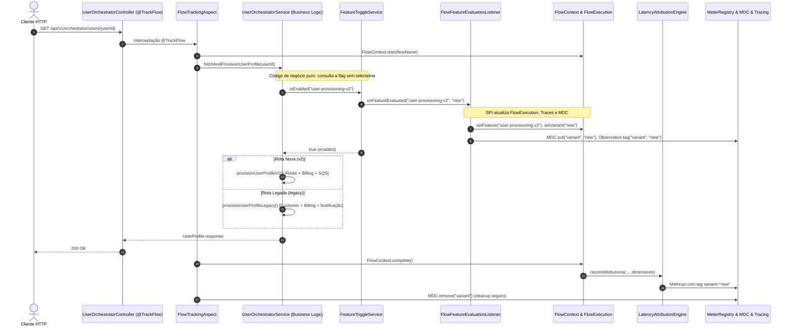

# Guia de Flow Dimensions, Migração Operacional e Feature Flags

Este guia documenta o padrão arquitetural de **Flow Dimensions** e a **SPI de Feature Flags** implementada na plataforma de observabilidade, demonstrando como conduzir migrações operacionais de fluxos (A/B, Canary, Blue-Green ou migração de rotas legadas para novas arquiteturas) com rastreabilidade total e **zero contaminação de código de negócio**.

---

## 🎯 1. O Problema Arquitetural: A Ilusão das Métricas Agregadas

Durante a migração de um serviço ou rota de processamento crítica, é comum utilizar mecanismos de Feature Toggle para desviar progressivamente o tráfego:

```text
                         POST /api/v1/orchestrator/users/{userId}
                                         │
                             Feature Toggle (user-v2)
                                         │
                    ┌────────────────────┴────────────────────┐
                    │                                         │
              variant=legacy                             variant=new
                    │                                         │
                    ▼                                         ▼
               Fluxo Atual                                Novo Fluxo
         (API A → API B → API C)                   (Redis → API B → SQS)
                    │                                         │
                    └────────────────────┬────────────────────┘
                                         │
                                     Response
```

### O Risco da Poluição Semântica
Se a métrica de fluxo registrar apenas:
```text
flow_total_duration_seconds{flow="GET /users/{userId}"}
```
ao dividir o tráfego (ex: 70% legado e 30% novo), os dados se **misturam**. A média, o P95 e o P99 tornam-se uma aberração estatística que não reflete nem o comportamento da rota antiga nem da rota nova.

Pior ainda: se o desenvolvedor precisar inserir manualmente telemetria no código de negócio:
```java
// ❌ ANTI-PATTERN: Poluição do código de negócio com telemetria
if (featureToggle.isEnabled("user-v2")) {
    FlowContext.setVariant("new"); // Acoplamento indevido
    return newRoute();
} else {
    FlowContext.setVariant("legacy");
    return legacyRoute();
}
```
o código de negócio fica poluído, violando o princípio fundamental de separação de responsabilidades da arquitetura de software corporativa.

---

## 🏗️ 2. A Solução: Flow Dimensions como Cidadão de Primeira Classe

A arquitetura resolve esse problema através de duas inovações:
1. **Flow Dimensions**: Dimensões analíticas de baixa cardinalidade (`variant`, `feature`, `experiment`) acopladas ao ciclo de vida do fluxo no `FlowExecution`.
2. **SPI `FeatureEvaluationListener`**: Uma abstração de evento na qual qualquer framework de Feature Flag (Hazelcast, Unleash, LaunchDarkly, Togglz ou propriedades locais) notifica a infraestrutura de observabilidade **de forma transparente**.



---

## 🧩 3. Componentes da Plataforma

### A. Modelo de Dimensões (`FlowDimensions`)
Localizado em `com.empresa.platform.observability.core.flow.FlowDimensions`, encapsula tags imutáveis e thread-safe de baixa cardinalidade:
- `variant`: Variante ativa (ex: `legacy`, `new`, `v2`, `canary`).
- `feature`: Nome canônico da feature flag avaliada (ex: `user-provisioning-v2`).
- Converte automaticamente para `Tags` do Micrometer (`toTags()`).

### B. SPI Desacoplada (`FeatureEvaluationListener`)
Localizada em `com.empresa.platform.observability.core.feature`:
```java
public interface FeatureEvaluationListener {
    void onFeatureEvaluated(String featureName, String variant, Map<String, String> metadata);

    default void onFeatureEvaluated(String featureName, boolean enabled) {
        onFeatureEvaluated(featureName, enabled ? "new" : "legacy", Map.of("enabled", String.valueOf(enabled)));
    }
}
```

### C. Listener Automático da Plataforma (`FlowFeatureEvaluationListener`)
Registrado pelo starter via `@ConditionalOnMissingBean`, ele intercepta toda avaliação:
1. Alimenta o `FlowExecution` corrente com as dimensões (`feature` e `variant`).
2. Alimenta o contexto de logs estruturados (`MDC.put("variant", variant)`).
3. Enriquece a `Observation` ativa no Micrometer Tracing.

### D. Aspecto de Fluxo (`FlowTrackingAspect`)
No encerramento do método anotado com `@TrackFlow`:
1. Vincula todas as dimensões do `FlowExecution` aos KeyValues de baixa cardinalidade do Span raiz do tracing.
2. Propaga as tags dimensionais para os passos `@TrackStep`.
3. Garante a limpeza do `MDC` no bloco `finally` para evitar contaminação em pools de threads.

---

## 🔬 4. Cenário de Laboratório: Rota Legada vs Rota Nova

No projeto `spring-observability-example`, implementamos exatamente a migração de processamento do endpoint de provisionamento de usuários:

| Dimensão | Rota Legada (`variant=legacy`) | Rota Nova (`variant=new`) |
|---|---|---|
| **Feature Flag** | `user-provisioning-v2 = false` | `user-provisioning-v2 = true` |
| **Passo 1** | Feign HTTP: `API Customer (GET /customers/{userId})` (~100ms) | Cache Local/Redis: `Cache Redis (GET customer:{userId})` (~1ms) |
| **Passo 2** | Feign HTTP: `API Billing (GET /billing/accounts/{userId})` (~50ms) | Feign HTTP: `API Billing (GET /billing/accounts/{userId})` (~50ms) |
| **Passo 3** | Feign HTTP Síncrono: `API Notificação (POST /notifications)` (~100ms) | Publicação Assíncrona: `Publicação SQS (welcome-email-queue)` (~5ms) |
| **Latência Típica E2E** | ~250ms | ~56ms |
| **Status de Notificação** | `DELIVERED` | `DELIVERED_ASYNC_SQS` |

### Código de Negócio Desacoplado
Veja como o [`UserOrchestratorService`](file:///Users/gleidsonfersanp/workspace/spring-observability-example/src/main/java/com/gleidsonfersanp/observability/application/UserOrchestratorService.java) permanece limpo:
```java
@CircuitBreaker(name = "orchestrator", fallbackMethod = "orchestratorFallback")
@Observed(name = "user.profile.provision", contextualName = "provision-user-profile")
@ObservationTag(key = "userId", expression = "#userId", highCardinality = true)
public UserProfile fetchAndProvisionUserProfile(String userId) {
    // Avaliação natural de negócio - o starter captura a variante de forma invisível
    if (featureToggleService.isEnabled("user-provisioning-v2")) {
        return provisionUserProfileV2(userId);
    }
    return provisionUserProfileLegacy(userId);
}
```

---

## 📊 5. Tríade de Telemetria com Flow Dimensions

### A. Métricas com Segmentação Dimensional
Todas as métricas geradas passam a conter a dimensão da variante:

#### 1. Duração Total e Wall-Clock
- `flow_total_duration_seconds{flow="GET /api/v1/orchestrator/users/{userId}", variant="legacy"}`
- `flow_total_duration_seconds{flow="GET /api/v1/orchestrator/users/{userId}", variant="new"}`
- `observability_flow_duration_seconds{flow="GET /api/v1/orchestrator/users/{userId}", variant="legacy", status="SUCCESS"}`
- `observability_flow_duration_seconds{flow="GET /api/v1/orchestrator/users/{userId}", variant="new", status="SUCCESS"}`

#### 2. Decomposição de Fatias (Slices) e Latência Atribuída
- **Rota Legada**:
  - `observability_flow_component_attributed_duration_seconds{variant="legacy", component="API Customer (GET /customers/{userId})"}`
  - `observability_flow_component_attributed_duration_seconds{variant="legacy", component="API Billing (GET /billing/accounts/{userId})"}`
  - `observability_flow_component_attributed_duration_seconds{variant="legacy", component="API Notificação (POST /notifications)"}`
- **Rota Nova**:
  - `observability_flow_component_attributed_duration_seconds{variant="new", component="Cache Redis (GET customer:{userId})"}`
  - `observability_flow_component_attributed_duration_seconds{variant="new", component="API Billing (GET /billing/accounts/{userId})"}`
  - `observability_flow_component_attributed_duration_seconds{variant="new", component="Publicação SQS (welcome-email-queue)"}`

### B. Contexto de Logs Estruturados (MDC)
Cada linha de log emitida dentro da execução carrega as propriedades:
```json
{
  "timestamp": "2026-09-29T15:24:03.055Z",
  "level": "INFO",
  "message": "Publishing welcome email event to SQS: user2",
  "cid": "641b5dd3-95d8-442a-90f1-a018b9738d3e",
  "traceId": "99c6b4842e978c6e3af54891699c5c92",
  "spanId": "59bbd45cdd16005e",
  "variant": "new",
  "feature.name": "user-provisioning-v2",
  "feature.variant": "new"
}
```

### C. Traces e Spans (OpenTelemetry / Jaeger)
No span de entrada do fluxo (`flow.get.api.v1.orchestrator.users.userid`):
```text
Tags / Attributes:
  flow = GET /api/v1/orchestrator/users/{userId}
  variant = new
  feature = user-provisioning-v2
  flow.status = SUCCESS
```

---

## 📈 6. Consultas PromQL para Painéis A/B no Grafana

Com Flow Dimensions, você pode criar painéis comparativos lado a lado:

### 1. Throughput por Variante (Req/s)
```promql
sum(rate(observability_flow_duration_seconds_count{flow="GET /api/v1/orchestrator/users/{userId}"}[1m])) by (variant)
```

### 2. Latência Média por Variante (ms)
```promql
(sum(rate(observability_flow_duration_seconds_sum{flow="GET /api/v1/orchestrator/users/{userId}"}[1m])) by (variant)
/
sum(rate(observability_flow_duration_seconds_count{flow="GET /api/v1/orchestrator/users/{userId}"}[1m])) by (variant)) * 1000
```

### 3. Percentis de Latência P95 (Histogram Quantile)
```promql
histogram_quantile(0.95, sum(rate(observability_flow_duration_seconds_bucket{flow="GET /api/v1/orchestrator/users/{userId}"}[1m])) by (le, variant))
```

### 4. Decomposição Percentual de Latência da Rota Legada (Pie Chart)
```promql
sum(rate(observability_flow_component_attributed_duration_seconds_sum{flow="GET /api/v1/orchestrator/users/{userId}", variant="legacy"}[1m])) by (component)
```

### 5. Decomposição Percentual de Latência da Rota Nova (Pie Chart)
```promql
sum(rate(observability_flow_component_attributed_duration_seconds_sum{flow="GET /api/v1/orchestrator/users/{userId}", variant="new"}[1m])) by (component)
```

### 6. Taxa de Erro / Interrupção por Variante (%)
```promql
(sum(rate(observability_flow_interruption_total[1m])) by (variant)
/
sum(rate(observability_flow_duration_seconds_count[1m])) by (variant)) * 100
```

---

## 🧪 7. Validação Automatizada (Suíte E2E)

A classe [`FeatureFlagMigrationFlowIntegrationTest`](file:///Users/gleidsonfersanp/workspace/spring-observability-example/src/test/java/com/gleidsonfersanp/observability/FeatureFlagMigrationFlowIntegrationTest.java) comprova os 3 cenários sem uso de mocks parciais:

1. **`shouldExecuteLegacyRouteWhenFeatureToggleDisabled()`**:
   - Dispara requisição com `user-provisioning-v2 = false`.
   - Valida que métricas de `duration`, fatias e atribuição contêm `variant="legacy"`.
   - Comprova a presença de `API Customer`, `API Billing` e `API Notificação`.
   - Valida `MDC` com `variant="legacy"` e trace enriquecido.

2. **`shouldExecuteNewRouteWhenFeatureToggleEnabled()`**:
   - Sobrescreve flag com `user-provisioning-v2 = true`.
   - Valida que métricas de `duration`, fatias e atribuição contêm `variant="new"`.
   - Comprova a presença de `Cache Redis`, `API Billing` e `Publicação SQS`.
   - Valida `MDC` com `variant="new"` e trace enriquecido.

3. **`shouldCompareLegacyVsNewVariantsSimultaneouslyInMetricsRegistry()`**:
   - Executa chamadas em ambas as rotas no mesmo ciclo de vida da JVM.
   - Prova a coexistência pacífica e a segregação estrita das métricas sem colisão no `MeterRegistry`.
   - Assegura que ferramentas como Prometheus e Grafana conseguem gerar comparações estatísticas fiéis em tempo real.

Para executar o teste:
```bash
mvn test -Dtest=FeatureFlagMigrationFlowIntegrationTest
```
