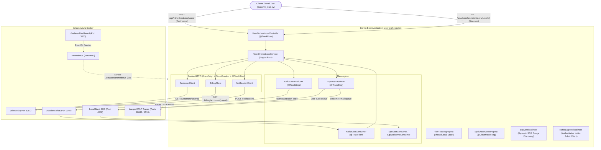

# Documentação do Projeto: User Orchestrator & Observabilidade Avançada

Este repositório é um laboratório prático de **Arquitetura Orientada a Eventos (EDA)**, **Integração de Microserviços** e **Observabilidade de Produção** com Spring Boot 3, Micrometer Observation, OpenTelemetry/Jaeger, Prometheus, Grafana, Resilience4j, Apache Kafka, AWS SQS (LocalStack) e WireMock.

---

## 🎯 Objetivo do Projeto

Demonstrar como instrumentar uma aplicação corporativa de ponta a ponta sem poluir o código de negócio com chamadas manuais de métricas e traces. A solução resolve desafios reais de arquitetura:

1. **Decomposição Matemática de Latência por Entrypoint**: Cada ponto de entrada (ex: `GET /users/{userId}` ou Consumidor Kafka) possui seu próprio gráfico de pizza no Grafana, onde a pizza inteira representa 100% do tempo do fluxo, fatiada com exatidão entre cada integração externa e o tempo residual de processamento interno via `FlowContext` e anotações `@TrackFlow` / `@TrackStep`.
2. **Circuit Breaking granular por integração**: Isolar falhas em serviços terceiros específicos (`customer-service`, `billing-service`, `notification-service`) em vez de mascarar problemas em um disjuntor genérico.
3. **Extração não-intrusiva de contexto com SpEL**: Anotar interfaces Feign e métodos com `@ObservationTag`, usando expressões SpEL (`#result?.billingType()?.name()`, `#userId`) para enriquecer métricas e spans sem poluir services ou controllers.
4. **Monitoramento autoritativo de filas e tópicos**: Acompanhamento automático de profundidade de filas SQS (descoberta dinâmica via AWS SDK com `SqsMetricsBinder`) e cálculo em tempo real do lag de consumidores Kafka via `AdminClient` (`KafkaLagMetricsBinder`).
5. **Engenharia de Caos**: Injeção de latência controlada, timeouts e erros 500 via WireMock para simular comportamentos sob estresse real.

---

## 🏗️ Arquitetura do Sistema



---

## 📂 Estrutura da Documentação

- [**Arquitetura e Fluxos**](README.md): Este documento, contendo visão geral, arquitetura e componentes.
- [**Guia de Pernas de Execução (Legs) e Mascaramento SpEL**](GUIA_DE_LEGS_E_AUDITORIA_DE_LOGS.md): Arquitetura de rastreamento de saltos (INBOUND/OUTBOUND), auditoria de payloads, mascaramento SpEL com conformidade LGPD/PCI-DSS e ingestão no Grafana Loki.
- [**Como Metrificar por Stack Tecnológica**](GUIA_METRIFICACAO_DAS_STACKS.md): Manual técnico passo a passo de como metrificar cada stack (MVC, Feign, Resilience4j, Kafka, SQS, HikariCP, Tracing, Alarmística).
- [**Catálogo de Métricas e Queries PromQL**](CATALOGO_DE_METRICAS_E_QUERIES_DASHBOARD.md): Referência exaustiva de todas as formas customizadas de metrificar e as 20 consultas do Dashboard Grafana (Prometheus & Loki).
- [**Guia de Alarmística, SLAs e Incidentes**](GUIA_DE_ALARMISTICA_E_SLAS.md): Arquitetura de alarmística não-intrusiva em 2 camadas, interceptação de disjuntores, SLA Guard e Prometheus alerts.
- [**Observabilidade e Métricas**](OBSERVABILIDADE_E_METRICAS.md): Explicação do Aspecto SpEL, tags customizadas, rastreamento de fatias por entrypoint, queries PromQL e estrutura do painel Grafana.
- [**Registro de Decisões Arquiteturais (ADRs)**](DECISOES_ARQUITETURAIS_ADR.md): Racional detalhado de todas as 10 decisões tomadas, problemas, soluções e trade-offs.
- [**Guia de Testes de Integração, E2E e Validação da Telemetria**](GUIA_DE_TESTES_E2E_E_INTEGRACAO.md): Metodologia de Stubs sobre Mocks, asserção da tríade de telemetria (Logs, Métricas e Traces), catálogo das suítes de teste e guia de como usar/executar.
- [**Cenários de Teste e Caos**](CENARIOS_DE_TESTE_E_CAOS.md): Detalhamento dos cenários de teste de carga contínua, simulação de falhas e disjuntores.
- [**Guia de Abstração de Vendors e Provedores**](GUIA_DE_ABSTRACAO_DE_VENDORS_E_PROVEDORES.md): Arquitetura agnóstica de fornecedor (Prometheus, Jaeger, Loki, Datadog via OTLP, Dynatrace, New Relic, OTel Collector).
- [**Especificação Técnica para Starter Spring Boot**](ESPECIFICACAO_TECNICA_STARTER_OBSERVABILIDADE.md): Especificação completa e guia para extração da observabilidade em um starter reutilizável por um Agente de IA.

---

## 🚀 Como Executar o Ambiente

### 1. Pré-requisitos
- Docker & Docker Compose
- Java 21 & Maven 3.9+
- Python 3

### 2. Subir a Infraestrutura
```bash
docker-compose up -d
```
Serviços iniciados:
- **WireMock**: `http://localhost:8081`
- **Prometheus**: `http://localhost:9090`
- **Jaeger UI**: `http://localhost:16686`
- **Grafana**: `http://localhost:3000` (acesso anônimo com perfil Admin habilitado)
- **LocalStack (AWS SQS)**: `http://localhost:4566`
- **Kafka / Zookeeper**: `localhost:9092` / `localhost:2181`

### 3. Iniciar a Aplicação Spring Boot
```bash
mvn spring-boot:run
```

### 4. Executar o Gerador de Carga e Caos
```bash
python3 massive_load.py
```
O script simula requisições síncronas (E2E) e assíncronas (Kafka/SQS) com usuários normais e de caos (`slow`, `error`, `flake`).

### 5. Visualizar o Dashboard no Grafana
Abra [http://localhost:3000/d/obs-master/observability-master-dashboard](http://localhost:3000/d/obs-master/observability-master-dashboard) com auto-refresh de 5 segundos.
