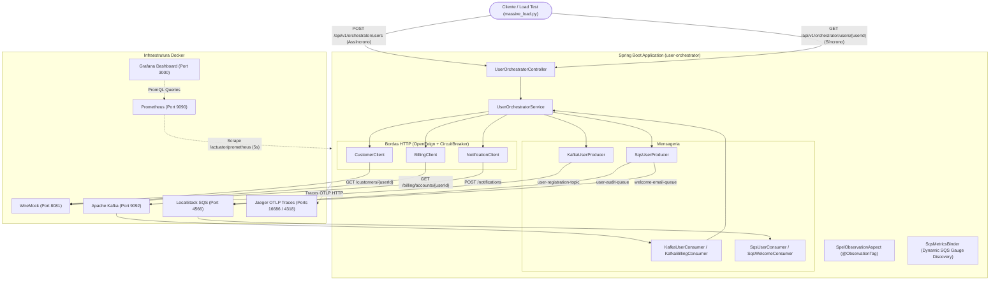

# Documentação do Projeto: User Orchestrator & Observabilidade Avançada

Este repositório é um laboratório prático de **Arquitetura Orientada a Eventos (EDA)**, **Integração de Microserviços** e **Observabilidade de Produção** com Spring Boot 3, Micrometer Observation, OpenTelemetry/Jaeger, Prometheus, Grafana, Resilience4j, Apache Kafka, AWS SQS (LocalStack) e WireMock.

---

## 🎯 Objetivo do Projeto

Demonstrar como instrumentar uma aplicação corporativa de ponta a ponta sem poluir o código de negócio com chamadas manuais de métricas e traces. A solução resolve desafios reais de arquitetura:

1. **Visibilidade granular de latência**: Medir o tempo total da operação de entrada e isolar o consumo de tempo de cada fatia externa (chamadas HTTP/Feign).
2. **Circuit Breaking granular por integração**: Isolar falhas em serviços terceiros específicos (`customer-service`, `billing-service`, `notification-service`) em vez de mascarar problemas em um disjuntor genérico.
3. **Extração não-intrusiva de contexto com SpEL**: Anotar interfaces Feign e métodos com `@ObservationTag`, usando expressões SpEL (`#result?.billingType()?.name()`, `#userId`) para enriquecer métricas e spans sem poluir services ou controllers.
4. **Monitoramento dinâmico de filas e tópicos**: Acompanhamento automático de profundidade de filas SQS (descoberta automática via AWS SDK) e lag de grupos de consumidores Kafka.
5. **Engenharia de Caos**: Injeção de latência controlada, timeouts e erros 500 via WireMock para simular comportamentos sob estresse real.

---

## 🏗️ Arquitetura do Sistema



---

## 📂 Estrutura da Documentação

- [**Arquitetura e Fluxos**](README.md): Este documento, contendo visão geral, arquitetura e componentes.
- [**Observabilidade e Métricas**](OBSERVABILIDADE_E_METRICAS.md): Explicação do Aspecto SpEL, tags customizadas, queries PromQL e estrutura do painel Grafana.
- [**Cenários de Teste e Caos**](CENARIOS_DE_TESTE_E_CAOS.md): Detalhamento dos cenários de teste de carga contínua, simulação de falhas e disjuntores.

---

## 🚀 Como Executar o Ambiente

### 1. Pré-requisitos
- Docker & Docker Compose
- Java 21 & Maven 3.9+
- Python 3

### 2. Subir a Infraestrutura
```bash
docker-compose up -d
```
Serviços iniciados:
- **WireMock**: `http://localhost:8081`
- **Prometheus**: `http://localhost:9090`
- **Jaeger UI**: `http://localhost:16686`
- **Grafana**: `http://localhost:3000` (acesso anônimo com perfil Admin habilitado)
- **LocalStack (AWS SQS)**: `http://localhost:4566`
- **Kafka / Zookeeper**: `localhost:9092` / `localhost:2181`

### 3. Iniciar a Aplicação Spring Boot
```bash
mvn spring-boot:run
```

### 4. Executar o Gerador de Carga e Caos
```bash
python3 massive_load.py
```
O script simula requisições síncronas (E2E) e assíncronas (Kafka/SQS) com usuários normais e de caos (`slow`, `error`, `flake`).

### 5. Visualizar o Dashboard no Grafana
Abra [http://localhost:3000/d/obs-master/observability-master-dashboard](http://localhost:3000/d/obs-master/observability-master-dashboard) com auto-refresh de 5 segundos.
