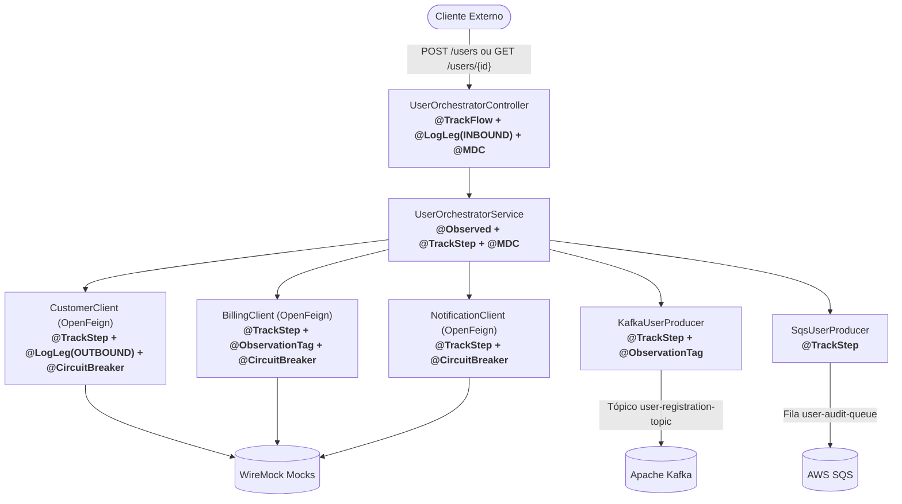

# Tutorial Completo de Adoção: Observability Spring Boot Starter & Catálogo de Anotações

> **Guia definitivo e prático para engenheiros de software instrumentarem microsserviços Spring Boot 3 com o starter corporativo de observabilidade.**

---

## 📑 Sumário

1. [Introdução e Filosofia](#1-introdução-e-filosofia)
2. [Quickstart: Em Operação em 5 Minutos](#2-quickstart-em-operação-em-5-minutos)
3. [Catálogo Completo das Anotações do Starter](#3-catálogo-completo-das-anotações-do-starter)
   - [3.1. `@TrackFlow`: Ponto de Entrada, Wall-Clock e Governança de SLA](#31-trackflow-ponto-de-entrada-wall-clock-e-governança-de-sla)
   - [3.2. `@TrackStep` e `ComponentType`: Fatiamento de Latência e Topologia](#32-trackstep-e-componenttype-fatiamento-de-latência-e-topologia)
   - [3.3. `@MDC` e `@MDCs`: Enriquecimento Declarativo de Logs sem Vazamento](#33-mdc-e-mdcs-enriquecimento-declarativo-de-logs-sem-vazamento)
   - [3.4. `@ObservationTag` e `@ObservationTags`: Dimensões de Métricas e Spans](#34-observationtag-e-observationtags-dimensões-de-métricas-e-spans)
   - [3.5. `@FlowDimension` e `@FlowDimensionsTag`: Variantes A/B e Feature Flags](#35-flowdimension-e-flowdimensionstag-variantes-ab-e-feature-flags)
   - [3.6. `@LogLeg`, `@MaskField` e `MaskPattern`: Auditoria e Conformidade LGPD](#36-logleg-maskfield-e-maskpattern-auditoria-e-conformidade-lgpd)
4. [Construindo um Microsserviço de Ponta a Ponta com o Exemplo Real](#4-construindo-um-microsserviço-de-ponta-a-ponta-com-o-exemplo-real)
   - [4.1. Camada de Entrada REST (`UserOrchestratorController`)](#41-camada-de-entrada-rest-userorchestratorcontroller)
   - [4.2. Camada de Orquestração de Negócio (`UserOrchestratorService`)](#42-camada-de-orquestração-de-negócio-userorchestratorservice)
   - [4.3. Integração com Clientes Externos (`CustomerClient` e `BillingClient`)](#43-integração-com-clientes-externos-customerclient-e-billingclient)
   - [4.4. Mensageria Assíncrona (`KafkaUserProducer` e `KafkaUserConsumer`)](#44-mensageria-assíncrona-kafkauserproducer-e-kafkauserconsumer)
5. [A Tríade de Telemetria Emitida nos Bastidores](#5-a-tríade-de-telemetria-emitida-nos-bastidores)
6. [Estratégia de Validação e Testes de Integração](#6-estratégia-de-validação-e-testes-de-integração)
7. [Tabela de Boas Práticas vs Anti-Padrões](#7-tabela-de-boas-práticas-vs-anti-padrões)

---

## 1. Introdução e Filosofia

A observabilidade em microsserviços distribuídos falha tipicamente em dois extremos:
1. **Ausência de Semântica de Negócio**: Agentes automáticos geram milhares de spans de framework (filtros HTTP genéricos, transações JPA vazias), mas os dashboards não respondem às perguntas vitais da operação: *"Qual porcentagem do tempo da emissão de apólice é gasta na API de Bureau vs processamento interno?"* ou *"Qual a latência da variante V2 comparada com a legado?"*.
2. **Poluição de Código de Domínio**: Desenvolvedores tentam resolver o problema acima injetando `MeterRegistry`, `Tracer`, `ObservationRegistry` e blocos manuais de `MDC.put(...)` / `MDC.remove(...)` dentro de services e controllers. O código de negócio fica coberto por 60% de lógica de infraestrutura.

### O Princípio 80/20 do Starter Corporativo

```text
┌────────────────────────────────────────────────────────────────────────┐
│ 80% a 95%: Instrumentação Automática por Padrão                       │
│ HTTP MVC, OpenFeign, Kafka, AWS SQS, JDBC/HikariCP, Resilience4j, JVM │
│                                                                        │
│ Injeção transparente de Correlation ID, W3C TraceContext e MDC         │
└───────────────────────────────────┬────────────────────────────────────┘
                                    │
                                    ▼
┌────────────────────────────────────────────────────────────────────────┐
│ 5% a 20%: Semântica Declarativa de Negócio                            │
│ @TrackFlow, @TrackStep, @LogLeg, @MaskField, @MDC, @ObservationTag     │
│                                                                        │
│ Sem tocar em APIs de telemetria, sem poluição de código de negócio     │
└────────────────────────────────────────────────────────────────────────┘
```

---

## 2. Quickstart: Em Operação em 5 Minutos

### Passo 1: Adicionar a Dependência Maven

Adicione a dependência agregadora no `pom.xml` da aplicação:

```xml
<dependency>
    <groupId>com.empresa.platform</groupId>
    <artifactId>observability-spring-boot-starter</artifactId>
    <version>1.0.0-SNAPSHOT</version>
</dependency>
```

> **Dica Arquitetural**: Para bibliotecas de domínio puro que não devem depender de Spring Boot ou Micrometer, adicione apenas o módulo de contratos leves:
> ```xml
> <dependency>
>     <groupId>com.empresa.platform</groupId>
>     <artifactId>observability-api</artifactId>
>     <version>1.0.0-SNAPSHOT</version>
> </dependency>
> ```

### Passo 2: Configurar o `application.yml`

Defina o perfil de observabilidade desejado:

```yaml
# ==============================================================================
# CONFIGURAÇÃO DO STARTER CORPORATIVO DE OBSERVABILIDADE
# ==============================================================================
observability:
  enabled: true
  profile: datadog     # 'datadog' (produção corporativa) ou 'prometheus' (local/CI)
  engine: datadog      # 'datadog' ou 'micrometer'
  
  metrics:
    allow-dual-export: false # Trava contra cobrança duplicada em SaaS
    
  alerting:
    enabled: true
    thresholds:
      default-flow-sla-ms: 2000
      default-step-sla-ms: 800
      flow-slas:
        "GET /api/v1/orchestrator/users/{userId}": 1500
        "POST /api/v1/orchestrator/users": 1000
      step-slas:
        "API Customer (GET /customers/{userId})": 500
        "API Billing (GET /billing/accounts/{userId})": 600
      hikari-pending-threads: 2
      circuit-breaker-open: true
```

Pronto! Sua aplicação já conta com rastreamento distribuído, propagação de `X-Correlation-Id`, sentinelas de HikariCP e disjuntores monitorados automaticamente.

---

## 3. Catálogo Completo das Anotações do Starter

---

### 3.1. `@TrackFlow`: Ponto de Entrada, Wall-Clock e Governança de SLA

#### O Que É?
Anotação de método aplicada no **ponto de entrada (entrypoint)** de uma transação de negócio: controladores HTTP (`@RestController`), ouvintes de mensageria (`@KafkaListener`, `@SqsListener`) ou jobs agendados (`@Scheduled`).

#### Atributos da Anotação:
| Atributo | Tipo | Padrão | Descrição |
|---|---|---|---|
| `value` / `name` | `String` | `""` | Identificador canônico do fluxo (ex: `"GET /api/v1/orchestrator/users/{userId}"`, `"order-checkout"`). |
| `type` | `String` | `"HTTP"` | Protocolo ou gatilho de entrada (`"HTTP"`, `"KAFKA"`, `"SQS"`, `"SCHEDULER"`). |
| `variant` | `String` | `""` | Variante arquitetural ou de rota opcional (ex: `"legacy"`, `"v2"`, `"canary"`). |

#### Por Que Usar?
1. **Unificação de Entradas**: Se uma mesma orquestração pode iniciar via HTTP REST ou via fila Kafka, o `@TrackFlow` agrupa as métricas sob o mesmo nome semântico canônico.
2. **Tempo Real de Relógio (*Wall-Clock Duration*)**: Estabelece o teto físico de duração percebido pelo cliente.
3. **Span Raiz no Tracing**: Cria o Span pai no Datadog APM e OpenTelemetry.
4. **Vigilância Automática de SLAs**: Se o tempo total estourar o limiar configurado em `flow-slas`, despacha automaticamente o alerta `FLOW_LATENCY_SLA_BREACH`.
5. **Contexto de Log Automático**: Injeta `flow="<nome>"` no MDC durante toda a execução da thread.

#### Exemplo Prático:
```java
@TrackFlow("GET /api/v1/orchestrator/users/{userId}")
@GetMapping("/users/{userId}")
public ResponseEntity<UserProfile> getUserProfile(@PathVariable @MDC("userId") String userId) {
    return ResponseEntity.ok(orchestratorService.fetchAndProvisionUserProfile(userId));
}
```

---

### 3.2. `@TrackStep` e `ComponentType`: Fatiamento de Latência e Topologia

#### O Que É?
Anotação de método para fatiar o processamento interno em etapas distintas, categorizando-as arquiteturalmente por meio do enum fechado [`ComponentType`](file:///Users/gleidsonfersanp/workspace/spring-observability-example/observability-api/src/main/java/com/empresa/platform/observability/core/annotation/ComponentType.java).

#### Atributos da Anotação:
| Atributo | Tipo | Padrão | Descrição |
|---|---|---|---|
| `value` / `name` | `String` | `""` | Identificador canônico da etapa (ex: `"API Customer"`, `"save-order"`). |
| `type` | `ComponentType` | `ComponentType.BUSINESS` | Categoria arquitetural padronizada do componente executado. |

#### O Enum Fechado `ComponentType` (18 Tipos Canônicos):
- **Integrações HTTP & RPC**: `HTTP`, `FEIGN`, `GRPC`
- **Persistência & Cache**: `DATABASE`, `CACHE`
- **Mensageria & Filas**: `KAFKA`, `KAFKA_PRODUCER`, `KAFKA_CONSUMER`, `SQS`, `SQS_PRODUCER`, `SQS_CONSUMER`, `SNS`, `JMS`
- **Execução Local & Negócio**: `BUSINESS` (padrão), `INTERNAL`, `EXECUTOR`
- **Padrões de Resiliência**: `RETRY`, `CIRCUIT_BREAKER`, `BULKHEAD`, `RATE_LIMITER`
- **Extensibilidade**: `CUSTOM`

#### Por Que Usar?

##### 1. Por que `ComponentType` é um enum restrito em vez de String livre?
- **Prevenção de Explosão de Cardinalidade**: Nomes livres (ex: `"meu_banco_oracle_v2"`) geram milhares de séries temporais não agregáveis no Prometheus e faturas exorbitantes no Datadog.
- **Dashboards Corporativos Globais**: Permite criar gráficos unificados como *"Tempo total em banco de dados (`type=DATABASE`)"* para todos os serviços da organização.
- **Topologia Automática**: Alimenta o Datadog Service Map e Request Flow Maps sem necessidade de mapeamentos manuais.

##### 2. O Motor de Atribuição de Latência (`LatencyAttributionEngine`)
Quando tarefas rodam em paralelo (ex: 3 chamadas HTTP de 200ms via `CompletableFuture` duram 210ms no total):
- **Esforço Nominal Bruto (`observability.flow.component.work.duration`)**: 600ms.
- **Duração Atribuída Normalizada (`observability.flow.component.attributed.duration`)**: 200ms distribuídos proporcionalmente, garantindo que o gráfico de pizza nunca ultrapasse 100% do wall-clock.
- **Sobreposição Concorrente Poupada (`observability.flow.parallel.overlap.duration`)**: ~390ms economizados pelo paralelismo.

#### Exemplo Prático:
```java
@FeignClient(name = "customer-service", url = "${app.integrations.customer.url}")
public interface CustomerClient {

    @TrackStep(value = "API Customer (GET /customers/{userId})", type = ComponentType.FEIGN)
    @GetMapping("/customers/{userId}")
    CustomerDto getCustomerInfo(@PathVariable("userId") String userId);
}
```

---

### 3.3. `@MDC` e `@MDCs`: Enriquecimento Declarativo de Logs sem Vazamento

#### O Que É?
Anotações que injetam chaves e valores no SLF4J MDC (Mapped Diagnostic Context) de maneira puramente declarativa via AOP. É repetível e agrupada pelo contêiner `@MDCs`.

#### Atributos da Anotação:
| Atributo | Tipo | Padrão | Descrição |
|---|---|---|---|
| `key` / `name` | `String` | `""` | Nome da chave canônica a ser inserida no MDC (ex: `"userId"`, `"channel"`). |
| `value` | `String` | `""` | Valor estático constante ou alias posicional abreviado `@MDC("userId")`. |
| `expression` | `String` | `""` | Expressão SpEL dinâmica (ex: `"#request.userId"`, `"#result?.status()"`). |

#### Por Que Usar?
1. **Eliminação de 100% de Boilerplate**: Não requer blocos de `try { MDC.put() } finally { MDC.remove() }`.
2. **Semântica de Pilha (Stack Semantics)**: Em servidores com reuso de threads (Tomcat, Undertow, pools de `@Async`), se uma chave já existia no método chamador, o valor original é preservado e restaurado no `finally`. Se não existia, a chave é removida.
3. **Zero Vazamento de Dados (Anti-Leak)**: Evita que o `userId` de um usuário A permaneça na thread e vaze nos logs da requisição de um usuário B atendido minutos depois.

#### Modos de Uso:

##### 1. Extração Direta de Parâmetro:
```java
@GetMapping("/users/{userId}")
public ResponseEntity<UserProfile> getUserProfile(@PathVariable @MDC("userId") String userId) {
    log.info("Processando usuário"); // Log já sai com [userId=123] no MDC
    return ResponseEntity.ok(service.get(userId));
}
```

##### 2. Extração SpEL e Valor Estático Combinados:
```java
@PostMapping("/users")
@MDC(key = "userId", expression = "#request.userId")
@MDC(key = "channel", value = "web")
public ResponseEntity<Map<String, String>> registerUser(@RequestBody UserRegistrationRequest request) {
    log.info("Iniciando cadastro"); // Log conterá [userId=..., channel=web]
    return ResponseEntity.accepted().body(...);
}
```

---

### 3.4. `@ObservationTag` e `@ObservationTags`: Dimensões de Métricas e Spans

#### O Que É?
Anotação declarativa para anexar tags semânticas ao ciclo de vida da `Observation` do Micrometer (afetando tanto métricas do Prometheus quanto Spans do Datadog APM/OTel). Repetível via `@ObservationTags`.

#### Atributos da Anotação:
| Atributo | Tipo | Padrão | Descrição |
|---|---|---|---|
| `key` | `String` | *(Obrigatório)* | Identificador da tag semântica (ex: `"client"`, `"billing_type"`). |
| `expression` | `String` | `""` | Expressão SpEL avaliada a partir dos argumentos (`#userId`) ou do retorno (`#result?.type()`). |
| `lowCardinality` | `boolean` | `true` | Se `true`, a tag é enviada às séries temporais de métricas (TSDB). |
| `highCardinality` | `boolean` | `false` | Se `true`, a tag é restrita aos atributos do Span no Tracing (sem poluir o TSDB). |

#### O Dilema da Cardinalidade:
- **Baixa Cardinalidade (`lowCardinality = true`)**: Valores previsíveis e finitos (`client="billing"`, `status="SUCCESS"`). Roteada para o **Prometheus e Datadog Metrics**. Nunca use IDs únicos aqui!
- **Alta Cardinalidade (`highCardinality = true` ou `lowCardinality = false`)**: Valores únicos (`userId="usr-123"`, `orderId="ord-999"`). Roteada exclusivamente para o **Span de Tracing**, evitando explosões de cardinalidade (*cardinality bombs*) no banco de métricas.

#### Exemplo Prático:
```java
@FeignClient(name = "billing-service", url = "${app.integrations.billing.url}")
public interface BillingClient {

    @ObservationTag(key = "client", expression = "'billing'")
    @ObservationTag(key = "billing_type", expression = "#result?.billingType()?.name()")
    @GetMapping("/billing/accounts/{userId}")
    BillingDto getBillingInfo(@PathVariable("userId") String userId);
}
```

---

### 3.5. `@FlowDimension` e `@FlowDimensionsTag`: Variantes A/B e Feature Flags

#### O Que É?
Anotação para anexar dimensões de fluxo de primeira classe (como `variant`, `tenant`, `region`, `feature`) diretamente ao escopo do `@TrackFlow`. Repetível via `@FlowDimensionsTag`.

#### Atributos da Anotação:
| Atributo | Tipo | Padrão | Descrição |
|---|---|---|---|
| `key` / `name` | `String` | `""` | Nome da dimensão (ex: `"variant"`, `"tenant"`). |
| `value` | `String` | `""` | Valor estático constante. |
| `expression` | `String` | `""` | Expressão SpEL avaliada dinamicamente a partir dos argumentos. |
| `mdc` | `boolean` | `true` | Se `true`, propaga a dimensão para o MDC da thread. |

#### Por Que Usar?
Em migrações graduais (ex: rota síncrona legado vs rota assíncrona orientada a eventos):
- O fluxo mantém o mesmo identificador semântico (`order-checkout`).
- A métrica ganha a dimensão `variant="legacy"` ou `variant="v2"`, permitindo comparação direta de P95, Throughput e Erros lado a lado no Grafana ou no Datadog Request Flow Map.

#### Exemplo Prático:
```java
@TrackFlow(value = "user-provisioning", type = "HTTP")
@FlowDimension(key = "variant", value = "event-driven-v2")
@FlowDimension(key = "tenant", expression = "#tenantId")
@PostMapping("/provision")
public ResponseEntity<Void> provision(@RequestParam String tenantId) {
    ...
}
```

---

### 3.6. `@LogLeg`, `@MaskField` e `MaskPattern`: Auditoria e Conformidade LGPD

#### O Que É?
Mecanismo de auditoria forense estruturada para registrar saltos de rede (`INBOUND`, `OUTBOUND`, `INTERNAL`) com mascaramento declarativo de dados sensíveis antes de qualquer envio para o logger `AUDIT_LEG_LOGGER`.

#### Atributos de `@LogLeg`:
| Atributo | Tipo | Padrão | Descrição |
|---|---|---|---|
| `target` | `String` | `""` | Identificador do serviço ou componente alvo (ex: `"customer-service"`). |
| `type` | `LegType` | `LegType.OUTBOUND` | Direção da integração: `INBOUND`, `OUTBOUND` ou `INTERNAL`. |
| `includePayload` | `boolean` | `false` | Se `true`, serializa e audita payloads. Padrão `false` (opt-in estrito LGPD/PCI). |
| `mask` | `MaskField[]` | `{}` | Regras de mascaramento dinâmico. |

#### Atributos de `@MaskField`:
| Atributo | Tipo | Padrão | Descrição |
|---|---|---|---|
| `expression` | `String` | *(Obrigatório)* | Expressão SpEL ou propriedade JSON do campo a ofuscar (ex: `"#result?.email()"`). |
| `pattern` | `MaskPattern` | `MaskPattern.FULL_MASK` | Padrão semântico de mascaramento. |
| `customMask` | `String` | `""` | Máscara estática personalizada opcional. |

#### Catálogo de Padrões (`MaskPattern`):
- `PASSWORD`: Redação total para senhas e tokens (`"********"`).
- `CARD_PARTIAL`: Mascaramento parcial de cartão de crédito PCI-DSS (`"************1234"`).
- `CPF_PARTIAL`: Preserva início e dígitos verificadores (`"123.***.***-45"`).
- `EMAIL_PARTIAL`: Preserva primeira/última letra e domínio (`"j***e@dominio.com"`).
- `FULL_MASK`: Redação total com substituição por `"***REDACTED***"`.

#### Exemplo Prático:
```java
@TrackStep("API Customer (GET /customers/{userId})")
@LogLeg(
    target = "customer-service",
    type = LegType.OUTBOUND,
    mask = {
        @MaskField(
            expression = "#result?.email()",
            pattern = MaskPattern.EMAIL_PARTIAL
        )
    }
)
@GetMapping("/customers/{userId}")
CustomerDto getCustomerInfo(@PathVariable("userId") String userId);
```

---

## 4. Construindo um Microsserviço de Ponta a Ponta com o Exemplo Real

Vamos analisar como essas anotações se integram harmoniosamente no projeto de exemplo [`user-orchestrator`](file:///Users/gleidsonfersanp/workspace/spring-observability-example/observability-demo):



### 4.1. Camada de Entrada REST (`UserOrchestratorController`)
Arquivo: [`UserOrchestratorController.java`](file:///Users/gleidsonfersanp/workspace/spring-observability-example/observability-demo/src/main/java/com/gleidsonfersanp/observability/api/UserOrchestratorController.java)

Combina `@TrackFlow` para iniciar o fluxo, `@LogLeg` para auditoria do salto HTTP recebido, `@MaskField` para proteção de e-mails de clientes e `@MDC` para indexar `userId` e `channel`:

```java
@RestController
@RequestMapping("/api/v1/orchestrator")
public class UserOrchestratorController {

    @TrackFlow("GET /api/v1/orchestrator/users/{userId}")
    @LogLeg(
        target = "user-orchestrator",
        type = LegType.INBOUND,
        mask = {
            @MaskField(
                expression = "#result?.customer()?.email()",
                pattern = MaskPattern.EMAIL_PARTIAL
            )
        }
    )
    @GetMapping("/users/{userId}")
    public ResponseEntity<UserProfile> getUserProfile(@PathVariable @MDC("userId") String userId) {
        log.info("Processing request in controller for user: {}", userId);
        return ResponseEntity.ok(orchestratorService.fetchAndProvisionUserProfile(userId));
    }

    @TrackFlow("POST /api/v1/orchestrator/users")
    @LogLeg(
        target = "user-orchestrator",
        type = LegType.INBOUND,
        mask = {
            @MaskField(
                expression = "#request.email",
                pattern = MaskPattern.EMAIL_PARTIAL
            )
        }
    )
    @MDC(key = "userId", expression = "#request.userId")
    @MDC(key = "channel", value = "web")
    @PostMapping("/users")
    public ResponseEntity<Map<String, String>> registerUser(@RequestBody UserRegistrationRequest request) {
        log.info("Registering user via controller: {}", request.userId());
        orchestratorService.initiateUserRegistration(request);
        return ResponseEntity.accepted().body(Map.of("status", "ACCEPTED"));
    }
}
```

### 4.2. Camada de Orquestração de Negócio (`UserOrchestratorService`)
Arquivo: [`UserOrchestratorService.java`](file:///Users/gleidsonfersanp/workspace/spring-observability-example/observability-demo/src/main/java/com/gleidsonfersanp/observability/application/UserOrchestratorService.java)

Aplica `@TrackStep` na iniciação assíncrona, enriquece o MDC com o tipo de orquestração e extrai tags de observação com respeito estrito à cardinalidade:

```java
@Service
public class UserOrchestratorService {

    @Observed(name = "user.registration.initiate", contextualName = "initiate-async-registration")
    @TrackStep(name = "initiate-async-registration", type = ComponentType.BUSINESS)
    @MDC(key = "userId", expression = "#request.userId")
    public void initiateUserRegistration(UserRegistrationRequest request) {
        log.info("Initiating async registration for user: {}", request.userId());
        kafkaProducer.publishUserRegistration(request);
    }

    @CircuitBreaker(name = "orchestrator", fallbackMethod = "orchestratorFallback")
    @Observed(name = "user.profile.provision", contextualName = "provision-user-profile")
    @ObservationTag(key = "userId", expression = "#userId", highCardinality = true) // Não polui TSDB!
    @ObservationTag(key = "flow", expression = "'provisioning'")
    @ObservationTag(key = "customer_plan", expression = "#result?.billing()?.plan()")
    @MDC(key = "flowType", value = "orchestrated-provisioning")
    public UserProfile fetchAndProvisionUserProfile(String userId) {
        log.info("Executing provisionUserProfile for user: {}", userId);
        return provisionUserProfileLegacy(userId);
    }
}
```

### 4.3. Integração com Clientes Externos (`CustomerClient` e `BillingClient`)
Arquivos: [`CustomerClient.java`](file:///Users/gleidsonfersanp/workspace/spring-observability-example/observability-demo/src/main/java/com/gleidsonfersanp/observability/integration/CustomerClient.java) e [`BillingClient.java`](file:///Users/gleidsonfersanp/workspace/spring-observability-example/observability-demo/src/main/java/com/gleidsonfersanp/observability/integration/BillingClient.java)

Mostra como as anotações declarativas decoram interfaces OpenFeign sem necessidade de implementação concreta:

```java
@FeignClient(name = "customer-service", url = "${app.integrations.customer.url}")
public interface CustomerClient {

    @ObservationTag(key = "client", expression = "'customer'")
    @TrackStep("API Customer (GET /customers/{userId})")
    @LogLeg(
        target = "customer-service",
        type = LegType.OUTBOUND,
        mask = {
            @MaskField(
                expression = "#result?.email()",
                pattern = MaskPattern.EMAIL_PARTIAL
            )
        }
    )
    @CircuitBreaker(name = "customer-service")
    @GetMapping("/customers/{userId}")
    CustomerDto getCustomerInfo(@PathVariable("userId") String userId);
}
```

### 4.4. Mensageria Assíncrona (`KafkaUserProducer` e `KafkaUserConsumer`)
Arquivo: [`KafkaUserProducer.java`](file:///Users/gleidsonfersanp/workspace/spring-observability-example/observability-demo/src/main/java/com/gleidsonfersanp/observability/integration/messaging/KafkaUserProducer.java)

Garante que o evento publicado no Kafka contenha a correlação injetada nos cabeçalhos (`CorrelationContext.CORRELATION_ID_HEADER`):

```java
@Component
public class KafkaUserProducer {

    @Observed(name = "messaging.produce", contextualName = "kafka-registration-produce")
    @ObservationTag(key = "messaging.system", expression = "'kafka'")
    @ObservationTag(key = "topic", expression = "'user-registration-topic'")
    @TrackStep("Publicação Kafka (user-registration-topic)")
    public void publishUserRegistration(UserRegistrationRequest request) {
        String payload = objectMapper.writeValueAsString(request);
        ProducerRecord<String, String> record = new ProducerRecord<>("user-registration-topic", payload);
        
        // Injeta correlation_id W3C nos cabeçalhos do Kafka Record
        String cid = CorrelationContext.generateOrGet();
        record.headers().add(CorrelationContext.CORRELATION_ID_HEADER, cid.getBytes(StandardCharsets.UTF_8));
        
        kafkaTemplate.send(record);
    }
}
```

---

## 5. A Tríade de Telemetria Emitida nos Bastidores

Quando uma requisição `GET /api/v1/orchestrator/users/123` é executada:

### 1. Logs Estruturados (Console e Loki/Datadog Logs)
```json
{
  "timestamp": "2026-09-30T14:15:20.102Z",
  "level": "INFO",
  "logger": "com.gleidsonfersanp.observability.api.UserOrchestratorController",
  "message": "Processing request in controller for user: 123",
  "correlation_id": "4c6e91f1-3d77-4a4b-9f93-181934981123",
  "trace_id": "a18d9f4e223b",
  "span_id": "f301b899a1",
  "flow": "GET /api/v1/orchestrator/users/{userId}",
  "userId": "123",
  "flowType": "orchestrated-provisioning"
}
```

### 2. Métricas no Prometheus / Grafana
```promql
# 1. Duração total percebida pelo cliente (Wall-Clock):
observability_flow_duration_seconds{flow="GET /api/v1/orchestrator/users/{userId}", status="SUCCESS"}

# 2. Decomposição exata de fatias de latência por integração externa (Pie Chart):
sum by (step) (rate(observability_step_duration_seconds_sum{flow="GET /api/v1/orchestrator/users/{userId}"}[5m]))

# 3. Alertas de violação de SLA:
rate(observability_flow_sla_violation_total[5m]) > 0
```

### 3. Rastreamento Distribuído no Jaeger / Datadog APM
```text
[Trace: a18d9f4e223b]
└── flow.GET /api/v1/orchestrator/users/{userId} (185ms)
    ├── step.API Customer (GET /customers/{userId}) (45ms) [client="customer"]
    ├── step.API Billing (GET /billing/accounts/{userId}) (65ms) [client="billing", billing_type="POSTPAID"]
    └── step.API Notification (POST /notifications) (35ms)
```

---

## 6. Estratégia de Validação e Testes de Integração

O projeto implementa uma metodologia rigorosa de testes de integração sem mocks de frameworks, verificando os 3 sinais diretamente:

Arquivo de Referência: [`MdcEnrichmentIntegrationTest.java`](file:///Users/gleidsonfersanp/workspace/spring-observability-example/observability-demo/src/test/java/com/gleidsonfersanp/observability/MdcEnrichmentIntegrationTest.java)

```java
@SpringBootTest(webEnvironment = SpringBootTest.WebEnvironment.MOCK)
@AutoConfigureMockMvc
class MdcEnrichmentIntegrationTest {

    @Autowired
    private MockMvc mockMvc;

    private ListAppender<ILoggingEvent> listAppender;

    @BeforeEach
    void setUp() {
        Logger rootLogger = (Logger) LoggerFactory.getLogger(Logger.ROOT_LOGGER_NAME);
        listAppender = new ListAppender<>();
        listAppender.start();
        rootLogger.addAppender(listAppender);
    }

    @Test
    void shouldPropagateMdcUserIdAndFlowTypeThroughControllerAndService() throws Exception {
        mockMvc.perform(get("/api/v1/orchestrator/users/user-test-123"))
                .andExpect(status().isOk());

        // Valida que os logs foram emitidos com as propriedades de MDC esperadas
        boolean foundMdcLog = listAppender.list.stream()
                .anyMatch(event -> "user-test-123".equals(event.getMDCPropertyMap().get("userId"))
                                && "orchestrated-provisioning".equals(event.getMDCPropertyMap().get("flowType")));

        assertThat(foundMdcLog).isTrue();
    }
}
```

---

## 7. Tabela de Boas Práticas vs Anti-Padrões

| Prática Recomendada ✅ | Anti-Padrão a Evitar ❌ |
|---|---|
| Usar `@TrackFlow` exclusivamente nos pontos de entrada (Controllers REST, Listeners de Mensageria). | Espalhar `@TrackFlow` em classes internas ou serviços intermediários. |
| Utilizar o enum tipado `ComponentType` no `@TrackStep` (`ComponentType.FEIGN`, `DATABASE`). | Passar Strings livres arbitrárias no tipo do step, causando explosão de cardinalidade no TSDB. |
| Usar `@MDC` para enriquecer logs textuais com identificadores únicos (`userId`, `orderId`). | Chamar `MDC.put()` manualmente e esquecer o bloco `finally { MDC.remove() }`, vazando contexto entre threads. |
| Marcar tags dinâmicas de alta cardinalidade com `highCardinality = true` no `@ObservationTag`. | Marcar `userId` ou tokens com `lowCardinality = true`, derrubando o Prometheus com milhões de séries. |
| Manter `includePayload = false` por padrão em `@LogLeg`, ativando apenas onde estritamente necessário. | Logar payloads completos de todas as requisições em alta volumetria, saturando o GC e estourando faturas de log. |
| Configurar limiares de SLA centralizadamente no `application.yml` via `observability.alerting.thresholds`. | Hardcodar limites de timeout e SLAs dentro das anotações em código Java compilado. |
